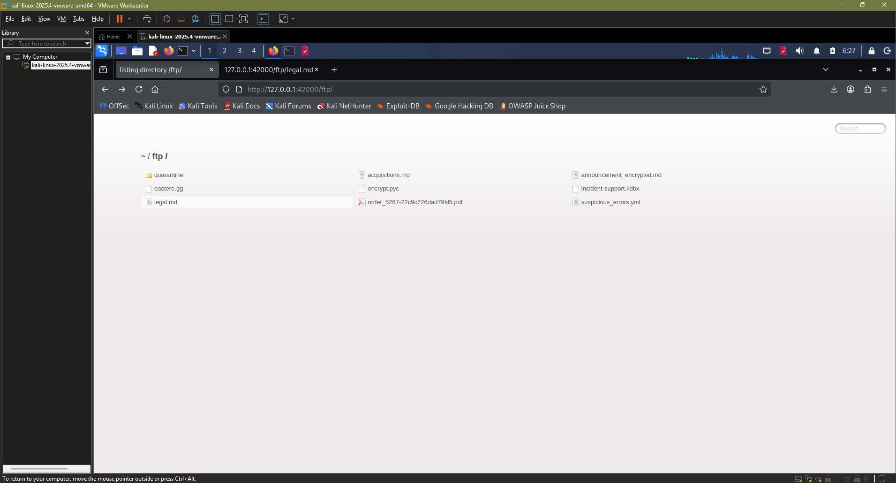
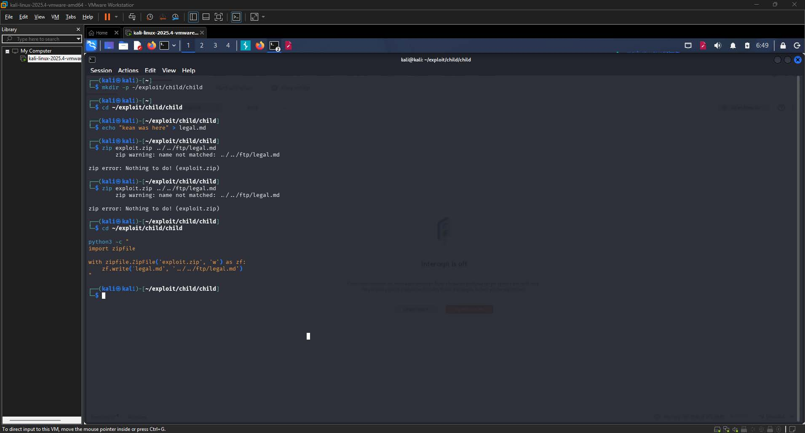
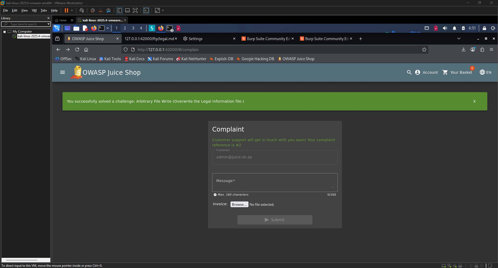
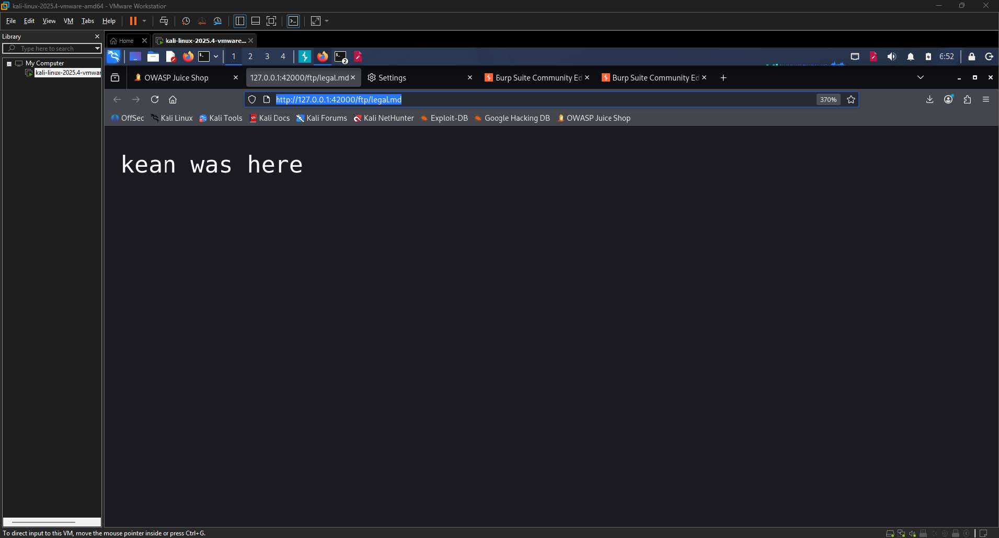

# Arbitrary File Write Write-up

| Challenge Name | Arbitrary File Write  |
| :---- | :---- |
| Category | Path Traversal / Improper Input Validation  |
| Difficulty | 6-Star |
| OWASP Top 10 | A03:2021 – Injection  |
| Secondary OWASP | A05:2021 – Security Misconfiguration  |
| CWE | CWE-22: Improper Limitation of a Pathname to a Restricted Directory ('Path Traversal')  |
| CVSS v3.1 Vector | AV:N/AC:L/PR:L/UI:N/S:C/C:N/I:H/A:L  |
| CVSS v3.1 Score | 8.5 (High)  |
| Environment | OWASP Juice Shop, Node.js, local instance at `127.0.0.1:42000`  |
| Date Completed | 2026-05-07  |
| Author | [Kean Louis R. Rosales](http://keanrosales.com) |

## 1\. Executive Summary

OWASP Juice Shop exposes its complaint file-upload endpoint to any authenticated user. By crafting a ZIP archive whose internal entry filename encodes path traversal sequences, an attacker can direct the server to extract and write that file to an arbitrary location on disk outside the intended upload directory. Only a standard user account is required; no administrative credentials or specialized tools are needed. This finding is classified under A03:2021 – Injection because the server processes attacker-controlled input, specifically the ZIP entry filename, without sanitization before using it in a filesystem write operation, allowing the attacker to inject a path that redirects output to an unintended location. 

## 2\. Technical Background

### 2.1 Application Architecture

OWASP Juice Shop is a deliberately vulnerable Node.js web application designed for security training. It exposes two file upload surfaces: a profile picture upload and a complaint submission endpoint that accepts ZIP archives. The complaint endpoint at `/file-upload` receives multipart form-data, extracts the submitted ZIP, and writes its contents to a server-side uploads directory. The application also serves a static FTP-like directory at `/ftp/`, which hosts publicly accessible files including `legal.md`, the application's legal information document. The FTP directory and the complaint upload extraction folder reside within the same filesystem tree, separated only by directory depth, with no enforced access boundary between them at either the application or operating system layer. 

### 2.2 Vulnerability Class

CWE-22 describes the failure of an application to properly neutralize special path elements such as `../` before using a filename in a filesystem operation. The expected secure behavior is that any filename derived from user input must be canonicalized and validated to confirm it resolves within the intended base directory before any write operation is performed. In this instance, the ZIP extraction routine constructs the output path by concatenating the extraction base folder with the filename stored inside the ZIP entry. Because the entry filename is entirely attacker-controlled and is never stripped of traversal sequences, the resulting resolved path escapes the upload directory and reaches the `/ftp/` directory. The absence of a canonical path check, commonly implemented as a prefix comparison between the resolved path and the intended base path, is the specific missing control that enables this vulnerability. 

## 3\. Reconnaissance and Discovery

### 3.1 Hypothesis

The complaint page was identified as the more interesting upload surface because it explicitly accepted ZIP files rather than images. ZIP archives are containers whose internal entry filenames are a well-known vector for path traversal, a class of vulnerability historically referred to as Zip Slip. Given that Juice Shop's FTP directory was accessible from the browser and housed application-critical files, the hypothesis was that the ZIP extraction routine likely lacked sanitization of entry filenames, making it feasible to target `legal.md` by crafting a traversal path that resolves from the extraction folder upward into the FTP directory. 

### 3.2 Discovery Method

Tool(s) used: Firefox browser, Burp Suite Community Edition, Python 3 (zipfile module), Linux terminal (Kali Linux) 

Target component: `/complaint` page upload form, `/file-upload` POST endpoint, `/ftp/legal.md` 

Steps performed:

1. Navigated to `http://127.0.0.1:42000/ftp/` in the browser to enumerate publicly accessible files and confirmed the presence of `legal.md` at [`http://127.0.0.1:42000/ftp/legal.md`](http://127.0.0.1:42000/ftp/legal.md).

  
**Image 1.1:** FTP directory listing at `127.0.0.1:42000/ftp/` 

2. Opened the complaint page and confirmed that the invoice upload field accepted ZIP files via the HTML form.  
3. Constructed a Python script using the standard `zipfile` module to create `exploit.zip` containing a single entry whose internal filename was set to `../../ftp/legal.md`, with attacker-controlled text as the file content.

    
**Image 1.2:** Python terminal session showing the `exploit.py` script  

4. Submitted the crafted ZIP through the complaint form while Burp Suite intercepted the resulting POST request to `/file-upload`.  
5. Observed the Juice Shop success banner confirming the challenge was solved, then navigated to `http://127.0.0.1:42000/ftp/legal.md` to verify that the file content had been replaced with the attacker-controlled payload.

    
**Image 1.3:** Juice Shop UI displaying the green success banner v

Finding: The server extracted the ZIP entry using the attacker-supplied filename without sanitization, writing the payload file directly to `/ftp/legal.md` and overwriting the original legal information document on the first attempt.

   
**Image 1.4:** Browser rendering the attacker-controlled string at `127.0.0.1:42000/ftp/legal.md`, confirming the file was overwritten. 

## 4\. Exploitation

### 4.1 Prerequisites

| Requirement | Detail |
| :---- | :---- |
| Authentication | User (standard authenticated account required to access the complaint page)  |
| Special Tools | Python 3; Burp Suite used for verification, not required for exploitation  |
| Network Access | Local |
| Permissions | None |

### 4.2 Attack Chain

1. Step 1 — Identify the target file  
   1. Browse to `http://127.0.0.1:42000/ftp/` and confirm that `legal.md` exists and is served from the `/ftp/` directory.  
2. Step 2 — Determine traversal depth  
   1. Assess that the complaint upload extraction directory is two levels above `/ftp/` in the filesystem tree, making the required traversal path `../../ftp/legal.md`.  
3. Step 3 — Craft the malicious ZIP archive  
   1. Execute `exploit.py` to produce `exploit.zip` containing one entry whose stored filename is `../../ftp/legal.md` and whose content is the attacker-controlled payload string.  
4. Step 4 — Submit the ZIP via the complaint upload form  
   1. POST `exploit.zip` to `/file-upload` as a multipart form-data request with `Content-Type: application/zip`.  
5. Step 5 — Server extracts ZIP without path sanitization  
   1. Server resolves `[uploads_base] + "../../ftp/legal.md"` to `/ftp/legal.md` and writes the attacker's payload to that path, overwriting the original file.  
6. Step 6 — Verify exploitation  
   1. Navigate to `http://127.0.0.1:42000/ftp/legal.md`; the server returns the attacker-controlled content, confirming the overwrite succeeded.

### 4.3 Evidence — Payload / Request

```py
# exploit.py — ZIP payload generation script
import zipfile

with zipfile.ZipFile('exploit.zip', 'w') as zf:
    zf.write('legal.md', '../../ftp/legal.md')
```

```py
# legal.md — payload file content written to disk
kean was here
```

```shell
POST /file-upload HTTP/1.1
Host: 127.0.0.1:42000
Content-Type: multipart/form-data; boundary=----geckoformboundary123abc
Content-Length: [variable]
Origin: http://127.0.0.1:42000
Referer: http://127.0.0.1:42000/#/complaint
Sec-Fetch-Dest: empty
Sec-Fetch-Mode: cors
Sec-Fetch-Site: same-origin
Priority: u=4

------geckoformboundary123abc
Content-Disposition: form-data; name="file"; filename="exploit.zip"
Content-Type: application/zip

[binary ZIP data — internal entry filename: ../../ftp/legal.md]
------geckoformboundary123abc--
```

4.4 Proof of Exploitation

The navigation to `http://127.0.0.1:42000/ftp/legal.md` returned the string "kean was here" in place of the original legal document, confirming that the arbitrary file write succeeded. 

## 5\. Root Cause Analysis

The root cause is the absence of canonical path validation during ZIP entry extraction in the complaint file-upload handler. The server constructs the output file path by appending the ZIP entry's stored filename directly to the extraction base directory without first resolving the resulting path and verifying that it remains within the intended directory boundary. This violates the Principle of Least Privilege and the Secure by Default principle, as the extraction routine was implicitly granted write access to the entire filesystem tree above the upload directory rather than being strictly constrained to a safe subdirectory.

Contributing factors:

1. No sanitization or rejection of `../` sequences within ZIP entry filenames before path construction.  
2. No canonical path resolution (e.g., `path.resolve()` followed by a `startsWith()` prefix check against the base directory) at the point of extraction.  
3. The extraction directory and the sensitive `/ftp/` directory share the same filesystem tree without any access boundary enforced at the application layer.  
4. No file integrity protection such as checksums or OS-level immutability flags on static application files like `legal.md` that should never be modified at runtime.  
5. The application process runs with filesystem permissions broad enough to write to the `/ftp/` directory, removing the operating system as a secondary control.

## 6\. Impact Assessment

| Dimension | Rating | Justification |
| :---- | :---- | :---- |
| Confidentiality | None | The attack writes files rather than reading them; no data disclosure occurs directly through this vector.  |
| Integrity | High | An attacker can overwrite arbitrary server-side files reachable by the application process, including legal documents, configuration files, and application data.  |
| Availability | Low | Overwriting critical application files could cause partial service degradation or feature breakage, though a full denial of service requires targeting binary or configuration files specifically.  |
| Privilege Required | Low | Only a standard authenticated user session is required; no administrative access is needed at any point in the attack chain.  |
| User Interaction | None | No action from another user or administrator is required for exploitation to succeed.  |
| Scope | Changed | The impact extends beyond the complaint upload component itself, affecting resources in the `/ftp/` directory that fall outside the vulnerable component's intended security scope.  |

### 6.1 Business Impact

An attacker holding a standard user account can overwrite any file accessible to the application process on the server. Beyond defacement of the legal information page, this capability extends to overwriting application configuration files, injecting malicious content into server-rendered templates, or corrupting database seed files, each of which produces distinct downstream harm. In a regulated environment, falsification of a legal disclosure document constitutes a compliance violation that may trigger mandatory breach notification obligations and regulatory investigation. The business therefore faces not only the direct cost of incident response and service restoration but also legal exposure, reputational damage from publicly tampered content, and the audit overhead required to determine the full scope of what was overwritten.

## 7\. Remediation

### 7.1 Short-Term — Canonical Path Validation (Immediate) 

Before writing any file extracted from a ZIP archive, resolve the full canonical output path and verify that it begins with the intended extraction base directory. If the resolved path falls outside the base directory, reject the entry immediately and abort the extraction. 

```javascript
// Node.js — safe ZIP extraction with canonical path check
const path = require('path');
const fs   = require('fs');

// Define the only directory where extracted files are permitted to land
const SAFE_BASE = path.resolve('/var/app/uploads/complaints');

function safeExtract(entryFilename, entryContent) {
  // Resolve the full absolute target path, collapsing any ../ sequences
  const targetPath = path.resolve(SAFE_BASE, entryFilename);

  // Reject any path that escapes the safe base directory
  if (!targetPath.startsWith(SAFE_BASE + path.sep)) {
    throw new Error(`Path traversal attempt blocked: ${entryFilename}`);
  }

  // Safe to write — create intermediate directories if needed
  fs.mkdirSync(path.dirname(targetPath), { recursive: true });
  fs.writeFileSync(targetPath, entryContent);
}
```

### 7.2 Long-Term — Hardened Extraction Library with OS-Level Isolation (Recommended) 

The short-term fix addresses the immediate gap but relies on every developer correctly reimplementing path validation at each extraction site. The architecturally correct solution replaces ad-hoc extraction logic with a well-maintained library that enforces safe extraction by design, and pairs it with OS-level filesystem permissions that deny the application process write access to static content directories such as `/ftp/` entirely. Defense in depth requires that even if application-layer validation is bypassed, the operating system serves as a hard second barrier. 

```javascript
// Sanitize entry filename before any path construction is attempted
const path = require('path');

function sanitizeZipEntry(entryName) {
  // Normalize the path, then strip any remaining leading traversal prefixes
  const normalized = path.normalize(entryName).replace(/^(\.\.(\/|\\|$))+/, '');

  // Final guard — reject anything that still contains traversal sequences
  if (normalized.includes('..')) {
    throw new Error(`Rejected unsafe ZIP entry after normalization: ${entryName}`);
  }

  return normalized;
}
```

```shell
# OS-level hardening — remove write access to /ftp/ for the app process user
chown root:root /var/app/ftp
chmod 755 /var/app/ftp          # app user can read and traverse, not write
chmod 644 /var/app/ftp/legal.md # app user can read, not overwrite

```

### 7.3 Remediation Priority

| Action | Effort | Priority |
| :---- | :---- | :---- |
| Implement canonical path check before ZIP entry extraction  | Low | Critical |
| Apply OS-level write restrictions on `/ftp/` for the application process user  | Low | High |
| Replace ad-hoc extraction with a hardened, actively maintained library  | Medium | High |
| Add immutability or checksum verification on static legal and configuration files  | Medium | Medium |
| Conduct a codebase-wide audit for all archive extraction points  | Medium | Medium |

## 8\. References

\[1\] OWASP Foundation, "File Upload Cheat Sheet," OWASP Cheat Sheet Series. \[Online\]. Available: [https://cheatsheetseries.owasp.org/cheatsheets/File\_Upload\_Cheat\_Sheet.html](https://cheatsheetseries.owasp.org/cheatsheets/File_Upload_Cheat_Sheet.html). \[Accessed: May 7, 2026\].

\[2\] MITRE Corporation, "CWE-22: Improper Limitation of a Pathname to a Restricted Directory ('Path Traversal')," Common Weakness Enumeration, 2023\. \[Online\]. Available: [https://cwe.mitre.org/data/definitions/22.html](https://cwe.mitre.org/data/definitions/22.html). \[Accessed: May 7, 2026\].

\[3\] OWASP Foundation, "OWASP Application Security Verification Standard 4.0 – V12.3: File Execution Requirements," OWASP ASVS, 2019\. \[Online\]. Available: [https://owasp.org/www-project-application-security-verification-standard/](https://owasp.org/www-project-application-security-verification-standard/). \[Accessed: May 7, 2026\].

\[4\] OWASP Foundation, "A03:2021 – Injection," OWASP Top 10, 2021\. \[Online\]. Available: [https://owasp.org/Top10/A03\_2021-Injection/](https://owasp.org/Top10/A03_2021-Injection/). \[Accessed: May 7, 2026\].

\[5\] OWASP Foundation, "A05:2021 – Security Misconfiguration," OWASP Top 10, 2021\. \[Online\]. Available: [https://owasp.org/Top10/A05\_2021-Security\_Misconfiguration/](https://owasp.org/Top10/A05_2021-Security_Misconfiguration/). \[Accessed: May 7, 2026\].

\[6\] Snyk Security Research, "Zip Slip Vulnerability," Snyk, 2018\. \[Online\]. Available: [https://security.snyk.io/research/zip-slip-vulnerability](https://security.snyk.io/research/zip-slip-vulnerability). \[Accessed: May 7, 2026\].

\[7\] FIRST.org, "CVSS v3.1 Specification Document," Forum of Incident Response and Security Teams, 2019\. \[Online\]. Available: [https://www.first.org/cvss/v3.1/specification-document](https://www.first.org/cvss/v3.1/specification-document). \[Accessed: May 7, 2026\].

## Appendix (Optional)

1. CVSS v3.1 Score Calculation

The CVSS v3.1 vector for this finding is AV:N/AC:L/PR:L/UI:N/S:C/C:N/I:H/A:L, which produces a Base Score of 8.5 (High). Each metric is justified as follows.

Attack Vector (AV): Network — The attack is carried out entirely over HTTP through a standard web browser via the complaint form upload. The attacker does not require physical access, local network positioning, or an adjacent network segment. Any internet-reachable deployment of the application would be exploitable remotely, so Network is the correct value.

Attack Complexity (AC): Low — No special conditions, race conditions, or target-dependent configurations are required for exploitation to succeed. The ZIP traversal technique is deterministic: the path ../../ftp/legal.md resolves consistently on every attempt without dependency on timing, environment state, or auxiliary information gathering. The attack can be reproduced reliably, which satisfies the Low complexity criterion.

Privileges Required (PR): Low — Accessing the complaint page and submitting the upload requires the attacker to hold a standard authenticated user session. No elevated or administrative role is needed at any point in the attack chain. Because some authentication is required, Low rather than None is the accurate rating.

User Interaction (UI): None — The attacker operates entirely independently. No victim user needs to click a link, visit a page, or take any action for exploitation to succeed. The file overwrite occurs the moment the server processes the uploaded ZIP.

Scope (S): Changed — The vulnerable component is the complaint upload handler, whose security scope is confined to the uploads directory. Exploitation results in writes to the /ftp/ directory, which is a separate component outside the upload handler's intended security boundary. Because the impact crosses into a resource governed by a different security authority, Scope is Changed.

Confidentiality Impact (C): None — This vulnerability is purely a write primitive. No file contents, credentials, or application data are read or disclosed to the attacker through this specific vector, so the confidentiality impact is None.

Integrity Impact (I): High — The core impact of this vulnerability is the ability to overwrite arbitrary files reachable by the application process. An attacker can replace legal documents, configuration files, or application data with attacker-controlled content, constituting a significant and targeted integrity violation with no upper bound on the files that can be targeted within the process's permission scope. This justifies a High rating.

Availability Impact (A): Low — If an attacker targets a file critical to application startup or runtime operation, such as a configuration file or route definition, the overwrite could cause partial service degradation or feature failures. However, because a standard user account does not have visibility into which files are operationally critical, and because the Juice Shop process likely recovers from some overwritten files without crashing, the availability impact is Low rather than High.

The numerical score is derived by applying the CVSS v3.1 Base Score formula to the selected metric values. The Exploitability sub-score is driven upward by the Network attack vector, Low complexity, Low privilege requirement, and no user interaction requirement. The Impact sub-score is weighted primarily by the High integrity impact, with a Low availability contribution, and is amplified by the Changed scope multiplier, which increases the overall score beyond what an Unchanged scope would produce. The resulting composite Base Score of 8.5 places this finding in the High severity band under the CVSS v3.1 qualitative severity rating scale, which defines High as scores in the range 7.0 to 8.9.