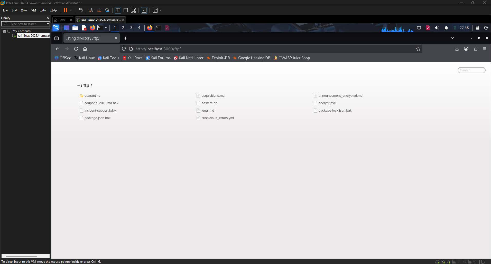
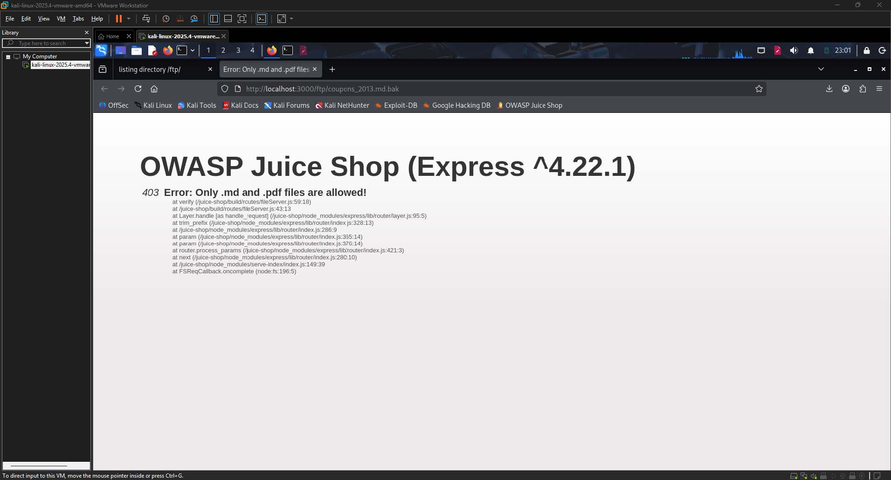
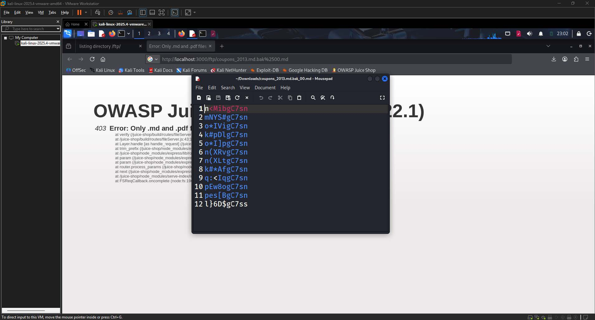
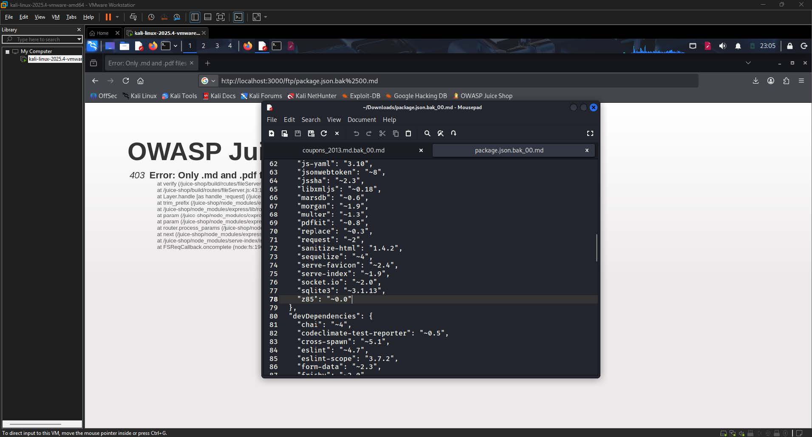
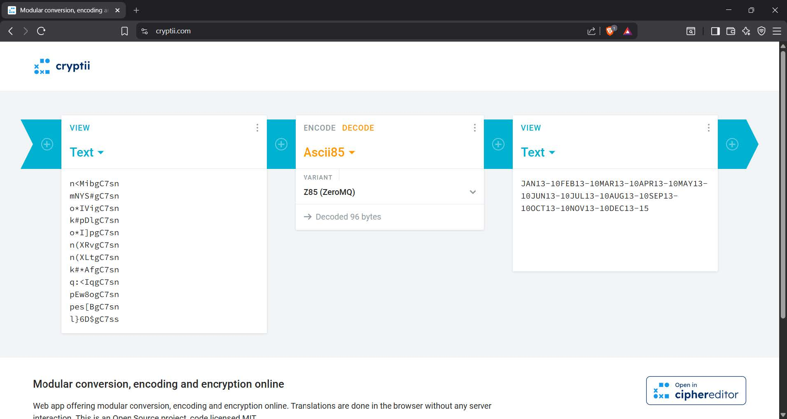

# Forged Coupon Write-up 

| Challenge Name | Forged Coupon |
| :---- | :---- |
| Category | Improper Input Validation / Cryptographic Issues  |
| Difficulty | 6-Star |
| OWASP Top 10 | A02:2021 – Cryptographic Failures  |
| Secondary OWASP | A05:2021 – Security Misconfiguration  |
| CWE | CWE-345: Insufficient Verification of Data Authenticity  |
| Secondary CWE | CWE-626: Poison Null Byte |
| CVSS v3.1 Vector | AV:N/AC:L/PR:L/UI:N/S:U/C:L/I:H/A:N  |
| CVSS v3.1 Score | 7.1 (High)  |
| Environment | OWASP Juice Shop, Kali Linux, localhost:3000 |
| Date Completed | 2025-05-07  |
| Author | [Kean Louis R. Rosales](http://keanrosales.com) |

## 1\. Executive Summary

OWASP Juice Shop exposes its coupon validation system to any authenticated user with access to the application's publicly reachable FTP directory. By retrieving a backup file containing Z85-encoded coupon strings from the unprotected FTP endpoint and decoding them using a freely available online tool, an attacker can reconstruct the coupon format and forge arbitrary discount codes of any value up to 99%. No administrative privileges or specialized tools are required beyond a web browser. This finding is classified under A02:2021 Cryptographic Failures because the application relies on a weak, reversible encoding scheme rather than a cryptographically signed token to authenticate coupon codes, and the key material needed to reverse the encoding is inadvertently disclosed through a misconfigured public file server. 

## 2\. Technical Background

### 2.1 Application Architecture

OWASP Juice Shop is a deliberately vulnerable Node.js and Express web application used for security training and CTF challenges. The application exposes an FTP directory at `http://localhost:3000/ftp/` that is publicly accessible without any authentication. This directory was likely intended as an internal administrative convenience and was left exposed due to a misconfiguration. The FTP endpoint contains a mixture of operational files including backup files with the `.bak` extension. The application's coupon redemption system accepts coupon codes at the payment checkout endpoint and applies a percentage discount to the current order. Coupon codes are validated server-side by decoding the submitted string using the Z85 encoding library, which is listed as a dependency in the application's `package.json`. 

### 2.2 Vulnerability Class

This vulnerability falls under CWE-345: Insufficient Verification of Data Authenticity. The expected secure behavior would require coupon codes to be cryptographically signed, such as through an HMAC, so that the server can verify that a given coupon was legitimately issued and has not been tampered with. What is missing is any such integrity check: the application decodes the submitted Z85 string and trusts the resulting plaintext value without verifying that the value was generated by an authoritative source. Since Z85 is a reversible encoding scheme and not an encryption or signing mechanism, any party who understands the format can produce a valid-looking coupon for any discount value. The exposure is further compounded by the fact that the encoding library used is identifiable from a backup of the application's dependency manifest, which is itself accessible from the public FTP directory. 

## 3\. Reconnaissance and Discovery

### 3.1 Hypothesis

FTP directories exposed on web applications are a well-known source of sensitive information leakage. The presence of a public `/ftp/` path on a web application strongly suggests that backup and configuration files may be accessible without authentication. Backup files in particular tend to contain artifacts from development and operations, including credential material, configuration snippets, and legacy data that was never intended for public consumption. Given these characteristics, the FTP directory was investigated under the hypothesis that it would yield files useful for understanding the application's internal behavior, including the mechanism behind coupon generation. 

### 3.2 Discovery Method

Tool(s) used: Web browser (Firefox), Mousepad text editor, [cryptii.com](http://cryptii.com)

Target component: `http://localhost:3000/ftp/` directory listing, specifically `coupons_2013.md.bak` and `package.json.bak`

Steps performed:

1. Navigated to `http://localhost:3000/ftp/` in the browser to inspect the publicly accessible FTP directory listing.

  
**Image 1.1:** FTP Directory of OWASP Juice Shop

2. Identified `coupons_2013.md.bak` as a high-value target due to its name suggesting a list of historical coupon codes.

3. Attempted to access the file directly by navigating to its URL, which returned a 403 error stating that only `.md` and `.pdf` files are permitted.

  
**Image 1.2:** 403 Error upon retrieving the files

4. Applied a Poison Null Byte attack by appending `%2500.md` to the filename in the URL, resulting in the request `http://localhost:3000/ftp/coupons_2013.md.bak%2500.md`, which successfully returned the file contents.  
5. Opened the retrieved file in Mousepad and observed a list of short encoded strings.

  
**Image 1.3:** Encoded coupon codes found in coupon\_2013.md.bak

6. Identified `package.json.bak` as a secondary target and retrieved it using the same null byte technique.  
7. Inspected the dependency list within `package.json.bak` and located the `z85` library, confirming the encoding scheme used for coupon codes.

  
**Image 1.4:** Encryption method found inside packages.json.bak

8. Navigated to cryptii.com, selected the Ascii85 decoder with the Z85 (ZeroMQ) variant, and pasted the coupon strings to decode them into plaintext date-discount strings.

  
**Image 1.5:** Decryption of the text in cryptii.com

Finding: The decoded coupon strings revealed a predictable plaintext format consisting of a month abbreviation, a two-digit year, and a numeric discount value, confirming that coupon codes can be forged by any party who knows the format and the encoding library. 

## 4\. Exploitation

### 4.1 Prerequisites

| Requirement | Detail |
| :---- | :---- |
| Authentication | User (standard account required to reach the payment page)  |
| Special Tools | Web browser; cryptii.com (freely accessible online tool)  |
| Network Access | Local / Remote  |
| Permissions | None beyond a standard user session  |

### 4.2 Attack Chain

1. Step 1   
   1. Access the public FTP directory. Navigate to `http://localhost:3000/ftp/` and enumerate the available files.  
2. Step 2   
   1. Bypass the file extension filter using a Poison Null Byte. Request `http://localhost:3000/ftp/coupons_2013.md.bak%2500.md` to trick the server-side extension validator into reading the terminal `.md` while the file system serves the actual `.bak` file.  
3. Step 3   
   1. Retrieve and read the coupon backup file. Open the downloaded file in a text editor and extract the Z85-encoded coupon strings.  
4. Step 4   
   1. Retrieve and read the package manifest backup. Repeat the null byte bypass on `package.json.bak` and inspect the dependencies section to identify the `z85` library.  
5. Step 5   
   1. Decode a legitimate coupon to understand the format. Paste individual encoded strings into cryptii.com using the Ascii85 / Z85 (ZeroMQ) decoder. Observe that decoded values follow the pattern `MONYR-NN` where `MON` is a three-letter month abbreviation, `YR` is a two-digit year, and `NN` is the discount percentage.  
6. Step 6   
   1. Verify format using a known current coupon. Locate a coupon code published on the OWASP Juice Shop Bluesky social media account. Decode it in cryptii.com to confirm it decodes to `MAY26-10`, validating the format against a known value.  
7. Step 7   
   1. Forge a maximum-value coupon. Construct the plaintext string `MAY26-99` and encode it using cryptii.com with the Z85 (ZeroMQ) variant to produce a forged encoded coupon string.  
8. Step 8   
   1. Redeem the forged coupon. Navigate to the Juice Shop payment page, enter the forged encoded string in the coupon field, and click Redeem. Observe that the application applies a 99% discount to the order total.

### 4.3 Evidence — Payload / Request

The forged coupon plaintext before encoding was constructed as follows: 

```
MAY26-99 
```

This was encoded using the Z85 (ZeroMQ) variant of Ascii85 via cryptii.com, producing a 10-character encoded string that was submitted directly into the coupon input field on the Juice Shop payment page at [`http://localhost:3000/#/payment/shop`](http://localhost:3000/#/payment/shop).

The null byte bypass payload used to retrieve restricted backup files took the following form:

```
GET /ftp/coupons_2013.md.bak%2500.md HTTP/1.1
Host: localhost:3000
```

![][image6]  
**Image 1.6:** Successfully forging a coupon with a 99% discount

The server's extension validator reads the null-terminated string and sees `.md` as the file extension, while the underlying file system resolves the path to `coupons_2013.md.bak` because it ignores everything after the null byte.

**Source:** Browser address bar and downloaded file contents retrieved from `http://localhost:3000/ftp/`

### 4.4 Proof of Exploitation

The Juice Shop score board displayed a green success notification confirming that the "Forged Coupon" challenge had been solved, with a 99% discount applied to the active order.![][image7]

**Image 1.7:** Forged Coupon Challenge Success banner

## 5\. Root Cause Analysis

The root cause is the absence of cryptographic integrity verification on the coupon redemption pathway. The application uses Z85 as a binary-to-text encoding scheme — not an encryption or signing mechanism. An encoded string carries no authentication tag and no proof of origin. 

Once an attacker understands the encoding format, they can produce an arbitrary coupon value that is indistinguishable from a legitimately issued one, because the server has no mechanism to verify that a given token was generated by an authoritative source. 

This design assumes that users will not discover the encoding format, showing a reliance on security through obscurity rather than cryptographic enforcement. This assumption fails the moment the encoding library is identifiable, which in this case it is, because the library name is disclosed in a backup of the application’s own dependency manifest, itself retrievable from a publicly accessible directory.

Contributing factors:

1. No HMAC or cryptographic signature on coupon tokens. The server decodes and trusts  
   the submitted Z85 string without verifying that it was produced by an authorized issuer.  
   Any party who knows the format can produce a valid token for any discount value.  
2. FTP directory exposed without authentication. The /ftp/ endpoint is reachable by  
   any unauthenticated user, making all files within it discoverable through simple directory  
   enumeration.  
3. Backup files retained in a web-accessible path. Files with the .bak extension —  
   including coupons\_2013.md.bak and package.json.bak — were left in the public FTP  
   directory. These files disclose historical coupon strings and the application’s full  
   dependency manifest respectively.  
4. Null byte vulnerability in the file extension validator. The server-side extension  
   check is bypassed by appending a URL-encoded null byte (%2500) followed by a permitted  
   extension. The validator reads the injected .md extension and permits the request, while  
   the file system resolves the actual .bak file. This is a distinct vulnerability  
   (CWE-626) that compounds the primary disclosure risk by allowing retrieval of files the  
   extension filter was intended to block.  
5. Encoding library identity disclosed in accessible backup. The z85 library is listed  
   by name in package.json.bak. An attacker who retrieves this file immediately knows  
   which encoding scheme to target and which online tools to use, eliminating any residual  
   protection that format obscurity might otherwise have provided.

## 6\. Impact Assessment

| Dimension | Rating | Justification |
| :---- | :---- | :---- |
| Confidentiality | Low | Retrieval of backup files exposes historical coupon codes and application dependency information, but not user credentials or personal data.  |
| Integrity | High | An attacker can forge arbitrary coupon codes and apply any discount value up to 99%, directly manipulating transaction amounts in their favor.  |
| Availability | None | The attack does not affect application availability.  |
| Privilege Required | Low | A standard user account is sufficient; no administrative access is needed.  |
| User Interaction | None | Exploitation is performed entirely by the attacker without requiring any action from another user.  |
| Scope | Unchanged | The impact is confined to the Juice Shop application and does not extend to adjacent systems.  |

### 6.1 Business Impact

An attacker who successfully exploits this vulnerability can apply a discount of up to 99% to any purchase, effectively acquiring goods or services at no cost and causing direct financial loss to the business. Because the coupon format is fully reversible and predictable, the attacker can generate an unlimited number of valid coupon codes for any discount value without needing to interact with a legitimate coupon issuance system. In a production environment, this would represent uncontrolled revenue loss and could be exploited repeatedly across many transactions or shared with other malicious actors. Additionally, the exposure of the FTP directory and backup files constitutes a secondary information disclosure risk that could assist further attacks against the application. 

7\. Remediation

### 7.1 Short-Term — Remove Public Access to FTP Directory (Immediate) 

The fastest risk reduction measure is to immediately restrict unauthenticated access to the `/ftp/` directory by applying server-side access controls so that the directory and its contents are no longer reachable from a browser without appropriate credentials. 

```javascript
// Express middleware: block access to /ftp/ for unauthenticated requests
app.use('/ftp', (req, res, next) => {
  if (!req.user || !req.user.isAdmin) {
    // Return 401 to prevent directory enumeration
    return res.status(401).json({ error: 'Unauthorized' });
  }
  next();
});
```

This does not address the underlying coupon forgery weakness but eliminates the primary disclosure vector that makes exploitation trivial.

### 7.2 Long-Term — Replace Encoding with HMAC-Signed Tokens (Recommended) 

The architecturally correct fix is to replace Z85 encoding with a server-side HMAC-signed token scheme for coupon generation and validation. Under this model, the server generates coupons by signing the discount value and an expiry timestamp with a secret key that is never exposed. On redemption, the server verifies the signature before applying the discount. This eliminates the ability to forge coupons even if an attacker understands the format, because they cannot produce a valid HMAC without the secret key. 

```javascript
const crypto = require('crypto');
const SECRET_KEY = process.env.COUPON_SECRET; // stored securely, never in source or FTP

// Coupon generation (server-side only)
function generateCoupon(discountPercent, expiryDate) {
  const payload = `${discountPercent}:${expiryDate}`;
  const hmac = crypto.createHmac('sha256', SECRET_KEY).update(payload).digest('hex');
  // Return base64url-encoded payload + signature
  return Buffer.from(`${payload}.${hmac}`).toString('base64url');
}

// Coupon validation on redemption
function validateCoupon(token) {
  const decoded = Buffer.from(token, 'base64url').toString();
  const [payload, receivedHmac] = decoded.split('.');
  const expectedHmac = crypto.createHmac('sha256', SECRET_KEY).update(payload).digest('hex');
  // Constant-time comparison to prevent timing attacks
  if (!crypto.timingSafeEqual(Buffer.from(receivedHmac), Buffer.from(expectedHmac))) {
    throw new Error('Invalid coupon');
  }
  const [discountPercent, expiryDate] = payload.split(':');
  return { discountPercent: parseInt(discountPercent, 10), expiryDate };
}

```

**Reference:** OWASP ASVS v4.0 Section V3: Session Management Verification Requirements; NIST SP 800-107 Recommendation for Applications Using Approved Hash Algorithms ([https://owasp.org/www-project-application-security-verification-standard/](https://owasp.org/www-project-application-security-verification-standard/)) 

### 7.3 Remediation Priority

| Action | Effort | Priority |
| :---- | :---- | :---- |
| Restrict FTP directory access with authentication middleware  | Low | Critical |
| Delete or relocate backup files from any web-accessible path  | Low | Critical |
| Replace Z85 encoding with HMAC-signed coupon tokens  | Medium | High |
| Patch null byte handling in the file extension validator  | Low | High |
| Audit all publicly accessible directories for sensitive file exposure  | Medium | Medium |

8\. References

\[1\] OWASP Foundation, "A02:2021 – Cryptographic Failures," *OWASP Top 10*, 2021\. \[Online\]. Available: [https://owasp.org/Top10/A02\_2021-Cryptographic\_Failures/](https://owasp.org/Top10/A02_2021-Cryptographic_Failures/). \[Accessed: May 7, 2026\].

\[2\] OWASP Foundation, "A05:2021 – Security Misconfiguration," *OWASP Top 10*, 2021\. \[Online\]. Available: [https://owasp.org/Top10/A05\_2021-Security\_Misconfiguration/](https://owasp.org/Top10/A05_2021-Security_Misconfiguration/). \[Accessed: May 7, 2026\].

\[3\] MITRE Corporation, "CWE-345: Insufficient Verification of Data Authenticity," *Common Weakness Enumeration*, 2024\. \[Online\]. Available: [https://cwe.mitre.org/data/definitions/345.html](https://cwe.mitre.org/data/definitions/345.html). \[Accessed: May 7, 2026\].

\[4\] MITRE Corporation, "CWE-626: Null Byte Interaction Error (Poison Null Byte)," *Common Weakness Enumeration*, 2024\. \[Online\]. Available: [https://cwe.mitre.org/data/definitions/626.html](https://cwe.mitre.org/data/definitions/626.html). \[Accessed: May 7, 2026\].

\[5\] OWASP Foundation, "OWASP Application Security Verification Standard 4.0," *OWASP ASVS*, 2019\. \[Online\]. Available: [https://owasp.org/www-project-application-security-verification-standard/](https://owasp.org/www-project-application-security-verification-standard/). \[Accessed: May 7, 2026\].

\[6\] B. Behrens, "OWASP Juice Shop: Probably the most modern and sophisticated insecure web application," *OWASP Juice Shop Project*, 2023\. \[Online\]. Available: [https://owasp.org/www-project-juice-shop/](https://owasp.org/www-project-juice-shop/). \[Accessed: May 7, 2026\].

Appendix 

1.  Attack Flow Summary 

 

```shell
/ftp/ directory (unauthenticated)
    --> coupons_2013.md.bak (blocked by extension filter)
        --> Null byte bypass: %2500.md appended to URL
            --> File contents retrieved: Z85-encoded coupon strings
    --> package.json.bak (same null byte bypass)
        --> Dependencies reveal: z85 library
            --> Encoding scheme identified
                --> cryptii.com Z85 decode: reveals MON YY-NN format
                    --> Forged payload: MAY26-99
                        --> Encoded and submitted to /payment/shop
                            --> 99% discount applied
```

2. CVSS v3.1 Score Calculation

The CVSS v3.1 vector for this finding is `AV:N/AC:L/PR:L/UI:N/S:U/C:L/I:H/A:N`, which produces a Base Score of 7.1 (High). Each metric is justified as follows.

Attack Vector (AV): Network — The attack is carried out entirely over HTTP through a standard web browser. The attacker does not require physical access, local network positioning, or an adjacent network segment. Any internet-reachable deployment of the application would be exploitable remotely, so Network is the correct value.

Attack Complexity (AC): Low — No special conditions, race conditions, or target-dependent configurations need to be in place for exploitation to succeed. The FTP directory is consistently accessible, the null byte bypass is a deterministic technique, and the encoding step requires only a freely available online tool. The attack can be reproduced reliably on every attempt, which satisfies the Low complexity criteria.

Privileges Required (PR): Low — Reaching the coupon redemption page requires the attacker to be authenticated as a regular user. No elevated or administrative role is needed at any point in the attack chain. The FTP directory itself is accessible without authentication, but submitting a forged coupon requires a logged-in session, so Low rather than None is the accurate rating.

User Interaction (UI): None — The attacker operates entirely independently. No victim user needs to click a link, visit a page, or take any action for exploitation to succeed.

Scope (S): Unchanged — The impact of this vulnerability is confined to the Juice Shop application itself. Exploiting the coupon system does not grant the attacker influence over any adjacent system, component, or security authority outside the application boundary.

Confidentiality Impact (C): Low — The null byte bypass discloses the contents of backup files stored in the FTP directory, including historical coupon codes and the application dependency manifest. This constitutes a limited information disclosure of non-critical operational data. Because no user credentials, personal data, or high-value secrets are directly exposed through this specific vector, the impact is rated Low rather than High.

Integrity Impact (I): High — The core of this vulnerability is the ability to forge coupon codes of arbitrary discount value. An attacker can construct a token that applies a 99% discount to any transaction, directly and materially altering financial data within the application. This constitutes a significant and targeted integrity violation against the transaction processing function, which justifies a High rating.

Availability Impact (A): None — The attack does not degrade, interrupt, or deny the availability of the application or any of its components. All functionality remains accessible throughout and after exploitation.

The numerical score is derived by applying the CVSS v3.1 Base Score formula to the selected metric values. The Exploitability sub-score is driven upward by the Network attack vector, Low complexity, Low privilege requirement, and no user interaction requirement. The Impact sub-score is weighted primarily by the High integrity impact, partially offset by the Low confidentiality impact and no availability impact, and kept within the Unchanged scope. The resulting composite Base Score of 7.1 places this finding in the High severity band under the CVSS v3.1 qualitative severity rating scale, which defines High as scores in the range 7.0 to 8.9.

3. Null Byte Bypass Technical Note

The null byte bypass exploits a C-style string termination behavior in older or improperly implemented server-side validation code. When the URL-encoded null byte `%00` (transmitted as `%2500` due to double URL encoding) is inserted before a fake permitted extension, the validator reads the string and terminates at the null byte, seeing only the `.bak` portion ending in the injected `.md`. The underlying file system, however, operates on the raw path and ignores the null byte and everything after it, resolving the actual `.bak` file. The result is a mismatch between what the validator approves and what the file system serves. 

