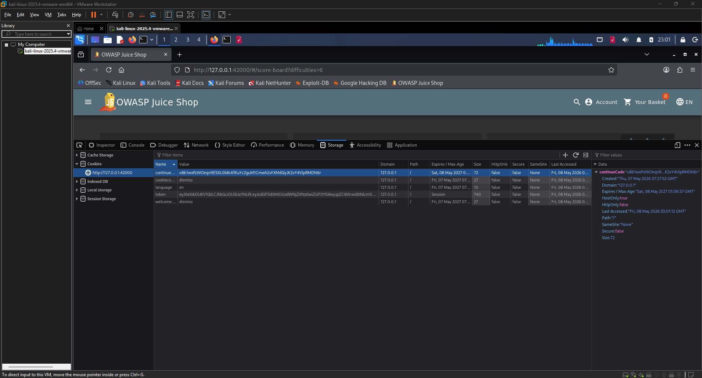
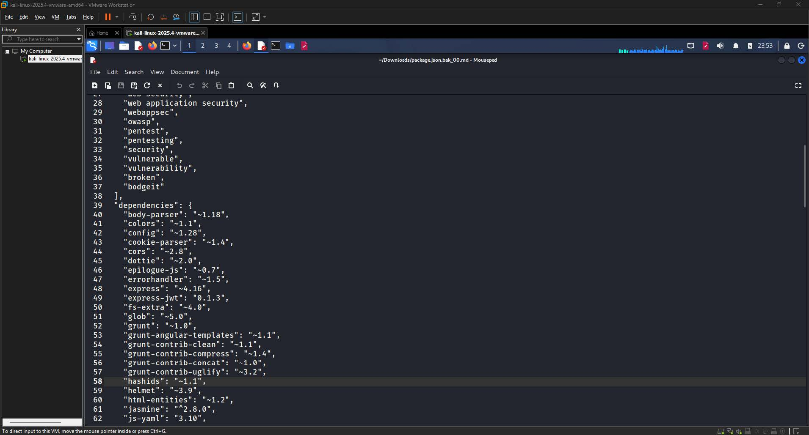
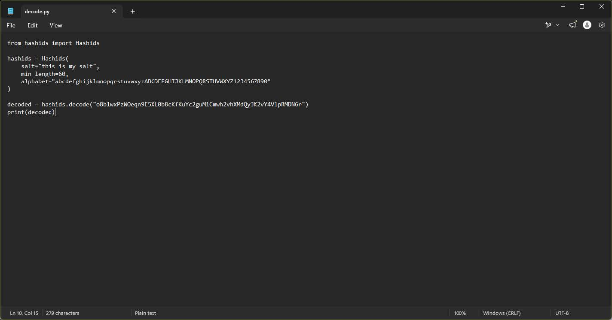
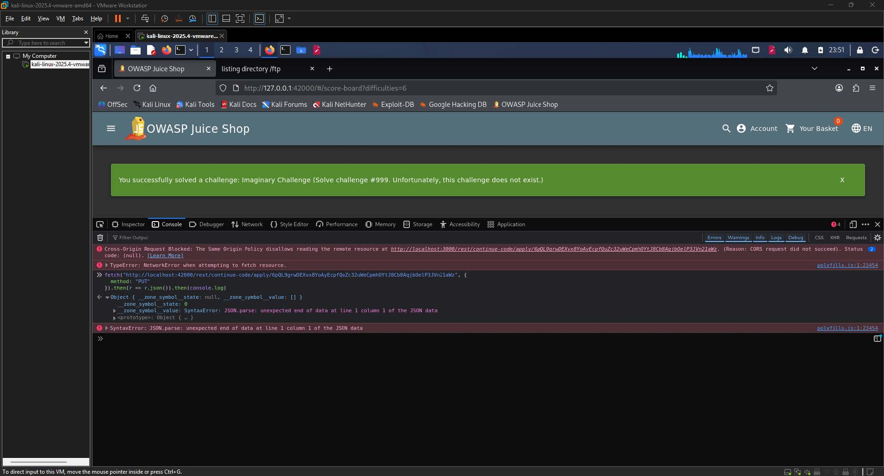

# Imaginary Challenge Write-up

| Challenge Name | Imaginary Challenge (Solve challenge \#999. Unfortunately, this challenge does not exist.)  |
| :---- | :---- |
| Category | Cryptographic Issues / Code Analysis / Shenanigans  |
| Difficulty | 6-Star |
| OWASP Top 10 | A02:2021 \-- Cryptographic Failures  |
| Secondary OWASP | A04:2021 \-- Insecure Design  |
| CWE | CWE-345: Insufficient Verification of Data Authenticity  |
| CVSS v3.1 Vector | AV:N/AC:H/PR:L/UI:N/S:U/C:N/I:H/A:N  |
| CVSS v3.1 Score | 5.3 (Medium)  |
| Environment | OWASP Juice Shop, localhost:42000  |
| Date Completed | 2026-05-08 |
| Author | [Kean Louis R. Rosales](http://keanrosales.com) |

## 1\. Executive Summary

OWASP Juice Shop exposes its challenge progress tracking mechanism to client-side manipulation through a predictable and reversible encoding scheme embedded in a browser cookie. By decoding the `continueCode` cookie using the Hashids library with a publicly discoverable salt, an attacker is able to forge a progress state that includes a non-existent challenge identifier, specifically challenge number 999, and submit it back to the server via a REST endpoint. No administrative privileges or special tooling beyond a Python interpreter are required. This finding is classified under A02:2021 \-- Cryptographic Failures because the application relies on an obfuscation-based encoding scheme rather than a cryptographically signed or authenticated token to protect the integrity of user progress data. 

## 2\. Technical Background

### 2.1 Application Architecture

OWASP Juice Shop is a deliberately vulnerable Node.js web application that serves as a training platform for web security concepts. The application tracks user challenge completion state through a cookie named `continueCode`, which is stored in the browser and submitted to the server via a REST endpoint at `/rest/continue-code/apply/:code`. The cookie value is not a session identifier or authentication token; its sole purpose is to persist and restore the set of challenge identifiers that a user has completed. The encoding of this cookie is handled server-side by the Hashids library, version 1.1, which is declared as a dependency in the application's `package.json` file. Hashids encodes a list of non-negative integers into a URL-safe alphanumeric string using a configurable salt and alphabet, and the operation is fully reversible without any secret key material that is withheld from the client. It is relevant to note that Hashids has since been deprecated and succeeded by a rebranded library called Sqids (pronounced "squids"), which retains a similar purpose but is not backwards-compatible with Hashids in terms of encoding output. Because the application's dependency manifest pins version 1.1 of the original Hashids library, any attempt to decode the cookie using the Sqids library will produce incorrect results, and the correct decoding tool must be identified by cross-referencing the declared dependency version rather than assuming the successor library is applicable. 

### 2.2 Vulnerability Class

CWE-345, Insufficient Verification of Data Authenticity, applies here because the server accepts and acts upon a client-supplied value without verifying that the value was generated by a trusted system or has not been tampered with. The expected secure behavior would be for the server to sign the encoded payload using a server-side secret, such as an HMAC, so that any modification of the encoded integer list would produce an invalid signature and be rejected. The missing control is a message authentication or digital signature layer over the `continueCode` value. Because Hashids is a deterministic, reversible, and publicly documented encoding scheme rather than an encryption or signing mechanism, any party who knows the salt and alphabet can produce a valid-looking cookie encoding an arbitrary set of challenge identifiers, including identifiers for challenges that do not legitimately exist. 

## 3\. Reconnaissance and Discovery

### 3.1 Hypothesis

The challenge is tagged with three categories: Cryptographic Issues, Code Analysis, and Shenanigans. The Shenanigans tag indicates that the solution is self-referential, meaning the mechanism by which challenges are tracked is itself the attack surface. The Cryptographic Issues tag implies that some form of encoding, hashing, or obfuscation is being misused rather than used securely. These two signals together suggested that the application must be storing challenge progress in a client-accessible location, and that the encoding protecting that data could be reversed or forged. The natural location for client-accessible state in a web application is the browser cookie store, which led directly to inspecting cookie values as the first investigative step. 

### 3.2 Discovery Method

Tool(s) used: Browser Developer Tools (Storage tab), CyberChef, FTP directory listing, Python 3 with the `hashids` library

Target component: `continueCode` cookie; `package.json.bak` from the FTP directory; `/rest/continue-code/apply/:code` REST endpoint

Steps performed:

1. Opened the browser Developer Tools and navigated to the Storage tab to enumerate all cookies set by the application.  
2. Identified a cookie named `continueCode` with a long alphanumeric value (`o8b1wxPzWOeqn9E5XL0b8cKfKuYc2guM1Cmwh2vhXMdQyJK2vY4VlpRMDN6r`) that was distinct from session and authentication cookies.  
3. Attempted to decode the cookie value in CyberChef using common encoding schemes (Base64, Base58, hex); no intelligible output was produced.  
4. Accessed the application's FTP directory and retrieved `package.json.bak`, a backup of the application's dependency manifest.  
5. Inspected `package.json.bak` and identified `"hashids": "~1.1"` as a declared dependency, confirming that the Hashids library is used by the application.  
6. Attempted to decode the cookie value using Sqids, the library that publicly succeeded and rebranded Hashids, on the reasoning that the two libraries serve the same purpose. This produced no valid output, as Sqids is not backwards-compatible with Hashids and uses a different internal encoding algorithm.  
7. Recognized the mismatch between the declared dependency (`hashids ~1.1`) and the Sqids library, and redirected investigation to the original Hashids library by consulting its PyPI project page, which revealed that the library's demonstration uses the salt `"this is my salt"` and a default alphabet of `abcdefghijklmnopqrstuvwxyzABCDEFGHIJKLMNOPQRSTUVWXYZ1234567890`.  
8. Wrote a Python script using the `hashids` library configured with `salt="this is my salt"`, `min_length=60`, and the default alphabet, and decoded the `continueCode` cookie value.

Finding: The cookie decoded to a tuple of nine integers \-- `(5, 26, 30, 33, 44, 50, 59, 74, 104)` \-- which corresponded exactly to the nine challenges completed at the time of the investigation, confirming that the cookie encodes a list of completed challenge identifiers using a reversible scheme with a publicly known salt.

## 4\. Exploitation

### 4.1 Prerequisites

| Requirement | Detail |
| :---- | :---- |
| Authentication | Low (standard user session required to submit the continue code)  |
| Special Tools | Python 3 with the `hashids` package  |
| Network Access | Local |
| Permissions | None |

### 4.2 Attack Chain

1. Enumerate cookies \-- Open Developer Tools and retrieve the value of the `continueCode` cookie from the Storage tab.

  
**Image 1.1:** Cookies found in the Storage tab of the Developer Tools

2. Identify the encoding library \-- Retrieve `package.json.bak` from the FTP directory and confirm the presence of the `hashids` dependency.

  
**Image 1.2:** Hashids dependency was found in the package.json.bak

3. Decode the cookie \-- Using the Hashids library with the known salt and alphabet, decode the cookie to obtain the list of completed challenge integers.

  
**Image 1.3:** Decoding the hash to reveal the challenge numbers

4. Forge the payload \-- Append the target identifier `999` to the decoded list, producing `[5, 26, 30, 33, 44, 50, 59, 74, 104, 999]`.  
5. Re-encode the payload \-- Re-encode the modified list using the same Hashids configuration to produce a new cookie value.  
6. Submit the forged code \-- Send a `PUT` request to `/rest/continue-code/apply/<forged_value>` to instruct the server to apply the forged progress state.

  
**Image 1.4:** Pushing the payload onto the console and successfully completing the challenge

### 4.3 Evidence — Payload / Request

Decode script:

```py
from hashids import Hashids

hashids = Hashids(
    salt="this is my salt",
    min_length=60,
    alphabet="abcdefghijklmnopqrstuvwxyzABCDEFGHIJKLMNOPQRSTUVWXYZ1234567890"
)

decoded = hashids.decode("o8b1wxPzWOeqn9E5XL0b8cKfKuYc2guM1Cmwh2vhXMdQyJK2vY4VlpRMDN6r")
print(decoded)
# Output: (5, 26, 30, 33, 44, 50, 59, 74, 104)
```

Forge and encode script:

```py
from hashids import Hashids

hashids = Hashids(
    salt="this is my salt",
    min_length=60,
    alphabet="abcdefghijklmnopqrstuvwxyzABCDEFGHIJKLMNOPQRSTUVWXYZ1234567890"
)

encoded = hashids.encode(5, 26, 30, 33, 44, 50, 59, 74, 104, 999)
print(encoded)
# Output: 6pQL9grwDEXvx8YoAyEcpfQuZc32uWeCpmhOYtJ8Cb8AqjbOelP3JVn21aWz
```

Submission request (executed from the browser console):

```javascript
fetch("http://localhost:3000/rest/continue-code/apply/6pQL9grwDEXvx8YoAyEcpfQuZc32uWeCpmhOYtJ8Cb8AqjbOelP3JVn21aWz", {
    method: "PUT"
}).then(r => r.json()).then(console.log)
```

### 4.4 Proof of Exploitation

The server accepted the forged continue code and responded by marking the Imaginary Challenge as solved, displaying the success banner: "You successfully solved a challenge: Imaginary Challenge (Solve challenge \#999. Unfortunately, this challenge does not exist.)." This confirms that the server performed no authenticity verification on the submitted code and trusted the client-supplied integer list without validation against a server-side signed token. 

## 5\. Root Cause Analysis

The root cause is the absence of a cryptographic integrity mechanism over the `continueCode` cookie value. The application uses Hashids, a deterministic and fully reversible encoding library, as though it were a confidential or authenticated token format. This violates the Principle of Secure by Default, as the library's own documentation explicitly states that it is not intended for security purposes and that its output is not resistant to reverse engineering by a party who knows the alphabet. Contributing factors include the following:

1. The Hashids salt (`"this is my salt"`) is identical to the value used in the library's public demonstration, meaning it provides no additional secrecy beyond the library's default behavior.  
2. The `package.json.bak` file is publicly accessible from the application's FTP directory without authentication, allowing any user to confirm which encoding library is in use.  
3. The REST endpoint `/rest/continue-code/apply/:code` applies the decoded challenge identifiers to the user's progress state without verifying that the submitted set is a strict superset of a server-authoritative record, permitting the injection of arbitrary identifiers including non-existent ones.  
4. No server-side HMAC or digital signature is appended to or wrapped around the encoded value, so there is no mechanism by which the server can distinguish a legitimate cookie from a forged one.

## 6\. Impact Assessment

| Dimension | Rating | Justification |
| :---- | :---- | :---- |
| Confidentiality | None | The attack does not expose any user data, credentials, or application secrets; the only information disclosed is the list of challenge IDs already known to the attacker.  |
| Integrity | High | An attacker can forge a progress record that includes any challenge identifier, including identifiers for challenges that have never been legitimately solved, directly corrupting the integrity of the application's challenge completion state.  |
| Availability | None | The attack does not degrade or interrupt any application function; all features remain accessible before and after exploitation.  |
| Privilege Required | Low | A standard authenticated user session is sufficient to submit the forged continue code; no elevated role is needed.  |
| User Interaction | None | The attacker operates entirely without requiring any action from another user or an administrator.  |
| Scope | Unchanged | The impact is confined to the Juice Shop application's progress tracking subsystem and does not affect any adjacent system or security boundary.  |

### 6.1 Business Impact

In a production application that uses a comparable mechanism to track user entitlements, completed training modules, or purchased content, this vulnerability would allow any authenticated user to forge completion of any content unit without actually engaging with it. The business consequence is a direct loss of data integrity in the progress or entitlement system, potentially enabling users to bypass paywalls, unlock premium content, or falsify compliance training records. Beyond the immediate data integrity concern, the public exposure of a backup dependency manifest through an unauthenticated FTP directory also gives an attacker a detailed view of the application's dependency tree, facilitating targeted exploitation of known vulnerabilities in disclosed library versions. 

## 7\. Remediation

### 7.1 Short-Term \-- HMAC-Signed Continue Code (Immediate) 

The fastest risk-reducing fix is to append an HMAC-SHA256 signature to the continue code before sending it to the client, and to verify that signature on every submission. This prevents forgery without requiring a redesign of the cookie structure.

```javascript
const crypto = require("crypto");
const HMAC_SECRET = process.env.CONTINUE_CODE_SECRET; // Store in environment, never in source

function signContinueCode(encodedCode) {
    const sig = crypto
        .createHmac("sha256", HMAC_SECRET)
        .update(encodedCode)
        .digest("hex");
    return `${encodedCode}.${sig}`; // Append signature with a delimiter
}

function verifyContinueCode(signedCode) {
    const [encoded, receivedSig] = signedCode.split(".");
    if (!encoded || !receivedSig) return null;

    const expectedSig = crypto
        .createHmac("sha256", HMAC_SECRET)
        .update(encoded)
        .digest("hex");

    // Constant-time comparison to prevent timing attacks
    if (!crypto.timingSafeEqual(Buffer.from(receivedSig, "hex"), Buffer.from(expectedSig, "hex"))) {
        return null;
    }
    return encoded;
}
```

### 7.2 Long-Term \-- Server-Side Progress Storage (Recommended) 

The architecturally correct fix is to remove client-side progress state entirely. Challenge completion should be stored exclusively in a server-side data store, keyed to the authenticated user's session or account identifier, and never transmitted to the client in a form that can be modified and resubmitted. The `continueCode` feature, if retained, should function only as a one-time import token that is validated against a server-authoritative record and immediately invalidated after use, rather than as a mutable representation of current progress.

```javascript
// On challenge completion, write directly to the database
async function recordChallengeCompletion(userId, challengeId) {
    await db.query(
        "INSERT INTO user_challenges (user_id, challenge_id, completed_at) VALUES (?, ?, NOW()) ON DUPLICATE KEY UPDATE completed_at = completed_at",
        [userId, challengeId]
    );
}

// On progress restore, read from the database -- never trust the client-supplied list
async function getUserProgress(userId) {
    const rows = await db.query(
        "SELECT challenge_id FROM user_challenges WHERE user_id = ?",
        [userId]
    );
    return rows.map(r => r.challenge_id);
}
```

### 7.3 Remediation Priority

| Action | Effort | Priority |
| :---- | :---- | :---- |
| Apply HMAC signature to continue code  | Low | Critical |
| Rotate and externalize the Hashids salt to an environment variable  | Low | High |
| Remove `package.json.bak` from the publicly accessible FTP directory  | Low | High |
| Migrate challenge progress to server-side storage  | Medium | High |
| Validate submitted challenge IDs against the set of legitimately existing challenges  | Low | Medium |

## 8\. References

\[1\] OWASP Foundation, "A02:2021 \-- Cryptographic Failures," OWASP Top 10, 2021\. \[Online\]. Available: [https://owasp.org/Top10/A02\_2021-Cryptographic\_Failures/](https://owasp.org/Top10/A02_2021-Cryptographic_Failures/). \[Accessed: May 8, 2026\].

\[2\] OWASP Foundation, "A04:2021 \-- Insecure Design," OWASP Top 10, 2021\. \[Online\]. Available: [https://owasp.org/Top10/A04\_2021-Insecure\_Design/](https://owasp.org/Top10/A04_2021-Insecure_Design/). \[Accessed: May 8, 2026\].

\[3\] MITRE Corporation, "CWE-345: Insufficient Verification of Data Authenticity," Common Weakness Enumeration, 2023\. \[Online\]. Available: [https://cwe.mitre.org/data/definitions/345.html](https://cwe.mitre.org/data/definitions/345.html). \[Accessed: May 8, 2026\].

\[4\] Ivan Akimov, "Sqids (formerly Hashids)," Sqids, 2023\. \[Online\]. Available: [https://sqids.org/](https://sqids.org/). \[Accessed: May 8, 2026\].

\[5\] Python Software Foundation, "hashids 1.3.1," PyPI, 2021\. \[Online\]. Available: [https://pypi.org/project/hashids/](https://pypi.org/project/hashids/). \[Accessed: May 8, 2026\].

\[6\] OWASP Foundation, "OWASP Application Security Verification Standard 4.0 \-- V3: Session Management Verification Requirements," OWASP ASVS, 2019\. \[Online\]. Available: [https://owasp.org/www-project-application-security-verification-standard/](https://owasp.org/www-project-application-security-verification-standard/). \[Accessed: May 8, 2026\].

\[7\] M. Bellare, R. Canetti, and H. Krawczyk, "RFC 2104: HMAC: Keyed-Hashing for Message Authentication," Internet Engineering Task Force, Feb. 1997\. \[Online\]. Available: [https://www.rfc-editor.org/rfc/rfc2104](https://www.rfc-editor.org/rfc/rfc2104). \[Accessed: May 8, 2026\].

## Appendix 

### A. CVSS v3.1 Score Calculation

The CVSS v3.1 vector for this finding is AV:N/AC:H/PR:L/UI:N/S:U/C:N/I:H/A:N, which produces a Base Score of 5.3 (Medium). Each metric is justified as follows.

Attack Vector (AV): Network \-- The attack is carried out entirely over HTTP using a standard browser and a Python script. The attacker does not require physical access, local network positioning, or an adjacent network segment. Any internet-reachable deployment of the application would be exploitable remotely, so Network is the correct value.

Attack Complexity (AC): High \-- Successful exploitation requires the attacker to independently discover that the `continueCode` cookie is Hashids-encoded, locate the `package.json.bak` file in the FTP directory, infer the correct salt and alphabet configuration, and correctly reconstruct the encoding parameters. A meaningful point of complexity in this investigation is the existence of Sqids, the library that publicly succeeded and rebranded Hashids. Because Sqids is the current and actively maintained successor, it is a natural first candidate for decoding the cookie value; however, the two libraries are not backwards-compatible, and applying Sqids to a Hashids-encoded value yields no valid output. Resolving this misdirection requires the attacker to consult the application's dependency manifest and match the specific library version declared therein, rather than relying on general knowledge of the current state of the library ecosystem. This chain of discovery steps involves non-trivial deduction and is not directly executable by an automated scanner without human analysis, which satisfies the High complexity criteria.

Privileges Required (PR): Low \-- A standard authenticated user session is required to submit the forged continue code to the `/rest/continue-code/apply/:code` endpoint. No elevated or administrative role is needed at any point in the attack chain, so Low rather than None is the accurate rating.

User Interaction (UI): None \-- The attacker operates entirely independently. No victim user needs to take any action for exploitation to succeed.

Scope (S): Unchanged \-- The impact of this vulnerability is confined to the Juice Shop application's progress tracking subsystem. Exploiting the continue code mechanism does not grant the attacker influence over any adjacent system or security authority outside the application boundary.

Confidentiality Impact (C): None \-- The attack does not disclose any sensitive information to the attacker. The only data involved is the list of challenge identifiers, which are already known to the attacker by virtue of having completed those challenges. No user credentials, personal data, or high-value secrets are exposed through this vector.

Integrity Impact (I): High \-- The core of this vulnerability is the ability to forge a progress record that includes any challenge identifier, including identifiers for challenges that do not legitimately exist. This constitutes a direct and material corruption of the application's challenge completion state, which justifies a High rating.

Availability Impact (A): None \-- The attack does not degrade, interrupt, or deny the availability of the application or any of its components. All functionality remains accessible throughout and after exploitation.

The numerical score is derived by applying the CVSS v3.1 Base Score formula to the selected metric values. The Exploitability sub-score is moderated by the High attack complexity despite the Network attack vector, Low privilege requirement, and absence of user interaction. The Impact sub-score is driven entirely by the High integrity impact, with no confidentiality or availability contribution, and is bounded by the Unchanged scope. The resulting composite Base Score of 5.3 places this finding in the Medium severity band under the CVSS v3.1 qualitative severity rating scale, which defines Medium as scores in the range 4.0 to 6.9.

### B. Tool Output

Cookie decode output:

```shell
C:\Users\keanl\Downloads\owasp juice shop> python decode.py
(5, 26, 30, 33, 44, 50, 59, 74, 104)
```

Forged code encode output:

```shell
C:\Users\keanl\Downloads\owasp juice shop> python decode.py
6pQL9grwDEXvx8YoAyEcpfQuZc32uWeCpmhOYtJ8Cb8AqjbOelP3JVn21aWz
```

### 