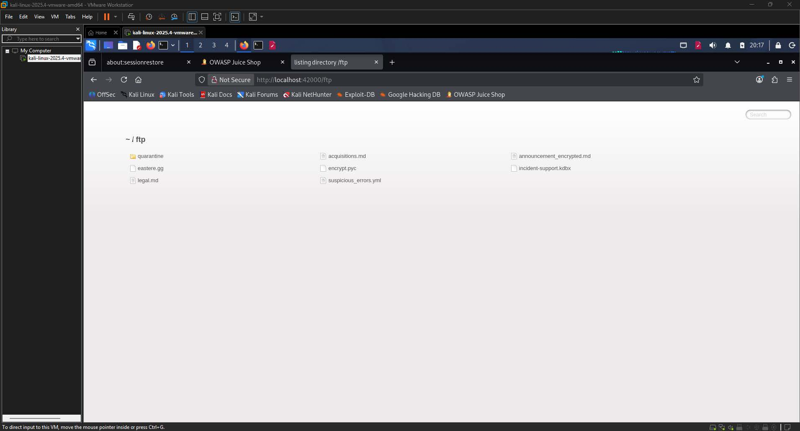
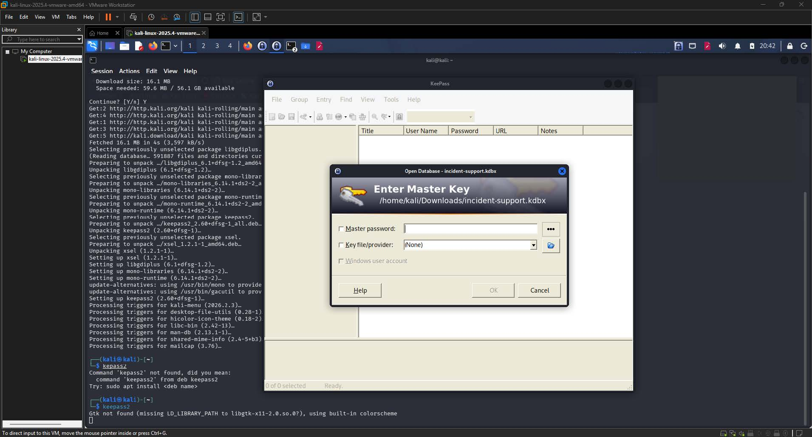
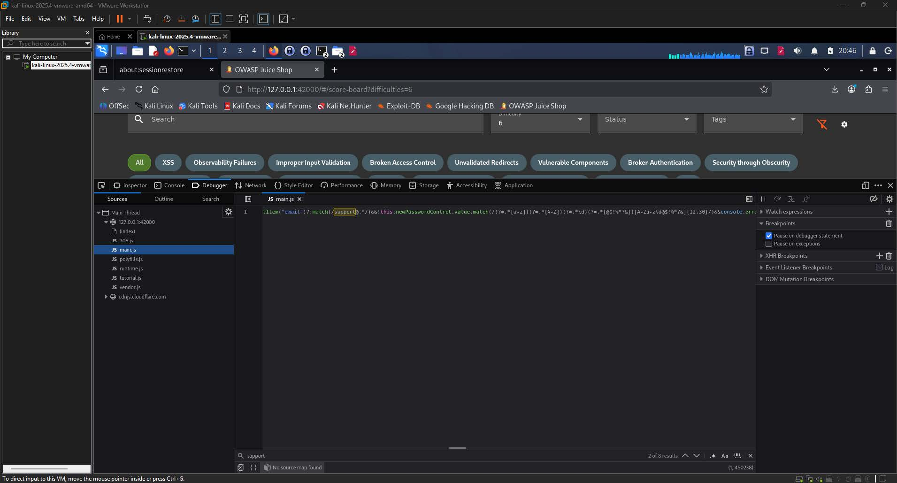
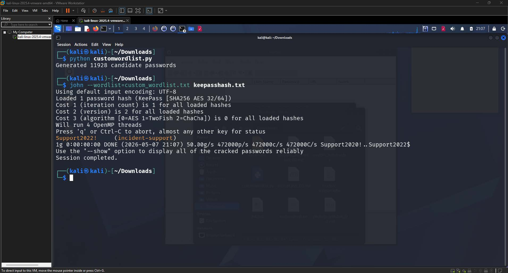
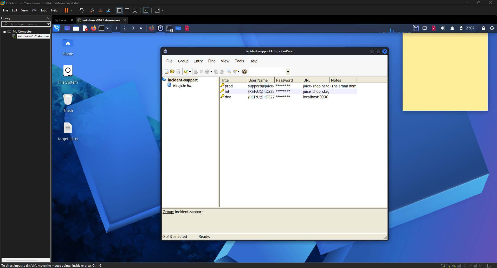
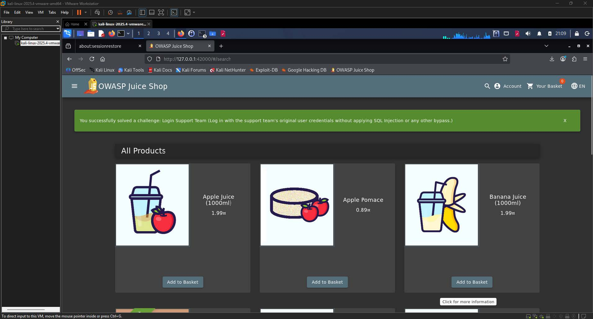

# Login Support Team Write-up

| Challenge Name | Login Support Team  |
| :---- | :---- |
| Category | Broken Authentication  |
| Difficulty | 6-Star |
| OWASP Top 10 | A07:2021 \- Identification and Authentication Failures  |
| Secondary OWASP | A02:2021 \- Cryptographic Failures  |
| CWE | CWE-522: Insufficiently Protected Credentials  |
| CVSS v3.1 Vector | AV:N/AC:H/PR:N/UI:N/S:U/C:H/I:L/A:N  |
| CVSS v3.1 Score | 6.5 (Medium)  |
| Environment | OWASP Juice Shop, localhost:42000 |
| Date Completed | 2026-05-08  |
| Author | [Kean Louis R. Rosales](http://keanrosales.com) |

## 1\. Executive Summary

OWASP Juice Shop exposes a KeePass database file (`incident-support.kdbx`) through an unauthenticated FTP directory, allowing any network-accessible attacker to retrieve and attempt to crack the master password that protects stored application credentials. By extracting the hash of the KeePass database and running a custom wordlist attack using John the Ripper, an attacker can recover the master password and obtain the plaintext credentials of the support team account. No elevated privileges or authentication are required to download the database file. This finding is classified under A07:2021 \- Identification and Authentication Failures because the application stores sensitive credentials in a publicly accessible location and relies on a weak, dictionary-guessable master password as the sole layer of protection. 

## 2\. Technical Background

### 2.1 Application Architecture

OWASP Juice Shop is a deliberately vulnerable Node.js web application built on an Express backend with an Angular frontend. The application exposes an FTP directory at port 42000 that is accessible without authentication, and which is intended to simulate a misconfigured file server. The KeePass database file (`incident-support.kdbx`) resides in this FTP directory and stores credentials for application accounts, including the support team email and password. KeePass is an open-source password manager that encrypts stored credentials behind a single master password, serialized into the `.kdbx` binary format. The application's frontend JavaScript bundle (`main.js`) is also reachable via the browser's developer tools and contains compiled source code that includes validation logic, including a password policy regex for the support account. 

### 2.2 Vulnerability Class

CWE-522 (Insufficiently Protected Credentials) applies here because the application stores a credential database in a location that is reachable by unauthenticated users, and the master password protecting that database does not meet a sufficient strength threshold to resist a targeted dictionary attack. The expected secure behavior is that credential stores are kept on access-controlled, authenticated infrastructure and are protected by a high-entropy passphrase that cannot be feasibly guessed. The missing controls are: (1) access restrictions on the FTP directory, and (2) enforcement of a strong, non-guessable master password for the KeePass database. The combination of unauthenticated access to the `.kdbx` file and a weak master password reduces the attack to a straightforward offline cracking exercise that can be completed within seconds. 

## 3\. Reconnaissance and Discovery

### 3.1 Hypothesis

The FTP directory at `localhost:42000/ftp` was identified as a recurring source of sensitive files in prior challenges against the same application. Given that password managers are a common enterprise solution for storing shared service credentials, it was reasonable to hypothesize that a `.kdbx` file in this directory would contain application account credentials. Furthermore, because the application compiles its Angular source into a single `main.js` bundle that is served to the browser, any client-side validation logic, including password policy constraints, would be recoverable through browser developer tools and could be used to narrow the search space for a brute-force attack. 

### 3.2 Discovery Method

Tool(s) used: Firefox browser, browser DevTools (Sources panel), KeePass2, John the Ripper, Python 3, `keepass2john`

Target component: FTP directory at `http://localhost:42000/ftp`, file `incident-support.kdbx`, and `main.js` served by the Juice Shop frontend

Steps performed:

1. Navigated to `http://localhost:42000/ftp` and identified the file `incident-support.kdbx` alongside other files in the FTP listing.

  
**Image 1.1:** FTP directory listing at `localhost:42000/ftp` showing `incident-support.kdbx` 

2. Downloaded `incident-support.kdbx` to the local machine.  
3. Attempted to open the file with a text editor (Mousepad) to inspect its contents, which failed because the file is a binary KeePass database.  
4. Installed KeePass2 and opened the `.kdbx` file, which prompted for a master password with no other clues available locally.

  
**Image 1.2:** KeePass master password prompt after opening `incident-support.kdbx` 

5. Returned to the FTP directory and attempted to download `encrypt.pyc` using a poison null byte (`%2500`) bypass to access restricted file extensions, which revealed a Python bytecode file that did not yield the master password.  
6. Opened browser DevTools on the Juice Shop frontend, navigated to the Sources panel, and searched `main.js` for the keyword `support`.

  
**Image 1.3:** Browser DevTools Sources panel showing the regex pattern extracted from `main.js` 

7. Located a password validation regex adjacent to `newPasswordControl.value.match`, confirming the password policy applied to the support account.

Finding: The `main.js` bundle exposed the full password validation regex, revealing that the support account password must follow a specific, constrained pattern that narrows the keyspace sufficiently for a targeted wordlist attack.

## 4\. Exploitation

### 4.1 Prerequisites

| Requirement | Detail |
| :---- | :---- |
| Authentication | None (FTP directory is unauthenticated)  |
| Special Tools | KeePass2, John the Ripper, `keepass2john`, Python 3  |
| Network Access | Local (localhost) or Remote if FTP is externally exposed  |
| Permissions | None |

### 4.2 Attack Chain

1. Retrieve the database \- Download `incident-support.kdbx` from `http://localhost:42000/ftp`.  
2. Extract the password policy \- Search `main.js` in browser DevTools for the keyword `support` and recover the regex: `(?=.*[a-z])(?=.*[A-Z])(?=.*\d)(?=.*[@$!%*?&])[A-Za-z\d@$!%*?&]{12,30}`.  
3. Generate a targeted wordlist \- Use a Python script to produce candidate passwords conforming to the recovered regex, combining Juice Shop-relevant keywords, capitalization patterns, years (2018-2023), and allowed special characters.  
4. Convert the database to a crackable hash \- Run `keepass2john incident-support.kdbx > keepasshash.txt` to extract the hash in a format John the Ripper can process.  
5. Crack the hash \- Run `john --wordlist=custom_wordlist.txt keepasshash.txt` to attempt the wordlist attack.  
6. Open the database \- Use the recovered master password (`Support2022!`) to open `incident-support.kdbx` in KeePass2.  
7. Retrieve stored credentials \- Navigate to the `prod` entry in the `incident-support` group to obtain the support team email and password.  
8. Authenticate to Juice Shop \- Log in at `http://127.0.0.1:42000` using `support@juice-sh.op` and the recovered password.

### 4.3 Evidence — Payload / Request

Regex Recovered from `main.js`:

```html
!this.newPasswordControl.value.match(/(?=.*[a-z])(?=.*[A-Z])(?=.*\d)(?=.*[@$!%*?&])[A-Za-z\d@$!%*?&]{12,30}/)
```

The regex enforces the following constraints on the support account password:

* At least one lowercase letter (`[a-z]`)  
* At least one uppercase letter (`[A-Z]`)  
* At least one digit (`\d`)  
* At least one special character from `[@$!%*?&]`  
* Only characters from `[A-Za-z\d@$!%*?&]` are permitted  
* Length between 12 and 30 characters

Python wordlist generation script:

```py
import itertools
import string

# All allowed characters from the regex
lowercase = string.ascii_lowercase        # a-z
uppercase = string.ascii_uppercase        # A-Z
digits = string.digits                    # 0-9
special = "@$!%*?&"                       # only these are allowed

# Word components - more variety
words = [
    "support", "password", "admin", "welcome", "juice",
    "shop", "helpdesk", "service", "manager", "secure",
    "login", "access", "user", "team", "desk",
    "help", "staff", "internal", "corporate", "system"
]

years = [str(y) for y in range(2018, 2024)]
numbers = [str(n) for n in range(0, 100)]

def meets_regex(password):
    """Check if password satisfies all regex requirements"""
    if not (12 <= len(password) <= 30):
        return False
    if not any(c in lowercase for c in password):
        return False
    if not any(c in uppercase for c in password):
        return False
    if not any(c in digits for c in password):
        return False
    if not any(c in special for c in password):
        return False
    # Check only allowed characters are used
    allowed = set(lowercase + uppercase + digits + special)
    if not all(c in allowed for c in password):
        return False
    return True

candidates = set()

# Pattern 1: Word variations with years and specials
for word in words:
    for year in years:
        for s in special:
            variations = [
                word.capitalize() + year + s,       
                word.capitalize() + s + year,        
                s + word.capitalize() + year,        
                word.upper() + year + s,            
                word.capitalize() + year[:2] + s,   
                word + year + s.upper(),             
            ]
            for v in variations:
                if meets_regex(v):
                    candidates.add(v)

# Pattern 2: Word + number combos (not just years)
for word in words:
    for num in numbers:
        for s in special:
            variations = [
                word.capitalize() + num + s,
                word.capitalize() + s + num,
                word.upper() + num + s,
            ]
            for v in variations:
                if meets_regex(v):
                    candidates.add(v)

# Pattern 3: Two words combined
for word1 in words:
    for word2 in words:
        if word1 == word2:
            continue
        for s in special:
            for num in ["1", "2", "123", "12"]:
                combo = word1.capitalize() + word2.capitalize() + num + s
                if meets_regex(combo):
                    candidates.add(combo)

# Write to file
with open("custom_wordlist.txt", "w") as f:
    for password in sorted(candidates):
        f.write(password + "\n")

print(f"Generated {len(candidates)} candidate passwords")
```

John the Ripper command:

```shell
john --wordlist=custom_wordlist.txt keepasshash.txt
```

Recovered credentials from KeePass database:

```
Master Password : Support2022!
Account Email   : support@juice-sh.op
Account Password: J6aVjTgOpRs@?5l!Zkq2AYnCE@RF$P
```

4.4 Proof of Exploitation

John the Ripper successfully recovered the master password `Support2022!` from the KeePass hash, and the credentials stored within the database were used to authenticate to the Juice Shop application as the support team user, triggering the challenge success banner: "You successfully solved a challenge: Login Support Team (Log in with the support team's original user credentials without applying SQL Injection or any other bypass)." 

  
**Image 1.4:** John the Ripper terminal output showing `Support2022!` recovered for the `incident-support` hash

  
**Image 1.5:** KeePass2 database open showing the `prod` entry containing `support@juice-sh.op`   
    
**Image 1.6:** Juice Shop frontend displaying the green challenge success banner after authenticating as `support@juice-sh.op`. 

## 5\. Root Cause Analysis

The root cause is the combination of an unauthenticated FTP directory that exposes a sensitive credential database and a master password that, while syntactically compliant with the application's own password policy, is semantically weak enough to be recovered through a targeted dictionary attack. This violates the Principle of Defense in Depth, as well as the Principle of Least Privilege, because the credential store is reachable by any user without any form of identity verification.

Contributing factors:

1. The FTP directory at port 42000 does not require authentication, making any file stored within it publicly accessible to anyone with network access to the host.  
2. The KeePass master password (`Support2022!`) follows a predictable pattern (capitalized common word, four-digit year, single special character) that is trivially enumerated once the password policy is known.  
3. The password validation regex embedded in `main.js` is served to every client, inadvertently providing an attacker with the exact constraints needed to build a targeted and efficient wordlist.  
4. No secondary authentication factor (e.g., a KeePass key file) was configured on the database, meaning the master password alone is the only barrier to accessing all stored credentials.  
5. The application stores plaintext credentials for a privileged account (the support team) in a single file, creating a single point of failure that results in full account compromise upon cracking.

## 6\. Impact Assessment

| Dimension | Rating | Justification |
| :---- | :---- | :---- |
| Confidentiality | High | The attack recovers the plaintext password of the support team account, which holds privileged access within the application.  |
| Integrity | Low | An attacker authenticated as the support user can manipulate application data within the bounds of that account's permissions.  |
| Availability | None | The attack does not disrupt application availability; all services remain operational.  |
| Privilege Required | None | The FTP directory and the frontend JavaScript bundle are accessible without any authentication.  |
| User Interaction | None | The attack is fully self-contained and requires no action from any other user or victim.  |
| Scope | Unchanged | The impact is confined to the Juice Shop application and does not extend to adjacent systems.  |

### 6.1 Business Impact

An attacker who completes this attack chain gains authenticated access to the Juice Shop application as the support team user, a role that typically carries elevated trust and potentially broader read or write permissions than a standard customer account. In a real-world analogy, this is equivalent to an external party obtaining the credentials of an internal help desk account, which could be used to access support tickets, customer records, internal communications, or administrative functions depending on the scope of that role. The business risk is compounded by the fact that the credential database was stored in an unauthenticated, internet-accessible location, meaning no insider access or social engineering was required. The financial and reputational consequences of a support account compromise include unauthorized access to customer data, potential regulatory liability under data protection frameworks, and erosion of customer trust. 

## 7\. Remediation

### 7.1 Short-Term \- Remove the Credential Database from the FTP Directory (Immediate) 

The most immediate risk reduction is to remove `incident-support.kdbx` from the publicly accessible FTP directory. Until the FTP directory is properly access-controlled, no sensitive files should reside within it. 

```shell
# Remove the exposed database from the public FTP root
rm /path/to/ftp/incident-support.kdbx

# Verify no other sensitive files remain
ls -la /path/to/ftp/
```

Additionally, the master password should be rotated immediately and replaced with a high-entropy passphrase that is not based on predictable word-year-symbol patterns. 

### 7.2 Long-Term \- Enforce Authentication on the FTP Directory and Apply Defense in Depth to the Credential Store (Recommended) 

The architecturally correct fix is to require authentication before any file in the FTP directory can be accessed, and to enforce additional protections on the KeePass database itself. This approach removes the unauthenticated access vector entirely and ensures that even if a credential database were inadvertently placed in a shared location, it would require multiple independent factors to open.

```shell
# Example: Restrict FTP directory access in Express (Node.js)
app.use('/ftp', requireAuthentication, express.static(ftpRoot));

# KeePass: Configure a composite master key (password + key file)
# Store the key file on a separate, access-controlled system
# Never store both the .kdbx file and its key file in the same location
```

Furthermore, the password validation regex in `main.js` should be moved entirely to server-side validation. Client-side regex is useful for user experience but must never be relied upon for security, and its presence in the compiled JavaScript bundle leaks implementation details that reduce the effective keyspace of the password.

```javascript
// Server-side password validation (Node.js example)
function validatePasswordPolicy(password) {
  const policy = /(?=.*[a-z])(?=.*[A-Z])(?=.*\d)(?=.*[@$!%*?&])[A-Za-z\d@$!%*?&]{12,30}/;
  return policy.test(password);
}
// Never expose this regex in client-side bundle output
```

### 

### 7.3 Remediation Priority

| Action | Effort | Priority |
| :---- | :---- | :---- |
| Remove credential database from FTP directory  | Low | Critical |
| Rotate the KeePass master password to a high-entropy passphrase  | Low | Critical |
| Enforce authentication on the FTP directory  | Medium | High |
| Configure a KeePass composite key (password \+ key file)  | Low | High |
| Move password policy validation to server-side only  | Medium | Medium |
| Audit FTP directory for other sensitive files  | Low | Medium |

## 8\. References

All the references must use IEEE format   
Sample:

\[1\] OWASP Foundation, "A07:2021 \- Identification and Authentication Failures," OWASP Top 10, 2021\. \[Online\]. Available: [https://owasp.org/Top10/A07\_2021-Identification\_and\_Authentication\_Failures/](https://owasp.org/Top10/A07_2021-Identification_and_Authentication_Failures/). \[Accessed: May 8, 2026\].

\[2\] OWASP Foundation, "A02:2021 \- Cryptographic Failures," OWASP Top 10, 2021\. \[Online\]. Available: [https://owasp.org/Top10/A02\_2021-Cryptographic\_Failures/](https://owasp.org/Top10/A02_2021-Cryptographic_Failures/). \[Accessed: May 8, 2026\].

\[3\] MITRE Corporation, "CWE-522: Insufficiently Protected Credentials," Common Weakness Enumeration, 2023\. \[Online\]. Available: [https://cwe.mitre.org/data/definitions/522.html](https://cwe.mitre.org/data/definitions/522.html). \[Accessed: May 8, 2026\].

\[4\] OWASP Foundation, "OWASP Application Security Verification Standard 4.0 \- V2: Authentication Verification Requirements," OWASP ASVS, 2019\. \[Online\]. Available: [https://owasp.org/www-project-application-security-verification-standard/](https://owasp.org/www-project-application-security-verification-standard/). \[Accessed: May 8, 2026\].

\[5\] Dominik Reichl, "KeePass Password Safe," KeePass, 2024\. \[Online\]. Available: [https://keepass.info/](https://keepass.info/). \[Accessed: May 8, 2026\].

\[6\] Openwall, "John the Ripper Password Cracker," Openwall, 2024\. \[Online\]. Available: [https://www.openwall.com/john/](https://www.openwall.com/john/). \[Accessed: May 8, 2026\].

\[7\] NIST, "SP 800-63B: Digital Identity Guidelines \- Authentication and Lifecycle Management," National Institute of Standards and Technology, 2017\. \[Online\]. Available: [https://pages.nist.gov/800-63-3/sp800-63b.html](https://pages.nist.gov/800-63-3/sp800-63b.html). \[Accessed: May 8, 2026\].

## Appendix 

### A. CVSS v3.1 Score Calculation

The CVSS v3.1 vector for this finding is `AV:N/AC:H/PR:N/UI:N/S:U/C:H/I:L/A:N`, which produces a Base Score of 6.5 (Medium). Each metric is justified as follows.

Attack Vector (AV): Network \- The FTP directory and the Juice Shop frontend are accessed entirely over HTTP/FTP through a standard web browser. No physical access, local network positioning, or adjacent network segment is required. Any network-reachable deployment of the application is vulnerable, so Network is the correct value.

Attack Complexity (AC): High \- While downloading the `.kdbx` file and running John the Ripper are individually straightforward, the full attack chain requires the attacker to: (1) identify and extract the relevant password policy from a minified JavaScript bundle, (2) construct a domain-specific wordlist that contains the correct candidate, and (3) successfully convert the KeePass database to a crackable hash format. The outcome is not guaranteed without prior knowledge of the application's domain vocabulary and password structure, which elevates the complexity above Low.

Privileges Required (PR): None \- The FTP directory is entirely unauthenticated. The Juice Shop frontend is served publicly. No credentials of any kind are required at any point prior to cracking the master password, so None is the correct rating.

User Interaction (UI): None \- The attacker operates entirely independently throughout the attack chain. No victim user needs to click a link, visit a page, or perform any action for exploitation to succeed.

Scope (S): Unchanged \- The impact of this vulnerability is confined to the Juice Shop application itself. Gaining access as the support team user does not grant the attacker any influence over systems or components outside the application boundary.

Confidentiality Impact (C): High \- The attack recovers the full plaintext credentials of the support team account, including the email address and a complex password stored inside the KeePass database. Access to a support account represents a significant disclosure of privileged authentication material, justifying a High rating.

Integrity Impact (I): Low \- Once authenticated as the support user, an attacker can modify application data within the scope of that account's permissions. However, the support role does not provide administrative write access to all application data, so the integrity impact is bounded and rated Low rather than High.

Availability Impact (A): None \- The attack does not degrade, interrupt, or deny the availability of any application component. All services remain fully accessible throughout and after exploitation.

The Exploitability sub-score is moderated downward by the High attack complexity despite the favorable Network vector, no privilege requirement, and no user interaction requirement. The Impact sub-score is driven primarily by the High confidentiality impact, partially offset by the Low integrity impact and no availability impact, within the Unchanged scope. The resulting composite Base Score of 6.5 places this finding in the Medium severity band under the CVSS v3.1 qualitative severity rating scale, which defines Medium as scores in the range 4.0 to 6.9.

### B. Tool Output

John the Ripper session output:

```shell
Using default input encoding: UTF-8
Loaded 1 password hash (KeePass [SHA256 AES 32/64])
Cost 1 (iteration count) is 1 for all loaded hashes
Cost 2 (version) is 2 for all loaded hashes
Cost 3 (algorithm [0=AES 1=TwoFish 2=ChaCha]) is 0 for all loaded hashes
Will run 4 OpenMP threads
Press 'q' or Ctrl-C to abort, almost any other key for status
1g 0:00:00:00 DONE (2026-05-07 21:07) 50.00g/s 472000p/s 472000C/s Support2020!..Support2022$
Support2022!     (incident-support)
Use the "--show" option to display all of the cracked passwords reliably
Session completed.
```

