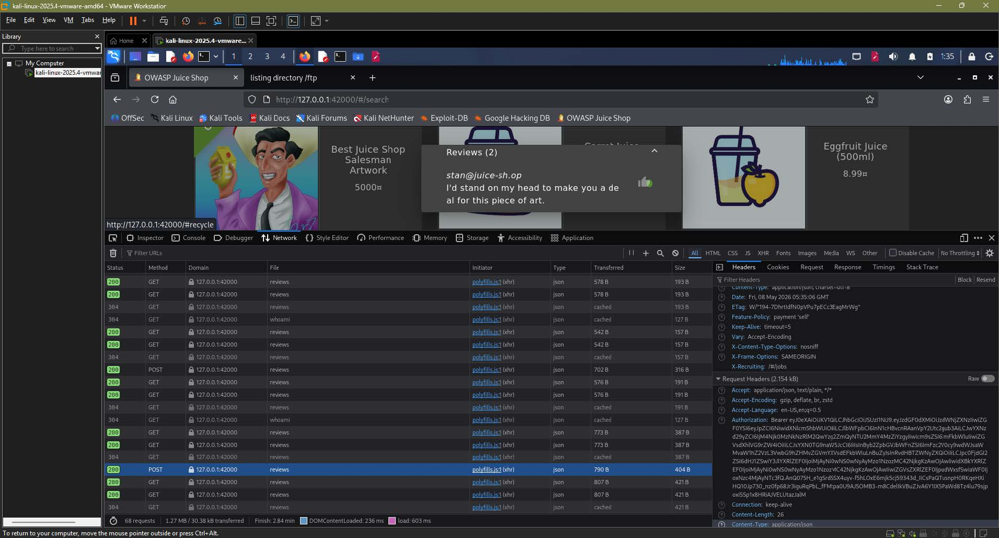
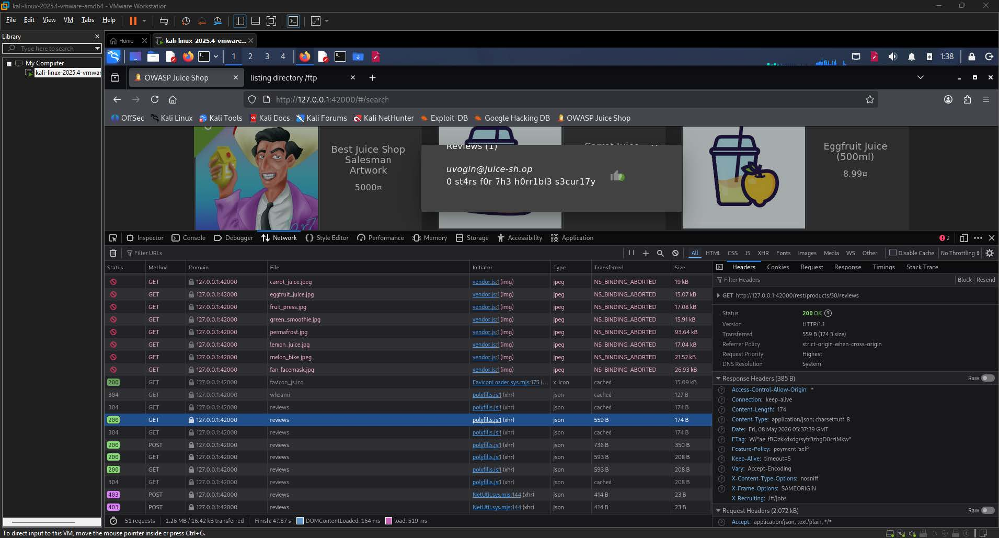
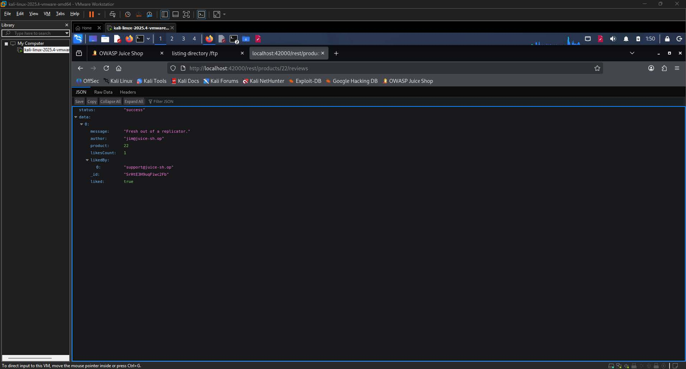
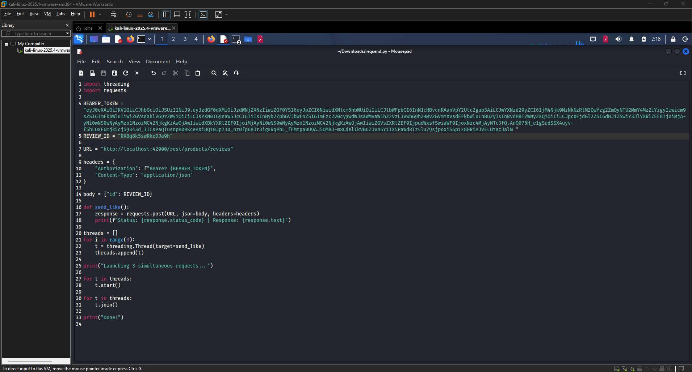
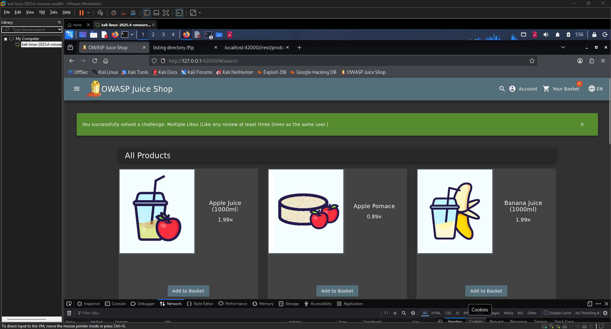

# Multiple Likes Write-up

| Challenge Name | Multiple Likes |
| :---- | :---- |
| Category | Race Condition / Improper Rate Limiting  |
| Difficulty | 6-Star |
| OWASP Top 10 | A04:2021 \- Insecure Design  |
| Secondary OWASP | A01:2021 \- Broken Access Control  |
| CWE | CWE-362: Concurrent Execution Using Shared Resource with Improper Synchronization (Race Condition)  |
| CVSS v3.1 Vector | AV:N/AC:H/PR:L/UI:N/S:U/C:N/I:L/A:N  |
| CVSS v3.1 Score | 3.1 (Low)  |
| Environment | OWASP Juice Shop, localhost:42000  |
| Date Completed | 2026-05-08  |
| Author | Kean Louis R. Rosales |

## 1\. Executive Summary

OWASP Juice Shop exposes its product review like endpoint to authenticated users who can abuse concurrent HTTP requests to bypass the server-side duplicate-like restriction. By launching multiple simultaneous POST requests to the `/rest/products/reviews` endpoint within the same race window, an authenticated attacker can register more than one like on the same review under a single user account. No elevated privileges or special tooling beyond a scripting environment and a valid session token are required. This finding is classified under CWE-362 and OWASP A04:2021 \- Insecure Design because the application enforces the uniqueness constraint only at the application layer without atomicity guarantees, allowing concurrent requests to pass the check before any single one has committed its result. 

## 2\. Technical Background

### 2.1 Application Architecture

OWASP Juice Shop is a deliberately vulnerable web application built on Node.js and Express, backed by an SQLite database and a NeDB document store for certain features including product reviews. The review like feature is exposed through a REST endpoint that accepts POST requests to `/rest/products/reviews`, where the request body carries the review identifier and the Authorization header carries a JWT bearer token identifying the acting user. Under normal operation, the application is expected to record that a given user has already liked a review and reject any subsequent like attempt from the same account with a 403 response. The vulnerability arises because the check-then-act sequence, which reads the current liked-by list and then writes an updated version, is not executed as an atomic database transaction, leaving a window during which concurrent requests can each pass the read check before any single write has completed. 

### 2.2 Vulnerability Class

CWE-362 describes a condition in which multiple threads or processes share a resource and the program does not adequately synchronize access, allowing the state of the resource to be modified in an unintended way between the time a check is performed and the time the corresponding action is taken. This is classically referred to as a Time-of-Check to Time-of-Use (TOCTOU) flaw. In this instance, the expected secure behavior is that the server atomically verifies uniqueness and records the like in a single indivisible operation so that no two concurrent requests from the same user can both succeed. The missing control is transactional atomicity or a mutex around the read-modify-write cycle on the review document. The absence of that control allows each of the simultaneously dispatched requests to read the pre-update state of the liked-by array, independently conclude that the user has not yet liked the review, and proceed to write, thereby incrementing the like count multiple times for one user account. 

## 3\. Reconnaissance and Discovery

### 3.1 Hypothesis

The challenge description requires liking a review at least three times as the same user, which is explicitly prohibited by the normal application flow. Because the application enforces this restriction at the server side on a per-request basis, the most plausible mechanism for circumventing it is a race condition: if multiple requests are dispatched simultaneously, they may each complete their uniqueness check before any single one has finished writing its result, causing all of them to be accepted. This hypothesis is consistent with a TOCTOU pattern commonly observed in web applications that perform sequential read-then-write operations without transactional guarantees. 

### 3.2 Discovery Method

Tools used: Firefox Developer Tools (Network tab), Python 3 (`threading`, `requests` modules), browser address bar for JSON inspection

Target component: `POST /rest/products/reviews` endpoint; `GET /rest/products/{id}/reviews` endpoint for review enumeration

Steps performed:

1. Opened the Juice Shop application at `localhost:42000` and navigated to a product that had at least one existing review, then opened the browser Developer Tools and switched to the Network tab.  
2. Clicked the like button on a review to capture a legitimate POST request to `/rest/products/reviews`, and recorded the full request structure including the Authorization header and the JSON request body containing the review ID field.

  
**Image 1.1:** The capture POST request in the Network tab

3. Attempted to resend the same POST request twice using the browser's resend function; the server returned HTTP 403 with the body `{"error":"Not allowed"}` on the second attempt, confirming that a per-user duplicate check was in place.

  
**Image 1.2:** 403 response after attempting to resend the same request twice 

4. Inspected the request tab of the captured POST to extract the review ID (`NEp7nRX9mMePKnp8j`) and the full JWT bearer token associated with the authenticated session.  
5. Navigated directly to `localhost:42000/rest/products/{id}/reviews` in the browser address bar for several product IDs to enumerate review documents in JSON format and identify a review that the current user had not yet liked, eventually finding review ID `RXBq8k5swRkeDJa9h` under product 38\.

  
**Image 1.3:** JSON view of `localhost:42000/rest/products/38/reviews` with the target review ID

Finding: The server enforces the duplicate-like restriction through a sequential read-then-write operation that is not atomic, meaning that simultaneous requests dispatched within the same time window can each pass the uniqueness check before any single one has committed its update. 

## 4\. Exploitation

### 4.1 Prerequisites

| Requirement | Detail |
| :---- | :---- |
| Authentication | User-level  |
| Special Tools | Python 3 with `threading` and `requests` modules  |
| Network Access | Local |
| Permissions | None |

### 4.2 Attack Chain

1. Authenticate \-- Log in to the Juice Shop application and capture a valid JWT bearer token from any authenticated request via browser Developer Tools.  
2. Identify target review \-- Navigate to `GET /rest/products/{id}/reviews` for available product IDs to enumerate review documents in JSON format and select a review whose `likedBy` array does not include the current user's email address.  
3. Extract review ID \-- Copy the `_id` field of the target review from the JSON response.  
4. Craft concurrent requests \-- Write a Python script that creates three threads, each targeting `POST /rest/products/reviews` with the captured bearer token and review ID, and starts all threads within the same execution cycle to maximize temporal overlap.  
5. Execute the script \-- Run the script; all three requests are dispatched simultaneously, each passing the server's duplicate check before any write has committed, resulting in three successful 200 responses.  
6. Verify \-- Reload the Juice Shop application in the browser to observe the challenge completion banner and confirm the like count has been incremented beyond the allowed single-like limit.  
     
   


### 4.3 Evidence — Payload / Request

The following Python script was used to exploit the race condition. All three threads are started before any blocking join calls, ensuring maximum concurrency.

```py
import threading
import requests

BEARER_TOKEN = "eyJ0eXAiOiJKV1QiLCJhbGciOiJSUzI1NiJ9.<...truncated for brevity...>"

REVIEW_ID = "RXBq8k5swRkeDJa9h"
URL = "http://localhost:42000/rest/products/reviews"

headers = {
    "Authorization": f"Bearer {BEARER_TOKEN}",
    "Content-Type": "application/json"
}

body = {"id": REVIEW_ID}

def send_like():
    response = requests.post(URL, json=body, headers=headers)
    print(f"Status: {response.status_code} | Response: {response.text}")

threads = []
for i in range(3):
    t = threading.Thread(target=send_like)
    threads.append(t)

print("Launching 3 simultaneous requests...")
for t in threads:
    t.start()

for t in threads:
    t.join()

print("Done!")
```

  
**Image 1.4:** The script open in a text editor showing the full code

### 4.4 Proof of Exploitation

All three concurrent POST requests returned HTTP 200, and the review's `likesCount` field was incremented to 3 with the test user's email appearing multiple times in the `likedBy` array, demonstrating that the server processed all three requests as independent unique likes.   
  
**Image 1.5:** The Juice Shop browser window displaying the green challenge completion banner 

## 5\. Root Cause Analysis

The root cause is the absence of an atomic check-and-set operation on the review document's liked-by list within the NeDB document store used by Juice Shop. This violates the Principle of Secure by Default and the principle of atomicity in concurrent system design.

Contributing factors:

1. The application performs a read of the `likedBy` array and a subsequent write as two separate, non-transactional operations, creating a TOCTOU window that concurrent requests can exploit.  
2. No server-side mutex, lock, or database-level unique constraint is applied to the review like operation to serialize access from the same user.  
3. The application relies solely on an in-memory or document-level check rather than a database-enforced uniqueness constraint, which does not hold under concurrent load.  
4. No rate limiting or request throttling is applied to the POST endpoint, allowing an arbitrary number of requests to be dispatched in rapid succession without triggering a protective control.

## 6\. Impact Assessment

| Dimension | Rating | Justification |
| :---- | :---- | :---- |
| Confidentiality | None | The attack does not expose any user data, session information, or application secrets.  |
| Integrity | Low | An attacker can artificially inflate the like count on any review, corrupting the integrity of the review rating system.  |
| Availability | None | The attack does not degrade or disrupt the availability of the application or any of its components.  |
| Privilege Required | Low | A valid authenticated user session is required; no administrative or elevated role is needed.  |
| User Interaction | None | The attacker operates entirely independently and does not require any victim to take action.  |
| Scope | Unchanged | The impact is confined to the review like feature within the Juice Shop application boundary.  |

### 6.1 Business Impact

An attacker who successfully exploits this vulnerability can manipulate the perceived popularity or credibility of any product review by inflating its like count without genuine user engagement. In a production e-commerce context, this constitutes a form of review manipulation that directly undermines customer trust in the platform's rating system and could influence purchasing decisions based on fraudulent social proof. While the vulnerability does not expose sensitive data or enable account takeover, the reputational and commercial risk associated with a manipulable review system is non-trivial, particularly for platforms where reviews drive conversion rates. The low exploitation barrier, requiring only a valid session and a basic Python script, means that this attack could be automated at scale across many reviews simultaneously. 

## 7\. Remediation

The fastest risk reduction measure is to wrap the read-modify-write operation in a synchronous lock so that concurrent requests from the same user are serialized at the application layer before any database access occurs.

```javascript
// Pseudocode: apply a per-review mutex before processing a like
const reviewLocks = {};

function likeReview(reviewId, userId) {
    if (reviewLocks[reviewId]) {
        // Lock is held; reject or queue this request
        return res.status(429).json({ error: "Request conflict, try again." });
    }
    reviewLocks[reviewId] = true; // Acquire lock
    try {
        const review = db.getReview(reviewId);       // Read
        if (review.likedBy.includes(userId)) {
            return res.status(403).json({ error: "Not allowed" });
        }
        review.likedBy.push(userId);
        review.likesCount += 1;
        db.updateReview(reviewId, review);            // Write
    } finally {
        delete reviewLocks[reviewId];                 // Release lock
    }
}
```

This approach reduces the TOCTOU window but is not persistent across process restarts and does not scale across multiple application instances.

### 7.2 Long-Term \-- Atomic Upsert with Database-Level Uniqueness Constraint (Recommended) 

The architecturally correct fix is to enforce uniqueness at the database layer using an atomic upsert operation that fails if the user ID already exists in the liked-by set. This eliminates the TOCTOU window entirely regardless of concurrency level or application instance count.

```javascript
// Using MongoDB-style atomic $addToSet operator (or equivalent NeDB atomic update)
db.update(
    { _id: reviewId, likedBy: { $ne: userId } }, // Match only if not already liked
    {
        $addToSet: { likedBy: userId },           // Atomically add userId
        $inc: { likesCount: 1 }                   // Atomically increment count
    },
    {},
    function(err, numReplaced) {
        if (numReplaced === 0) {
            // No document was updated; user already liked this review
            return res.status(403).json({ error: "Not allowed" });
        }
        return res.status(200).json({ success: true });
    }
);
```

By conditioning the update on the absence of the user ID in the `likedBy` array within a single atomic operation, the database engine guarantees that only one concurrent request can succeed, making the race condition unexploitable by design.

### 7.3 Remediation Priority

| Action | Effort | Priority |
| :---- | :---- | :---- |
| Apply in-process mutex around the like read-write cycle  | Low | High |
| Replace sequential read-write with atomic database upsert  | Medium | Critical |
| Implement per-user rate limiting on the POST /rest/products/reviews endpoint  | Low | Medium |
| Add integration tests that assert concurrent like requests from the same user return exactly one success  | Medium | Medium |

## 8\. References

\[1\] OWASP Foundation, "A04:2021 \- Insecure Design," OWASP Top 10, 2021\. \[Online\]. Available: [https://owasp.org/Top10/A04\_2021-Insecure\_Design/](https://owasp.org/Top10/A04_2021-Insecure_Design/). \[Accessed: May 8, 2026\].

\[2\] OWASP Foundation, "A01:2021 \- Broken Access Control," OWASP Top 10, 2021\. \[Online\]. Available: [https://owasp.org/Top10/A01\_2021-Broken\_Access\_Control/](https://owasp.org/Top10/A01_2021-Broken_Access_Control/). \[Accessed: May 8, 2026\].

\[3\] MITRE Corporation, "CWE-362: Concurrent Execution Using Shared Resource with Improper Synchronization ('Race Condition')," Common Weakness Enumeration, 2023\. \[Online\]. Available: [https://cwe.mitre.org/data/definitions/362.html](https://cwe.mitre.org/data/definitions/362.html). \[Accessed: May 8, 2026\].

\[4\] OWASP Foundation, "OWASP Application Security Verification Standard 4.0 \-- V11: Business Logic Verification Requirements," OWASP ASVS, 2019\. \[Online\]. Available: [https://owasp.org/www-project-application-security-verification-standard/](https://owasp.org/www-project-application-security-verification-standard/). \[Accessed: May 8, 2026\].

\[5\] OWASP Foundation, "OWASP Juice Shop Project," GitHub, 2024\. \[Online\]. Available: [https://github.com/juice-shop/juice-shop](https://github.com/juice-shop/juice-shop). \[Accessed: May 8, 2026\].

\[6\] PortSwigger, "Race Conditions," Web Security Academy. \[Online\]. Available: [https://portswigger.net/web-security/race-conditions](https://portswigger.net/web-security/race-conditions). \[Accessed: May 8, 2026\].

## Appendix 

### A. CVSS v3.1 Score Calculation

The CVSS v3.1 vector for this finding is `AV:N/AC:H/PR:L/UI:N/S:U/C:N/I:L/A:N`, which produces a Base Score of 3.1 (Low). Each metric is justified as follows.

Attack Vector (AV): Network \-- The exploit is executed entirely over HTTP using standard Python libraries. The attacker does not require physical or local network access; any network-reachable deployment of the application would be vulnerable, making Network the appropriate value.

Attack Complexity (AC): High \-- Successful exploitation is not guaranteed on every attempt. The race condition depends on the simultaneous arrival of multiple requests within a narrow time window at the server's event loop. Timing is influenced by network latency, server load, and operating system thread scheduling, none of which the attacker controls deterministically. This temporal dependency satisfies the High complexity criteria, as the attacker cannot reliably reproduce success without favorable conditions.

Privileges Required (PR): Low \-- A valid authenticated user session is required to attach a bearer token to the POST request. No administrative or elevated role is needed at any point in the attack chain, so Low is the correct rating rather than None.

User Interaction (UI): None \-- The attacker operates entirely independently. No victim user is required to take any action for the exploit to succeed.

Scope (S): Unchanged \-- The impact of this vulnerability is confined entirely to the review like feature within the Juice Shop application. Exploiting the race condition does not grant the attacker influence over any adjacent system, component, or security authority outside the application boundary.

Confidentiality Impact (C): None \-- The attack does not expose any data. No user credentials, personal information, or application secrets are disclosed through this vulnerability vector.

Integrity Impact (I): Low \-- The attacker can artificially increment the like count on a product review beyond the intended single-like limit, corrupting the integrity of the review rating data. Because the impact is limited to a non-critical cosmetic feature and does not affect financial data, authentication state, or user records, the impact is rated Low rather than High.

Availability Impact (A): None \-- The attack does not degrade or interrupt the availability of the application or any of its components. All functionality remains accessible throughout and after exploitation.

The numerical score is derived by applying the CVSS v3.1 Base Score formula to the selected metric values. The Exploitability sub-score is moderated downward primarily by High attack complexity, despite the Network attack vector and absence of user interaction. The Impact sub-score is low due to no confidentiality or availability impact and only a Low integrity impact within an Unchanged scope. The resulting composite Base Score of 3.1 places this finding in the Low severity band under the CVSS v3.1 qualitative severity rating scale, which defines Low as scores in the range 0.1 to 3.9.

### D. Tool Output

```shell
Launching 3 simultaneous requests...
Status: 200 | Response: {"modified":1,"original":[...],"updated":[...]}
Status: 200 | Response: {"modified":1,"original":[...],"updated":[...]}
Status: 200 | Response: {"modified":1,"original":[...],"updated":[...]}
Done!
```

### 

