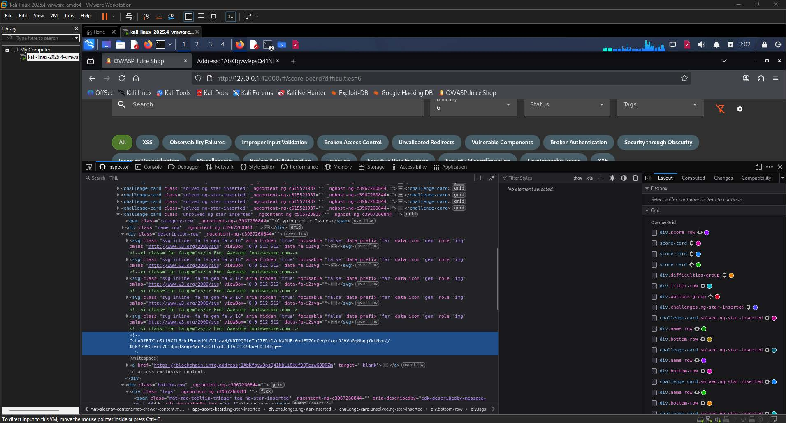
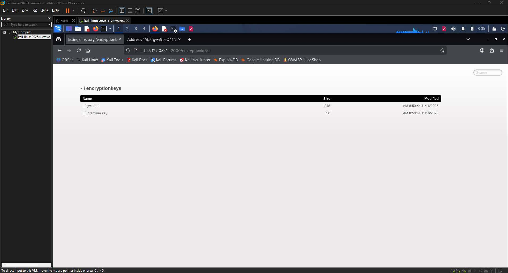
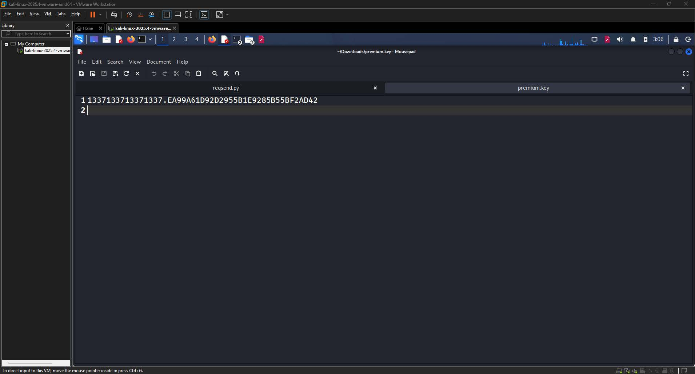
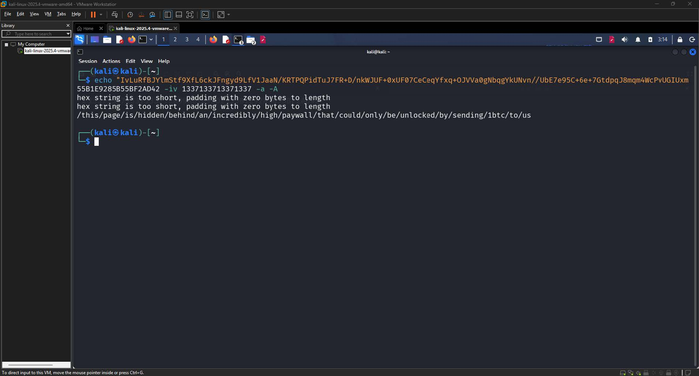
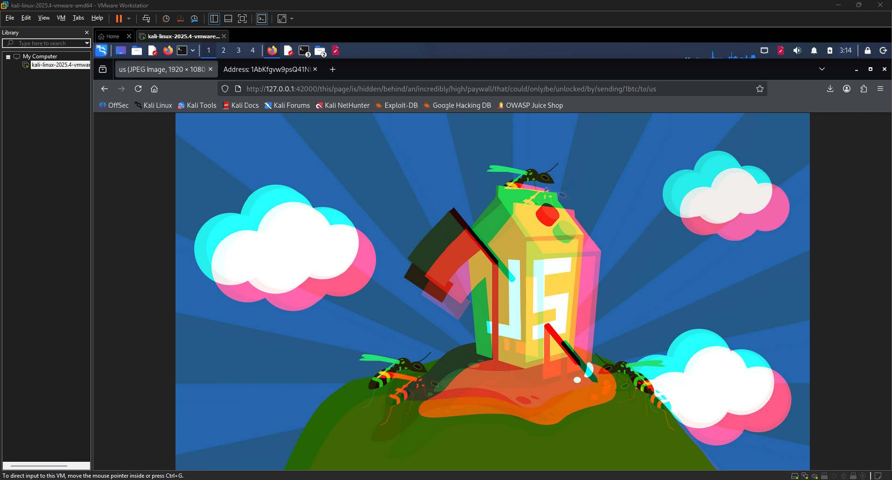
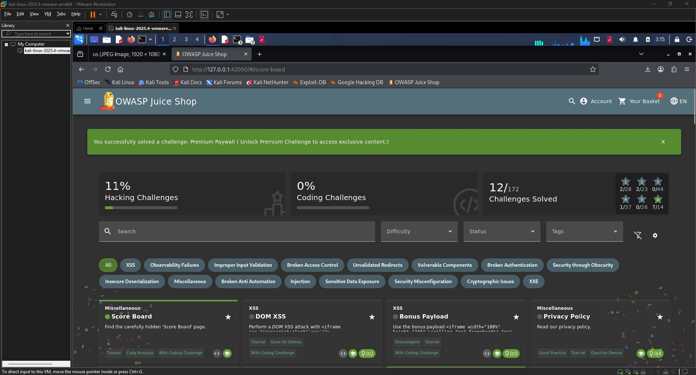

# Premium Paywall Write-up

| Challenge Name | Premium Paywall  |
| :---- | :---- |
| Category | Cryptographic Issues  |
| Difficulty | 6-Star |
| OWASP Top 10 | A02:2021 \- Cryptographic Failures  |
| Secondary OWASP | A05:2021 \- Security Misconfiguration  |
| CWE | CWE-321: Use of Hard-coded Cryptographic Key  |
| CVSS v3.1 Vector | AV:N/AC:L/PR:N/UI:N/S:U/C:H/I:N/A:N  |
| CVSS v3.1 Score | 7.5 (High)  |
| Environment | OWASP Juice Shop, localhost:42000 |
| Date Completed | 2026-05-08 |
| Author | [Kean Louis R. Rosales](https://keanrosales.com/Rosales,%20Kean%20Louis.pdf) |

## 1\. Executive Summary

OWASP Juice Shop exposes an AES-256-CBC encrypted data attribute within the frontend scoreboard component that is accessible to any unauthenticated user through browser Developer Tools. By locating a previously disclosed encryption key stored in a publicly accessible `/encryptionkeys` directory, an attacker is able to decrypt the ciphertext and reconstruct a hidden application route without any elevated privileges or special tools. This finding is classified under A02:2021 \- Cryptographic Failures because the confidentiality of the paywall route is entirely dependent on a symmetric key that is stored and served insecurely alongside the ciphertext it is meant to protect. 

## 2\. Technical Background

OWASP Juice Shop is a deliberately vulnerable Node.js web application built on an Angular frontend and an Express.js backend. The scoreboard page at `/#/score-board` renders challenge cards dynamically from client-side data, some of which contain embedded attributes that are not intended to be directly visible to users. One such attribute, associated with the Premium Paywall challenge, holds an AES-256-CBC encrypted string that encodes a hidden application route. The application additionally exposes a directory listing at `/encryptionkeys` which serves flat key files, including `premium.key`, to any client that navigates to that endpoint. Under normal intended use, the encrypted route would prevent casual users from reaching the premium content; however, because the decryption key is served from the same application with no access control, the encryption provides no meaningful security boundary. 

### 2.2 Vulnerability Class

CWE-321 describes the use of a hard-coded cryptographic key, wherein a key required to protect sensitive data is stored in a location discoverable by an attacker without authentication or special privileges. The expected secure behavior in this context would be for the encryption key to reside in a secrets management system or environment variable that is never exposed over the network. The missing control is server-side access restriction on the `/encryptionkeys` directory. Because that control is absent, an attacker who observes the encrypted attribute in the DOM can trivially obtain the corresponding key from the same host and perform offline decryption, rendering the encryption entirely ineffective. 

## 3\. Reconnaissance and Discovery

### 3.1 Hypothesis

During prior reconnaissance of the Juice Shop application, the `/encryptionkeys` directory was identified as an unauthenticated endpoint serving cryptographic material. The scoreboard was subsequently examined as a high-value target because it is known to contain challenge metadata that the application does not intend to expose directly. The combination of an accessible key store and a ciphertext embedded in the DOM created a reasonable hypothesis that the two artifacts were related and that the encrypted value could be decrypted using the available key material. 

### 3.2 Discovery Method

Tools used: Browser Developer Tools (Chrome Inspector), base64decode.org, OpenSSL (command-line)

Target component: Scoreboard challenge card DOM attribute for the Premium Paywall challenge; `/encryptionkeys/premium.key` endpoint

Steps performed:

1. Navigated to `http://127.0.0.1:42000/#/score-board` and located the Premium Paywall challenge card.  
2. Right-clicked the challenge card element and opened the Inspector panel to examine the underlying HTML attributes.  
3. Identified a long base64-encoded string embedded as a `data-*` attribute on the challenge card element. The trailing `==` padding characters were consistent with base64 encoding.

  
**Image 1.1:** Base64 ciphertext visible in the `data-*` attribute 

4. Copied the ciphertext and submitted it to base64decode.org to confirm it was not plaintext encoded but rather binary ciphertext that required a key for decryption.  
5. Recalled from prior reconnaissance that the application served files at `/encryptionkeys`. Navigated to `http://127.0.0.1:42000/encryptionkeys` and confirmed the directory listing exposed two files: `jwt.pub` and `premium.key`.

  
**Image 1.2:** directory listing with `jwt.pub` and `premium.key` visible 

6. Opened `premium.key` and observed its contents: `1337133713371337.EA99A61D92D2955B1E9285B55BF2AD42`.

  
**Image 1.3:** exact key material used for decryption 

Finding: The `premium.key` file contained a period-delimited pair of values that, upon inspection, corresponded to a 16-byte Initialization Vector (`1337133713371337`) and a 32-byte AES key (`EA99A61D92D2955B1E9285B55BF2AD42`), confirming that the ciphertext in the DOM was encrypted using AES-256-CBC with this key material.

## 4\. Exploitation

### 4.1 Prerequisites

| Requirement | Detail |
| :---- | :---- |
| Authentication | None |
| Special Tools | OpenSSL |
| Network Access | Local |
| Permissions | None |

### 4.2 Attack Chain

1. Inspect the DOM \- Open the scoreboard at `/#/score-board`, right-click the Premium Paywall challenge card, and use the browser Inspector to locate and copy the base64-encoded ciphertext from the challenge card's data attribute.  
2. Retrieve the encryption key \- Navigate to `http://127.0.0.1:42000/encryptionkeys/premium.key` and record the key file contents: `1337133713371337.EA99A61D92D2955B1E9285B55BF2AD42`.  
3. Identify the algorithm \- Recognize that the key file contains two components separated by a period. The first component (`1337133713371337`) is 16 hexadecimal characters, consistent with a 64-bit Initialization Vector. The second component (`EA99A61D92D2955B1E9285B55BF2AD42`) is 32 hexadecimal characters, consistent with a 128-bit hex representation of a 256-bit AES key. The presence of an IV indicates CBC mode, as ECB (Electronic Codebook) does not use an IV.  
4. Decrypt the ciphertext \- Execute the OpenSSL decryption command to recover the plaintext route.  
5. Access the hidden route \- Navigate to the decrypted URL path in the browser to confirm that the premium paywall content is now accessible, completing the challenge.  
     
   


### 4.3 Evidence — Payload / Request

The following OpenSSL command was executed in a Kali Linux terminal to decrypt the ciphertext:

```shell
echo "IvLuRfBJYlmStf9XfL6ckJFngyd9LfV1JaaN/KRTPQPidTuJ7FR+D/nkWJUF+0xUF07CeCeqYfxq+OJVVa0gNbqgYkUNvn//UbE7e95C+6e+7GtdpqJ8mqm4WcPvUGIUxmGLTTAC2+G9UuFCD1DUjg==" \
| openssl enc -d -aes-256-cbc \
  -K EA99A61D92D2955B1E9285B55BF2AD42 \
  -iv 1337133713371337 \
  -a -A
```

Parameter breakdown:

1. `-d` \- Decrypt mode  
2. `-aes-256-cbc` \- AES algorithm, 256-bit key length, CBC chaining mode  
3. `-K EA99A61D92D2955B1E9285B55BF2AD42` \- Hexadecimal representation of the 256-bit symmetric key  
4. `-iv 1337133713371337` \- Hexadecimal Initialization Vector  
5. `-a -A` \- Accepts base64-encoded input as a single line

Decrypted output:

```shell
/this/page/is/hidden/behind/an/incredibly/high/paywall/that/could/only/be/unlocked/by/sending/1btc/to/us
```

   
**Image 1.4:** Confirmation of the tool execution and produced output.

### 4.4 Proof of Exploitation

Navigating the browser to `http://127.0.0.1:42000/this/page/is/hidden/behind/an/incredibly/high/paywall/that/could/only/be/unlocked/by/sending/1btc/to/us` successfully rendered the premium paywall image and triggered the challenge success notification on the scoreboard.   
  
**Image 1.5:** [`http://127.0.0.1:42000/this/page/is/hidden/behind/an/incredibly/high/paywall/that/could/only/be/unlocked/by/sending/1btc/to/us`](http://127.0.0.1:42000/this/page/is/hidden/behind/an/incredibly/high/paywall/that/could/only/be/unlocked/by/sending/1btc/to/us)

  
**Image 1.6:** Juice Shop scoreboard showing the green success banner 

## 5\. Root Cause Analysis

The root cause is the absence of server-side access controls on the `/encryptionkeys` directory, which allows unauthenticated retrieval of the symmetric key used to protect the premium route. This violates the Principle of Defense in Depth and the Secure by Default principle, as the security of the paywall depends entirely on the secrecy of a key that is publicly served by the same application.

Contributing factors:

1. The `/encryptionkeys` endpoint has no authentication middleware, meaning any HTTP client can enumerate and retrieve key files without credentials.  
2. The symmetric key and the ciphertext it protects are both served from the same application and the same host, eliminating the separation that would be required to make key secrecy meaningful.  
3. The Initialization Vector is a static, patterned value (`1337133713371337`) rather than a cryptographically random value, which slightly reduces the effective security of the CBC scheme independent of the key exposure issue.  
4. The frontend embeds the encrypted route directly in the DOM as a data attribute, making the ciphertext trivially discoverable through standard browser tooling with no network interception required.

## 6\. Impact Assessment

| Dimension | Rating | Justification |
| :---- | :---- | :---- |
| Confidentiality | High | Any unauthenticated user can decrypt and access the hidden premium route, fully defeating the intended access restriction.  |
| Integrity | None | The vulnerability provides read access to a hidden route but does not enable modification of any application data.  |
| Availability | None | Exploitation does not degrade or interrupt application availability in any way.  |
| Privilege Required | None | No account, session token, or elevated role is required at any step of the attack chain.  |
| User Interaction | None | The attacker operates entirely independently without requiring any action from another user or administrator.  |
| Scope | Unchanged | The impact is confined to the Juice Shop application and does not extend to adjacent systems or security authorities.  |

### 6.1 Business Impact

An attacker who exploits this vulnerability gains unrestricted access to content that is explicitly designated as premium and intended to require payment or special authorization to access. In a production system modeled on this architecture, this would constitute a complete bypass of a revenue-generating access control, allowing any user to consume paid content at no cost. Beyond the direct financial impact, the public exposure of encryption keys from the same server also signals a broader key management failure, which could affect other protected assets within the same application if additional key files are present in the `/encryptionkeys` directory. 

## 7\. Remediation

The fastest risk reduction measure is to restrict all HTTP access to the `/encryptionkeys` directory by adding authentication middleware to that route. This prevents unauthenticated clients from retrieving key material even if the directory itself is retained for internal use.

```javascript
// Express.js middleware example - restrict /encryptionkeys to authenticated admin sessions
const requireAdminAuth = (req, res, next) => {
  if (!req.user || req.user.role !== 'admin') {
    return res.status(403).json({ error: 'Forbidden' });
  }
  next();
};

// Apply before the static file handler for /encryptionkeys
app.use('/encryptionkeys', requireAdminAuth, express.static('encryptionkeys'));
```

### 7.2 Long-Term \- Migrate to a Secrets Management System (Recommended) 

The architecturally correct fix is to remove cryptographic keys from the application filesystem entirely and store them in a dedicated secrets management system such as HashiCorp Vault, AWS Secrets Manager, or Azure Key Vault. The application retrieves keys at runtime through authenticated API calls, and keys are never written to disk or served over HTTP under any circumstances. This approach eliminates the entire class of vulnerability because there is no longer a file path that an attacker could request to obtain key material.

```javascript
// Example: retrieve key from AWS Secrets Manager at runtime
const { SecretsManagerClient, GetSecretValueCommand } = require('@aws-sdk/client-secrets-manager');

const client = new SecretsManagerClient({ region: 'us-east-1' });

const getPremiumKey = async () => {
  const response = await client.send(
    new GetSecretValueCommand({ SecretId: 'juiceshop/premiumKey' })
  );
  return JSON.parse(response.SecretString); // { key: '...', iv: '...' }
};
```

Additionally, the Initialization Vector should be generated randomly per encryption operation rather than using a static patterned value.

### 7.3 Remediation Priority

| Action | Effort | Priority |
| :---- | :---- | :---- |
| Restrict `/encryptionkeys` with authentication middleware  | Low | Critical |
| Restrict `/encryptionkeys` with authentication middleware  | Low | Critical |
| Migrate key storage to a secrets management system  | Medium | High |
| Replace static IV with cryptographically random IV per operation  | Low | Medium |

## 8\. References

\[1\] OWASP Foundation, "A02:2021 \- Cryptographic Failures," OWASP Top 10, 2021\. \[Online\]. Available: [https://owasp.org/Top10/A02\_2021-Cryptographic\_Failures/](https://owasp.org/Top10/A02_2021-Cryptographic_Failures/). \[Accessed: May 8, 2026\].

\[2\] MITRE Corporation, "CWE-321: Use of Hard-coded Cryptographic Key," Common Weakness Enumeration, 2023\. \[Online\]. Available: [https://cwe.mitre.org/data/definitions/321.html](https://cwe.mitre.org/data/definitions/321.html). \[Accessed: May 8, 2026\].

\[3\] MITRE Corporation, "CWE-330: Use of Insufficiently Random Values," Common Weakness Enumeration, 2023\. \[Online\]. Available: [https://cwe.mitre.org/data/definitions/330.html](https://cwe.mitre.org/data/definitions/330.html). \[Accessed: May 8, 2026\].

\[4\] OWASP Foundation, "OWASP Application Security Verification Standard 4.0 \- V6: Stored Cryptography Verification Requirements," OWASP ASVS, 2019\. \[Online\]. Available: [https://owasp.org/www-project-application-security-verification-standard/](https://owasp.org/www-project-application-security-verification-standard/). \[Accessed: May 8, 2026\].

\[5\] National Institute of Standards and Technology, "Recommendation for Block Cipher Modes of Operation: Methods and Techniques," NIST SP 800-38A, 2001\. \[Online\]. Available: [https://csrc.nist.gov/publications/detail/sp/800-38a/final](https://csrc.nist.gov/publications/detail/sp/800-38a/final). \[Accessed: May 8, 2026\].

## Appendix 

### A. CVSS v3.1 Score Calculation

The CVSS v3.1 vector for this finding is `AV:N/AC:L/PR:N/UI:N/S:U/C:H/I:N/A:N`, which produces a Base Score of 7.5 (High). Each metric is justified as follows.

Attack Vector (AV): Network \- The entire attack is conducted over HTTP using a standard web browser and terminal. The attacker does not require physical access, local network adjacency, or a VPN connection. Any network-reachable deployment of OWASP Juice Shop that retains the default `/encryptionkeys` directory would be exploitable remotely, making Network the appropriate value.

Attack Complexity (AC): Low \- No special conditions, race conditions, or configuration-specific states are required for exploitation to succeed. The encrypted attribute is consistently present in the DOM on every page load, the key file is consistently available at the same path, and the OpenSSL decryption command is deterministic. The attack can be reproduced reliably on every attempt, satisfying the Low complexity criteria.

Privileges Required (PR): None \- No user account, session cookie, or authentication token is required at any step of the attack chain. The scoreboard is accessible without login, and the `/encryptionkeys` directory has no authentication middleware. An anonymous HTTP client is sufficient to complete the full exploit.

User Interaction (UI): None \- The attacker operates entirely independently. No victim user, administrator, or other party needs to take any action for exploitation to succeed. The ciphertext is statically present in the DOM and the key is statically present on the server.

Scope (S): Unchanged \- The impact of this vulnerability is confined to the Juice Shop application itself. Decrypting the hidden route and accessing the premium content does not grant the attacker influence over any adjacent system, database, or security authority outside the application boundary.

Confidentiality Impact (C): High \- The vulnerability results in the complete disclosure of the premium route, which is the entirety of the secret that the encryption was designed to protect. There is no partial or residual confidentiality remaining once the decryption is performed. The protected asset, that being the hidden application route and its associated content, is fully exposed to any attacker who follows the steps described above.

Integrity Impact (I): None \- The attack is purely read-oriented. The attacker decrypts and accesses existing content but does not modify, delete, or inject any data within the application. No application state is altered by exploitation.

Availability Impact (A): None \- The attack does not degrade, interrupt, or deny the availability of the application or any of its components. All functionality remains accessible throughout and after exploitation.

The numerical score is derived by applying the CVSS v3.1 Base Score formula to the selected metric values. The Exploitability sub-score is maximized by the Network attack vector, Low complexity, no privilege requirement, and no user interaction requirement, all of which represent the least restrictive values in their respective metric categories. The Impact sub-score is driven entirely by the High confidentiality impact, with zero contribution from integrity or availability. The resulting composite Base Score of 7.5 places this finding in the High severity band under the CVSS v3.1 qualitative severity rating scale, which defines High as scores in the range 7.0 to 8.9.

### B. Tool Output

OpenSSL decryption command output:

```shell
hex string is too short, padding with zero bytes to length
hex string is too short, padding with zero bytes to length
/this/page/is/hidden/behind/an/incredibly/high/paywall/that/could/only/be/unlocked/by/sending/1btc/to/us
```

The two padding warnings are produced by OpenSSL because the provided IV (`1337133713371337`) is 16 hexadecimal characters (64 bits) whereas AES-CBC expects a 128-bit (32 hex character) IV. OpenSSL zero-pads the short IV to the required length. This behavior is consistent with the static, patterned IV design choice and does not prevent successful decryption.

