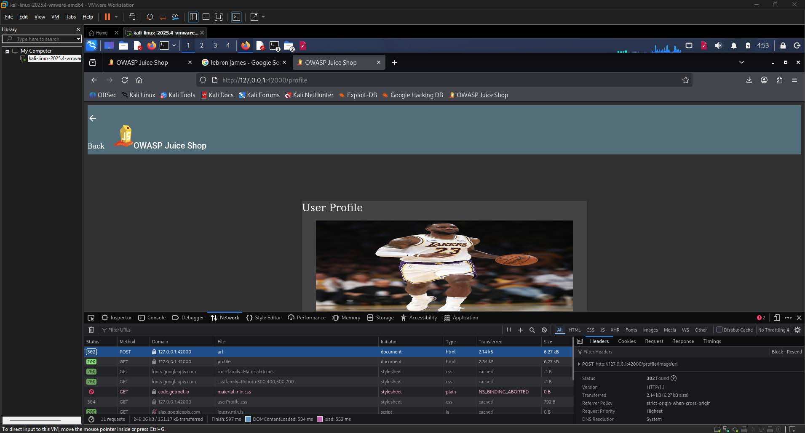
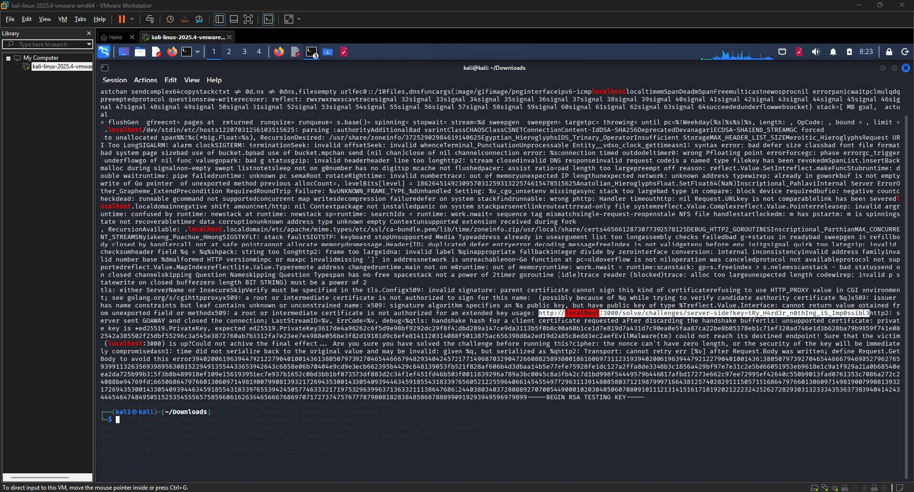
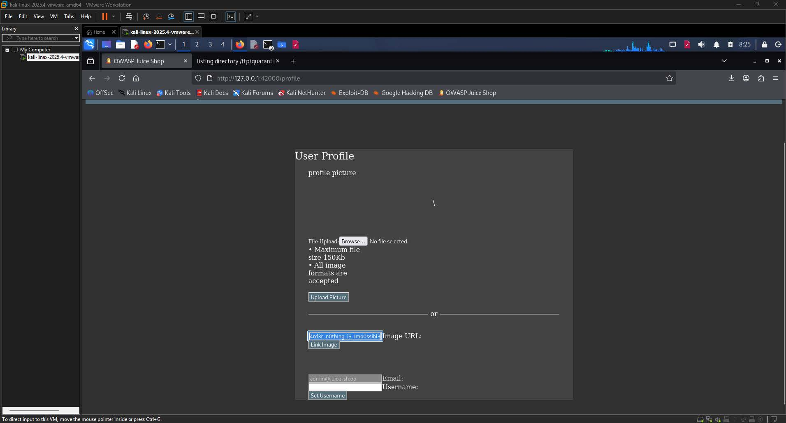
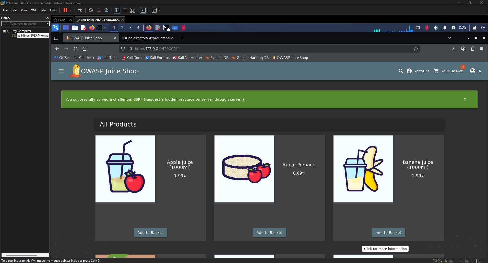

# SSRF Write-up

| Challenge Name | SSRF: Request a Hidden Resource on the Server Through the Server  |
| :---- | :---- |
| Category | Server-Side Request Forgery (SSRF)  |
| Difficulty | 6-Star |
| OWASP Top 10 | A10:2021 \- Server-Side Request Forgery  |
| Secondary OWASP | A05:2021 \- Security Misconfiguration  |
| CWE | CWE-918: Server-Side Request Forgery (SSRF)  |
| CVSS v3.1 Vector | AV:N/AC:L/PR:L/UI:N/S:C/C:L/I:L/A:N  |
| CVSS v3.1 Score | 6.4 (Medium)  |
| Environment | OWASP Juice Shop  |
| Date Completed | 2026-05-11 |
| Author | [Kean Louis R. Rosales](https://keanrosales.com/Rosales,%20Kean%20Louis.pdf) |

## 1\. Executive Summary

OWASP Juice Shop exposes its profile image URL input field to an untrusted server-side proxy mechanism that fetches remote resources on behalf of the user without adequate origin validation. By supplying an internal localhost URL as the image source, an attacker authenticated as a regular user can coerce the server into issuing HTTP requests to internal endpoints that are otherwise inaccessible from the outside. No elevated privileges or specialized tooling are required beyond a standard web browser. This finding is classified under A10:2021 \- Server-Side Request Forgery because the application's server acts as an unvalidated intermediary, enabling unauthorized access to internal network resources. 

## 2\. Technical Background

### 2.1 Application Architecture

OWASP Juice Shop is a deliberately vulnerable Node.js and Express-based web application used for security training. The profile page exposes an image URL input field that accepts an external URL, which the backend server then fetches and uses as the user's profile picture. This proxy behavior is implemented server-side, meaning all HTTP requests to retrieve the image are issued by the server rather than the client browser. Under normal operation, this feature is intended to allow users to link publicly accessible images hosted on external CDNs. However, because the server does not validate or restrict which hosts or IP ranges may be requested, it can be redirected to issue requests against internal services, including those bound to localhost that would otherwise be unreachable from an external client. 

### 2.2 Vulnerability Class

CWE-918 defines Server-Side Request Forgery as a condition in which a web application fetches a remote resource based on user-supplied input without validating the destination URL. The expected secure behavior is that the application should enforce an allowlist of permitted external domains or at minimum deny requests targeting loopback addresses, private IP ranges, and internal service endpoints. In this instance, no such restriction is present. The absence of origin validation means the server will faithfully forward any URL it receives, including those targeting internal challenge-solving endpoints such as `http://localhost:3000/solve/challenges/server-side`. The vulnerability arises because the control that should distinguish between legitimate external image hosts and malicious internal targets does not exist. 

## 3\. Reconnaissance and Discovery

### 3.1 Hypothesis

The investigation began with the observation that the profile page accepts a user-supplied URL for the purpose of setting a profile image. Any feature that accepts a URL and causes the server to make an outbound HTTP request is a candidate for SSRF. The key question was whether the server was retrieving the image directly or merely relaying the URL to the client. If the server was acting as the HTTP client, it would be possible to supply an internal address and have the server issue a request to it on the attacker's behalf. 

### 3.2 Discovery Method

Tool(s) used: Browser DevTools (Network tab), Kali Linux terminal (reverse engineering of `juicy_malware_linux_amd64`)

Target component: User Profile page image URL input field at `/profile`

Steps performed:

1. Navigated to the User Profile page at `http://127.0.0.1:42000/profile`.  
2. Supplied an external image URL (`https://cdn.britannica.com/19/233519-050-F0604A51/LeBron-James-Los-Angeles-Lakers-Staples-Center-2019.jpg`) into the Image URL field and submitted it.

  
**Image 1.1:** The Network tab in DevTools showing that no request was made to `cdn.britannica.com` 

3. Opened the browser DevTools Network tab and observed that no outbound request was made from the browser to `cdn.britannica.com`, confirming that the fetch was performed server-side.  
4. Analyzed the file `juicy_malware_linux_amd64` using reverse engineering techniques in the terminal, which exposed an internal challenge-solving URL embedded within the binary: [`http://localhost:3000/solve/challenges/server-side?key=tRy_H4rd3r_n0thIng_iS_Imp0ssibl3`](http://localhost:3000/solve/challenges/server-side?key=tRy_H4rd3r_n0thIng_iS_Imp0ssibl3).

    
**Image 1.2:** The terminal output showing the reverse engineering of `juicy_malware_linux_amd64` 

5. Adapted the URL to the local port in use: [`http://localhost:42000/solve/challenges/server-side?key=tRy_H4rd3r_n0thIng_iS_Imp0ssibl3`](http://localhost:42000/solve/challenges/server-side?key=tRy_H4rd3r_n0thIng_iS_Imp0ssibl3).

Finding: The absence of any browser-side request to Britannica confirmed the presence of a server-side proxy, and the reverse-engineered binary revealed the internal endpoint and key required to solve the challenge. 

## 4\. Exploitation

### 4.1 Prerequisites

| Requirement | Detail |
| :---- | :---- |
| Authentication | User  |
| Special Tools | None |
| Network Access | Local |
| Permissions | None |

### 4.2 Attack Chain

1. Authenticate \- Log in to the Juice Shop application with any valid user account.  
2. Navigate to Profile \- Access the User Profile page at `http://127.0.0.1:42000/profile`.  
3. Identify the Proxy \- Submit an external image URL and confirm via DevTools that no browser-side request is issued, establishing that the server acts as the HTTP client.  
4. Obtain the Internal Endpoint \- Reverse engineer `juicy_malware_linux_amd64` to extract the embedded internal challenge URL and its required query parameter key.  
5. Construct the Payload \- Adapt the URL to the local port in use: `http://localhost:42000/solve/challenges/server-side?key=tRy_H4rd3r_n0thIng_iS_Imp0ssibl3`.  
6. Inject via Image URL Field \- Paste the crafted URL into the Image URL input field on the profile page and submit it.  
7. Observe the Server Response \- The server fetches the internal URL on behalf of the attacker, triggering the challenge solution and redirecting to the Juice Shop home page with a success banner.

### 4.3 Evidence — Payload / Request

The following URL was submitted as the image source through the profile page Image URL field:

```shell
http://localhost:42000/solve/challenges/server-side?key=tRy_H4rd3r_n0thIng_iS_Imp0ssibl3
```

****  
**Image 1.3:** The profile page with the crafted payload visible inside the Image URL input field 

### 4.4 Proof of Exploitation

Submission of the payload caused the server to issue an internal HTTP GET request to the challenge-solving endpoint, which returned a success response and triggered the application to display a green notification banner reading: "You successfully solved a challenge: SSRF (Request a hidden resource on server through server)."   
****  
**Image 1.4:** The Juice Shop home page with the green success banner 

## 5\. Root Cause Analysis

The root cause is the absence of server-side URL validation on the profile image proxy endpoint. This violates the Principle of Least Privilege and the Secure by Default principle, as the server should only be permitted to communicate with explicitly trusted external hosts.

Contributing factors:

1. No allowlist of permitted external domains or IP ranges is enforced on the image URL input.  
2. No blocklist preventing requests to loopback addresses (`127.0.0.1`, `localhost`) or private IP ranges is implemented.  
3. The internal challenge-solving endpoint does not require any form of server-to-server authentication, meaning any client that can reach it can trigger actions.  
4. The inclusion of a sensitive internal URL and key within a publicly distributed binary (`juicy_malware_linux_amd64`) further lowered the barrier for an attacker to identify the target endpoint.

## 6\. Impact Assessment

| Dimension | Rating | Justification |
| :---- | :---- | :---- |
| Confidentiality | Low | An attacker can probe internal services and observe their responses, potentially exposing internal application structure, but no direct credential or data leakage was demonstrated in this instance.  |
| Integrity | Low | The attacker was able to trigger an internal state change by causing the server to issue an authenticated internal request, which constitutes a limited integrity impact.  |
| Availability | None | The attack does not degrade or interrupt any application functionality.  |
| Privilege Required | Low | A standard authenticated user session is sufficient to trigger the attack; no administrative access is needed.  |
| User Interaction | None | The attacker operates entirely independently and no victim user action is required.  |
| Scope | Unchanged | The vulnerability allows the attacker to influence resources and services outside the original application component, specifically internal endpoints on the same host that are not directly reachable by external clients.  |

### 6.1 Business Impact

An SSRF vulnerability in a production environment would allow an attacker to enumerate and interact with internal services, cloud metadata endpoints (such as AWS Instance Metadata Service at `169.254.169.254`), and backend APIs that are assumed to be inaccessible from the public internet. In a cloud-hosted deployment, this could expose infrastructure credentials, enabling lateral movement and privilege escalation well beyond the application layer. For the organization, this translates to a risk of internal network reconnaissance, sensitive data exposure, and potential full compromise of cloud infrastructure, all initiated through what appears to be a routine user profile feature.

## 7\. Remediation

### 7.1 Short-Term — Input Validation with Blocklist (Immediate) 

The fastest mitigation is to validate the user-supplied URL on the server before issuing the outbound request and reject any URL that resolves to a loopback address, private IP range, or internal hostname.

```javascript
const url = require('url');
const dns = require('dns').promises;

async function isSafeUrl(inputUrl) {
  const parsed = url.parse(inputUrl);
  const hostname = parsed.hostname;

  // Block loopback and localhost
  if (hostname === 'localhost' || hostname === '127.0.0.1' || hostname === '::1') {
    return false;
  }

  // Resolve hostname and check for private IP ranges
  const addresses = await dns.lookup(hostname, { all: true });
  for (const addr of addresses) {
    if (isPrivateIP(addr.address)) return false; // implement RFC 1918 check
  }

  return true;
}
```

This approach reduces immediate risk but is not comprehensive, as DNS rebinding attacks can bypass hostname-based checks.

### 7.2 Long-Term — Allowlist-Based Proxy with Egress Filtering (Recommended) 

The architecturally correct solution is to replace the blocklist approach with a strict allowlist that enumerates every external domain the proxy is permitted to contact. All other destinations should be denied by default. This should be combined with network-level egress filtering so that the application server is not permitted to make outbound connections to RFC 1918 addresses or the loopback interface at the infrastructure layer, independent of application-level controls.

```javascript
const ALLOWED_IMAGE_HOSTS = [
  'cdn.britannica.com',
  'gravatar.com',
  'i.imgur.com'
  // Add only trusted image CDNs
];

function isAllowedImageHost(inputUrl) {
  try {
    const { hostname } = new URL(inputUrl);
    return ALLOWED_IMAGE_HOSTS.includes(hostname);
  } catch {
    return false;
  }
}
```

### 7.3 Remediation Priority

| Action | Effort | Priority |
| :---- | :---- | :---- |
| Implement loopback/private IP blocklist  | Low | High |
| Enforce allowlist of permitted image hosts  | Low | Critical |
| Apply network-level egress filtering (firewall/security group rules)  | Medium | High |
| Remove sensitive internal URLs from distributed binaries  | Low | Critical |

## 8\. References

\[1\] OWASP Foundation, "A10:2021 \- Server-Side Request Forgery (SSRF)," OWASP Top 10, 2021\. \[Online\]. Available: [https://owasp.org/Top10/A10\_2021-Server-Side\_Request\_Forgery\_%28SSRF%29/](https://owasp.org/Top10/A10_2021-Server-Side_Request_Forgery_%28SSRF%29/). \[Accessed: May 11, 2025\].

\[2\] MITRE Corporation, "CWE-918: Server-Side Request Forgery (SSRF)," Common Weakness Enumeration, 2023\. \[Online\]. Available: [https://cwe.mitre.org/data/definitions/918.html](https://cwe.mitre.org/data/definitions/918.html). \[Accessed: May 11, 2025\].

\[3\] OWASP Foundation, "Server-Side Request Forgery Prevention Cheat Sheet," OWASP Cheat Sheet Series. \[Online\]. Available: [https://cheatsheetseries.owasp.org/cheatsheets/Server\_Side\_Request\_Forgery\_Prevention\_Cheat\_Sheet.html](https://cheatsheetseries.owasp.org/cheatsheets/Server_Side_Request_Forgery_Prevention_Cheat_Sheet.html). \[Accessed: May 11, 2025\].

\[4\] PortSwigger, "What is SSRF (Server-Side Request Forgery)?," Web Security Academy. \[Online\]. Available: [https://portswigger.net/web-security/ssrf](https://portswigger.net/web-security/ssrf). \[Accessed: May 11, 2025\].

\[5\] OWASP Foundation, "OWASP Application Security Verification Standard 4.0 \- V12: File and Resources Verification Requirements," OWASP ASVS, 2019\. \[Online\]. Available: [https://owasp.org/www-project-application-security-verification-standard/](https://owasp.org/www-project-application-security-verification-standard/). \[Accessed: May 11, 2025\].

## Appendix 

1. CVSS v3.1 Score Calculation

The CVSS v3.1 vector for this finding is `AV:N/AC:L/PR:L/UI:N/S:C/C:L/I:L/A:N`, which produces a Base Score of 6.4 (Medium). Each metric is justified as follows.

Attack Vector (AV): Network \- The attack is carried out entirely over HTTP through a standard web browser directed at the application's profile endpoint. The attacker does not require physical access, local network positioning, or an adjacent network segment. Any internet-reachable deployment of the application would be exploitable remotely, so Network is the correct value.

Attack Complexity (AC): Low \- No special conditions, race conditions, or configuration prerequisites need to be satisfied for exploitation to succeed. The image URL field is consistently accessible to any authenticated user, and the payload is a deterministic, single-input submission. The attack can be reproduced reliably on every attempt, which satisfies the Low complexity criteria.

Privileges Required (PR): Low \- Reaching the profile page and submitting an image URL requires the attacker to be authenticated as a standard registered user. No elevated or administrative role is needed at any point in the attack chain. Because some level of authentication is required, Low rather than None is the accurate rating.

User Interaction (UI): None \- The attacker operates entirely independently. No victim user needs to click a link, visit a page, or take any action for exploitation to succeed. The attack is self-contained within the attacker's authenticated session.

Scope (S): Changed \- This is a critical distinguishing factor for this vulnerability. The impact extends beyond the vulnerable component itself. By coercing the server to issue requests to internal endpoints, the attacker gains influence over resources outside the original security authority, specifically the internal challenge endpoint and, in a real-world scenario, internal cloud metadata services or backend APIs. This satisfies the Changed scope criterion.

Confidentiality Impact (C): Low \- The attacker can probe internal services and observe server behavior, which constitutes limited disclosure of internal network structure and service availability. Because no direct credential or sensitive data exfiltration was demonstrated in this specific instance, the impact is rated Low rather than High.

Integrity Impact (I): Low \- The attacker successfully caused the server to issue an internal state-changing request to the challenge-solving endpoint, constituting a limited and targeted integrity impact. Because the action was restricted to a single internal endpoint without broader write access to data stores or configurations, Low rather than High is the appropriate rating.

Availability Impact (A): None \- The attack does not degrade, interrupt, or deny the availability of the application or any of its components. All functionality remains accessible throughout and after exploitation.

The Exploitability sub-score is elevated by the Network attack vector, Low complexity, Low privilege requirement, and no user interaction requirement. The Impact sub-score is moderated by the Low confidentiality and integrity impacts with no availability impact, but is amplified by the Changed scope, which applies a scope multiplier in the CVSS v3.1 formula. The resulting composite Base Score of 6.4 places this finding in the Medium severity band.

2. ### Personal Experience and Reflection

This challenge was straightforward and completed without significant difficulty. The key insight was noticing early on that the browser's Network tab showed no outbound request to the external CDN after submitting an image URL, which immediately confirmed that the server was acting as the proxy rather than the browser. That single observation was what guided the entire approach.

The more interesting part of the challenge was the reverse engineering step. Analyzing `juicy_malware_linux_amd64` in the terminal produced a large volume of output, but within that output the internal URL and key were visible. The challenge title and the clue embedded in the binary made the target endpoint straightforward to identify once the output was examined carefully.

Adapting the URL from port 3000 to port 42000 to match the local environment was a minor but necessary adjustment, and the challenge was resolved on the first attempt after that correction. Overall, the experience reinforced how a feature as seemingly harmless as a profile image URL field can introduce a significant server-side attack surface when outbound request validation is absent. The difficulty was rated as easy in practice, consistent with the challenge's design intent of introducing the SSRF concept through a clear and reproducible exploitation path.
