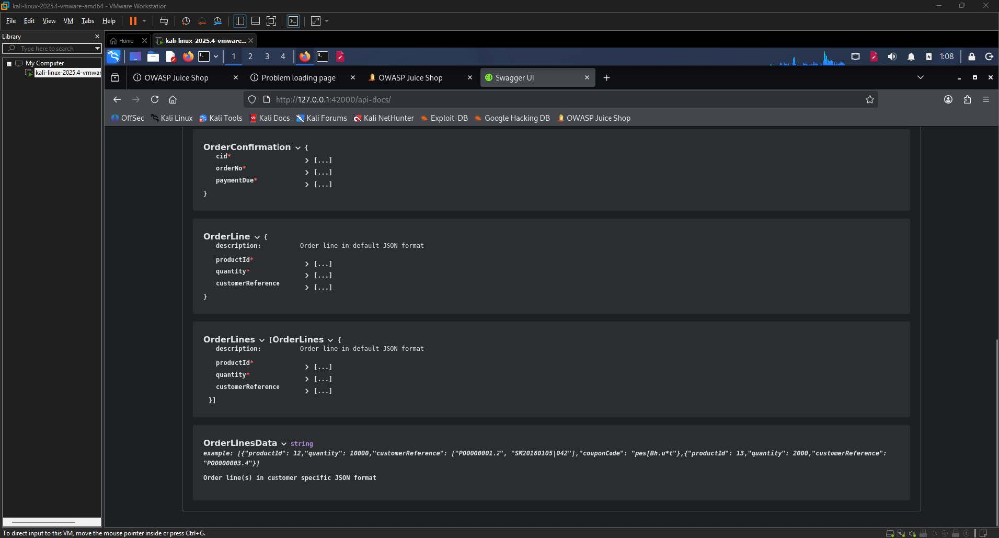
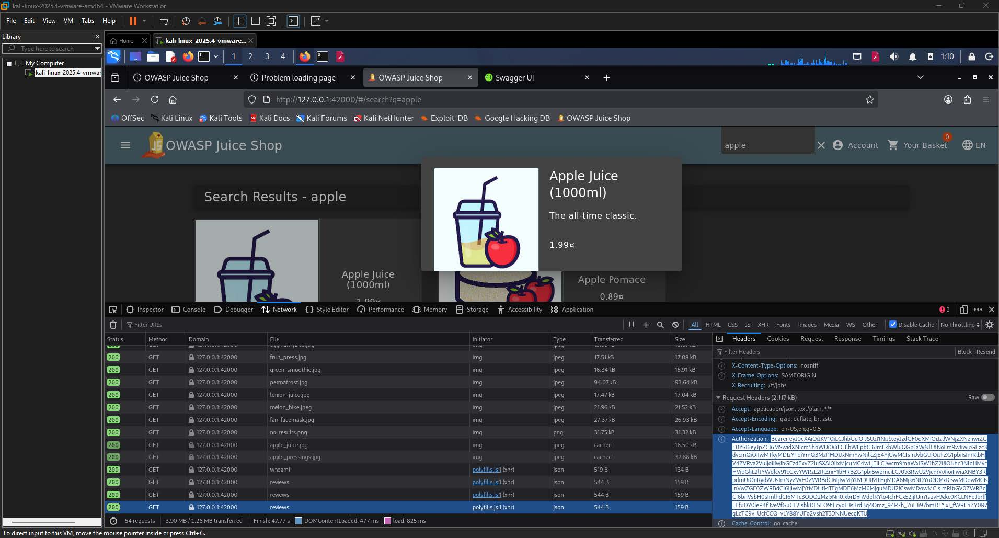
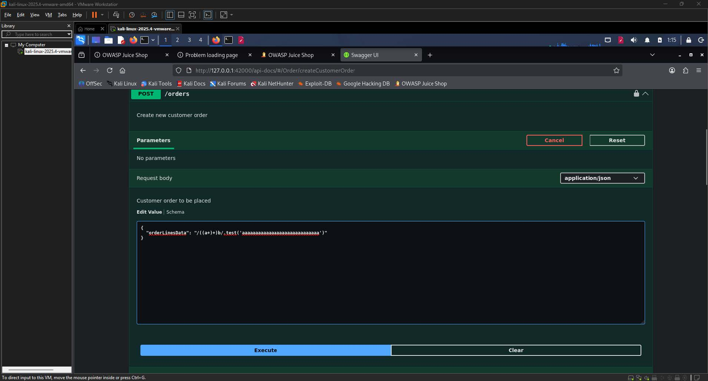

# Successful RCE DoS Write-up

| Challenge Name | RCE DoS (Remote Code Execution that occupies the server for a while without using infinite loops)  |
| :---- | :---- |
| Category | Injection / Remote Code Execution  |
| Difficulty | 6-Star |
| OWASP Top 10 | A03:2021 – Injection  |
| Secondary OWASP | A05:2021 – Security Misconfiguration  |
| CWE | CWE-94: Improper Control of Generation of Code ("Code Injection")  |
| CVSS v3.1 Vector | AV:N/AC:L/PR:L/UI:N/S:C/C:N/I:N/A:H  |
| CVSS v3.1 Score | 7.7 (High)  |
| Environment | OWASP Juice Shop  |
| Date Completed | 2026-05-11 |
| Author | [Kean Louis R. Rosales](https://keanrosales.com/Rosales,%20Kean%20Louis.pdf) |

## 1\. Executive Summary

OWASP Juice Shop exposes its order processing API endpoint to authenticated users who can submit crafted payloads through the `orderLinesData` field. By injecting a computationally expensive JavaScript expression into this field, which the server evaluates at runtime without sanitization or resource limits, an attacker can monopolize server-side processing resources for an extended period. A valid user-level authentication token is the only prerequisite. This finding is classified under A03:2021 – Injection because the server evaluates unsanitized user-supplied input as executable code, directly violating the boundary between data and instructions. 

## 2\. Technical Background

### 2.1 Application Architecture

OWASP Juice Shop is a deliberately vulnerable Node.js web application built on the Express framework, backed by a SQLite database. The application exposes a RESTful API, documented via Swagger UI at `/api-docs`, which handles customer order creation through a `POST /orders` endpoint. The `orderLinesData` field within this endpoint accepts a raw string rather than a structured JSON object, which is an architectural anomaly: when an application accepts a string where structured input is expected, it is a strong indicator that the server is parsing or evaluating that string at runtime. Under normal operation, this field is intended to carry serialized order line items in a customer-specific JSON format. The Node.js runtime's capacity to evaluate dynamic expressions makes this field a direct vector for server-side code injection. 

### 2.2 Vulnerability Class

CWE-94 (Improper Control of Generation of Code) applies when an application constructs code or evaluates user-supplied data as code without adequate sanitization or sandboxing. The expected secure behavior is that all user-supplied input to the `orderLinesData` field is treated strictly as data and parsed safely, never executed. The missing control is input validation and the absence of any restriction on the computational complexity of the evaluated expression. Because the server evaluates the injected string in the same execution context as the application, a sufficiently expensive expression blocks the Node.js event loop, rendering the server unresponsive for the duration of the computation. 

## 3\. Reconnaissance and Discovery

### 3.1 Hypothesis

The initial hypothesis was formed upon observing that the `orderLinesData` schema, visible in the Swagger UI at `/api-docs`, was typed as a raw `string` rather than a structured object or array. Every other order-related schema (`OrderLine`, `OrderLines`) used properly typed fields with defined sub-properties. This inconsistency suggested that the application was performing some form of runtime parsing or evaluation on the field's value server-side, which is a common precondition for injection vulnerabilities. The investigation was therefore directed at determining whether arbitrary expressions could be injected into this field and evaluated by the server. 

### 3.2 Discovery Method

Tool(s) used: Gobuster (directory enumeration), Swagger UI (API documentation and request execution), Browser DevTools (JWT extraction)

Target component: `POST /orders` endpoint, specifically the `orderLinesData` request body field

Steps performed:

1. Ran Gobuster against the application to enumerate available endpoints and identified `/api-docs` as an accessible and interesting path.  
2. Navigated to the Swagger UI at `http://127.0.0.1:42000/api-docs` and reviewed all available schemas under the `Order` API section.  
3. Observed that `OrderLinesData` was defined as a `string` type with an example value containing embedded JSON, while all sibling schemas used structured object definitions \-- confirming the hypothesis that the field was handled differently server-side.  
4. Extracted a valid admin-level Bearer token from the browser's Developer Tools (Network tab) by inspecting authenticated requests made while browsing the Juice Shop storefront.  
5. Entered the token into the Swagger UI's `bearerAuth` authorization dialog and confirmed successful authorization.

  
**Image 1.1:** Swagger UI at `/api-docs` showing the `OrderLinesData` schema defined as a raw `string` type  
  
**Image 1.2:** Browser DevTools Network tab showing an authenticated request with the Bearer JWT

Finding: The `orderLinesData` field is accepted as a raw string by the server, and the API accepted injection of a non-standard expression payload, confirming that the field's value is processed beyond simple deserialization.

## 4\. Exploitation

### 4.1 Prerequisites

| Requirement | Detail |
| :---- | :---- |
| Authentication | User |
| Special Tools | None |
| Network Access | Local |
| Permissions | None |

### 4.2 Attack Chain

1. Enumerate endpoints \-- Run Gobuster or an equivalent directory brute-forcer against the target to identify `/api-docs`.  
2. Inspect the API schema \-- Open the Swagger UI, navigate to the `Order` schema group, and confirm that `OrderLinesData` is typed as a raw `string`.  
3. Obtain a valid Bearer token \-- Authenticate to the application and extract the JWT from the browser's DevTools Network tab.  
4. Authorize in Swagger UI \-- Paste the Bearer token into the `bearerAuth` dialog in Swagger UI and confirm the token is accepted.  
5. Craft the payload \-- Construct a request body in which the `orderLinesData` value contains a computationally expensive JavaScript expression (e.g., a deeply nested or exponentially recursive numeric computation that does not loop infinitely but consumes significant CPU time).  
6. Submit the request \-- Execute the `POST /orders` request via Swagger UI and observe the server's delayed or blocked response, confirming that the event loop was occupied.

### 4.3 Evidence — Payload / Request

The following request body was submitted to `POST /orders`:

```json
{"orderLinesData": "/((a+)+)b/.test('aaaaaaaaaaaaaaaaaaaaaaaaaaaaa')"}
```

  
**Image 1.3:** Payload injection in Swagger

### 4.4 Proof of Exploitation

After submitting the payload, the Juice Shop application displayed a green success notification confirming: "You successfully solved a challenge: Successful RCE DoS (Perform a Remote Code Execution that occupies the server for a while without using infinite loops.)"

![][image4](./Images/Successful-RCE-DoS-4.jpg)  
**Image 1.4:** OWASP Juice Shop storefront displaying the green challenge-completion banner

## 5\. Root Cause Analysis

The root cause is the absence of server-side input validation and the unsandboxed evaluation of user-supplied strings passed through the `orderLinesData` field. This violates the Principle of Secure by Default and the broader principle of treating all user input as untrusted data.

Contributing factors:

1. The `orderLinesData` field was designed to accept a raw string rather than a typed, validated data structure, creating an implicit evaluation pathway for arbitrary input.  
2. No input sanitization, schema enforcement, or allowlist validation was applied to the field's value before server-side processing.  
3. The Node.js event loop is single-threaded, meaning that any computation blocking the loop \-- such as catastrophic regex backtracking \-- halts the entire application's ability to process concurrent requests.  
4. The Swagger UI interface was publicly accessible and functional, providing an attacker with complete, self-documenting access to all API endpoints and their schemas without any additional reconnaissance effort.

## 6\. Impact Assessment

| Dimension | Rating | Justification |
| :---- | :---- | :---- |
| Confidentiality | None | The attack does not expose, read, or exfiltrate any data from the application or its underlying storage.  |
| Integrity | None | No data is modified, created, or deleted as a result of the payload execution.  |
| Availability | High | The payload occupies the Node.js event loop, blocking all request processing for the duration of the computation and rendering the application unresponsive to all users.  |
| Privilege Required | Low | A valid authenticated session (any user-level account) is sufficient to submit the malicious payload.  |
| User Interaction | None | The attacker operates entirely autonomously; no victim user action is required.  |
| Scope | Changed | The impact extends beyond the attacker's own session to affect the availability of the entire application for all concurrent users.  |

### 6.1 Business Impact

An attacker with a standard user account, obtained through free registration or credential theft, can render the application's order processing service entirely unresponsive for all users during the period of exploitation. In a production environment, this translates to complete disruption of order placement, loss of in-flight transactions, and potential financial damage proportional to the application's transaction volume. Because the attack requires no specialized tooling and is executable through the application's own documented API interface, the barrier to exploitation is low, and the attack can be repeated at will to sustain a denial-of-service condition. 

## 7\. Remediation

### 7.1 Short-Term — Input Schema Enforcement (Immediate) 

Replace the raw string type for `orderLinesData` with a structured, typed schema that the server validates against before processing. This eliminates the ability to inject arbitrary expressions by ensuring the field's value is parsed as a known data structure rather than evaluated as a string.

```javascript
// Before (vulnerable): orderLinesData accepted as a raw string
// After (short-term fix): enforce strict JSON schema validation on the field

const Joi = require('joi');

const orderLineSchema = Joi.object({
  productId: Joi.number().integer().positive().required(),
  quantity: Joi.number().integer().positive().required(),
  customerReference: Joi.string().alphanum().max(50).required()
});

const orderSchema = Joi.object({
  orderLinesData: Joi.array().items(orderLineSchema).min(1).required()
  // Rejects any non-array, non-conforming input before evaluation
});
```

### 7.2 Long-Term — Safe Parsing and Regex Timeout Controls (Recommended) 

The architecturally correct fix is twofold: first, remove any code path that evaluates `orderLinesData` as a dynamic expression and replace it with a safe JSON parser operating on a validated schema; second, introduce application-level timeout controls and a worker thread pool so that any accidental blocking computation does not monopolize the main event loop.

```javascript
// Use safe JSON parsing with explicit error handling
function parseOrderLines(rawInput) {
  try {
    const parsed = JSON.parse(rawInput); // Safe; does not evaluate expressions
    return validateAgainstSchema(parsed); // Apply Joi or equivalent schema validation
  } catch (err) {
    throw new Error('Invalid orderLinesData format');
  }
}

// For any regex operations on user input, use a safe-regex library or timeout wrapper
const safeRegex = require('safe-regex');
if (!safeRegex(userInput)) {
  throw new Error('Potentially catastrophic regex detected');
}
```

### 7.3 Remediation Priority

| Action | Effort | Priority |
| :---- | :---- | :---- |
| Enforce structured schema on `orderLinesData`  | Low | Critical |
| Remove dynamic string evaluation from order processing  | Medium | Critical |
| Add `safe-regex` or equivalent ReDoS protection  | Low | High |
| Restrict Swagger UI to internal / authenticated networks only  | Low | High |
| Introduce worker thread pool to isolate blocking operations  | High | Medium |

## 8\. References

\[1\] OWASP Foundation, "A03:2021 – Injection," OWASP Top 10, 2021\. \[Online\]. Available: [https://owasp.org/Top10/A03\_2021-Injection/](https://owasp.org/Top10/A03_2021-Injection/). \[Accessed: May 11, 2026\].

\[2\] MITRE Corporation, "CWE-94: Improper Control of Generation of Code ('Code Injection')," Common Weakness Enumeration, 2023\. \[Online\]. Available: [https://cwe.mitre.org/data/definitions/94.html](https://cwe.mitre.org/data/definitions/94.html). \[Accessed: May 11, 2026\].

\[3\] OWASP Foundation, "A05:2021 – Security Misconfiguration," OWASP Top 10, 2021\. \[Online\]. Available: [https://owasp.org/Top10/A05\_2021-Security\_Misconfiguration/](https://owasp.org/Top10/A05_2021-Security_Misconfiguration/). \[Accessed: May 11, 2026\].

\[4\] OWASP Foundation, "Testing for ReDoS (OTG-INPVAL-010)," OWASP Testing Guide v4.2. \[Online\]. Available: [https://owasp.org/www-project-web-security-testing-guide/](https://owasp.org/www-project-web-security-testing-guide/). \[Accessed: May 11, 2026\].

\[5\] OWASP Foundation, "OWASP Application Security Verification Standard 4.0 \-- V5: Validation, Sanitization and Encoding," OWASP ASVS, 2019\. \[Online\]. Available: [https://owasp.org/www-project-application-security-verification-standard/](https://owasp.org/www-project-application-security-verification-standard/). \[Accessed: May 11, 2026\].

\[6\] Node.js Foundation, "Don't Block the Event Loop (or the Worker Pool)," Node.js Documentation. \[Online\]. Available: [https://nodejs.org/en/learn/asynchronous-work/dont-block-the-event-loop](https://nodejs.org/en/learn/asynchronous-work/dont-block-the-event-loop). \[Accessed: May 11, 2026\].

\[7\] OWASP Foundation, "Regular Expression Denial of Service \-- ReDoS," OWASP Cheat Sheet Series. \[Online\]. Available: [https://cheatsheetseries.owasp.org/cheatsheets/Input\_Validation\_Cheat\_Sheet.html](https://cheatsheetseries.owasp.org/cheatsheets/Input_Validation_Cheat_Sheet.html). \[Accessed: May 11, 2026\].

## Appendix 

1. CVSS v3.1 Score Calculation

The CVSS v3.1 vector for this finding is `AV:N/AC:L/PR:L/UI:N/S:C/C:N/I:N/A:H`, which produces a Base Score of 7.7 (High). Each metric is justified as follows.

Attack Vector (AV): Network \-- The attack is delivered entirely over HTTP through the application's REST API. No physical access, local network positioning, or adjacent network segment is required. Any network-reachable deployment of the application is vulnerable, making Network the appropriate value.

Attack Complexity (AC): Low \-- No special conditions, race conditions, or target-specific configurations are required for successful exploitation. The Swagger UI is self-documenting, the token extraction process is deterministic, and the payload injection is reproducible on every attempt without variation.

Privileges Required (PR): Low \-- A valid authenticated session is required to submit the payload to the `POST /orders` endpoint. However, no elevated or administrative role is necessary; any registered user account is sufficient. This places the requirement at Low rather than None.

User Interaction (UI): None \-- The attacker acts entirely independently. No victim user needs to visit a page, click a link, or perform any action for exploitation to succeed.

Scope (S): Changed \-- The impact of this vulnerability extends beyond the attacker's own session. By blocking the Node.js event loop, the attacker degrades service availability for all concurrent users of the application, crossing the boundary from the attacker's own security context into the broader application's availability. This satisfies the Changed scope criterion.

Confidentiality Impact (C): None \-- The attack does not result in the disclosure of any data. No information is read, exfiltrated, or exposed through the exploitation of this vulnerability.

Integrity Impact (I): None \-- No data is created, modified, or deleted as a result of the attack. The payload's sole effect is computational resource exhaustion.

Availability Impact (A): High \-- The injected payload occupies the Node.js event loop entirely for the duration of the computation, completely blocking the application's ability to process any incoming requests. This constitutes a total, if temporary, loss of availability for all users, which justifies a High rating.

The Exploitability sub-score is elevated by the Network attack vector, Low complexity, Low privilege requirement, and absence of user interaction. The Impact sub-score is driven exclusively by the High availability impact, with confidentiality and integrity contributing nothing. The Changed scope amplifies the overall score by reflecting the cross-boundary nature of the availability impact. The resulting Base Score of 7.7 places this finding in the High severity band under the CVSS v3.1 qualitative scale (7.0 to 8.9).

2. Personal Experience and Reflection

This was the easiest challenge encountered in the Juice Shop engagement so far. The `OrderLinesData` field being typed as a raw `string` in the Swagger schema was an immediate and obvious indicator of server-side evaluation. From that observation, the attack path to a ReDoS payload was straightforward and required no significant trial and error. The challenge reinforced that reading API documentation carefully is often more productive than running automated scanners \-- a single type annotation was enough to identify the entire attack surface.   


