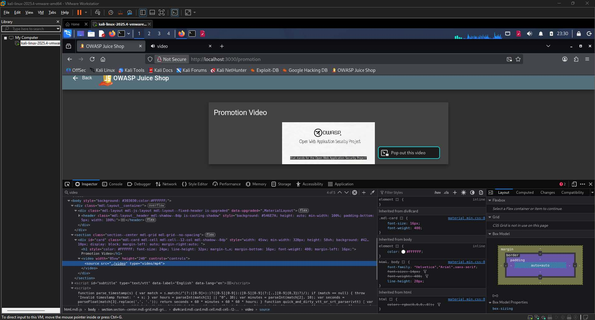
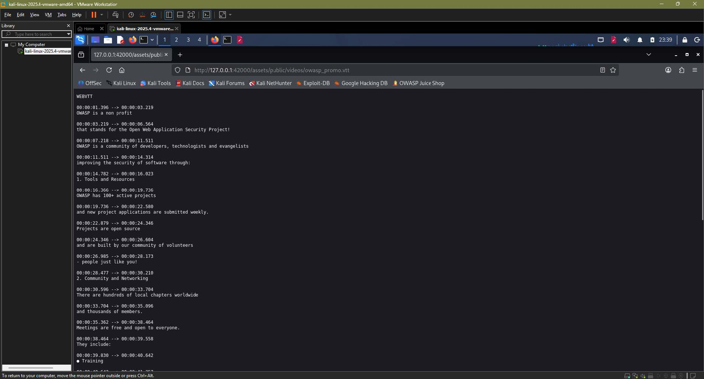
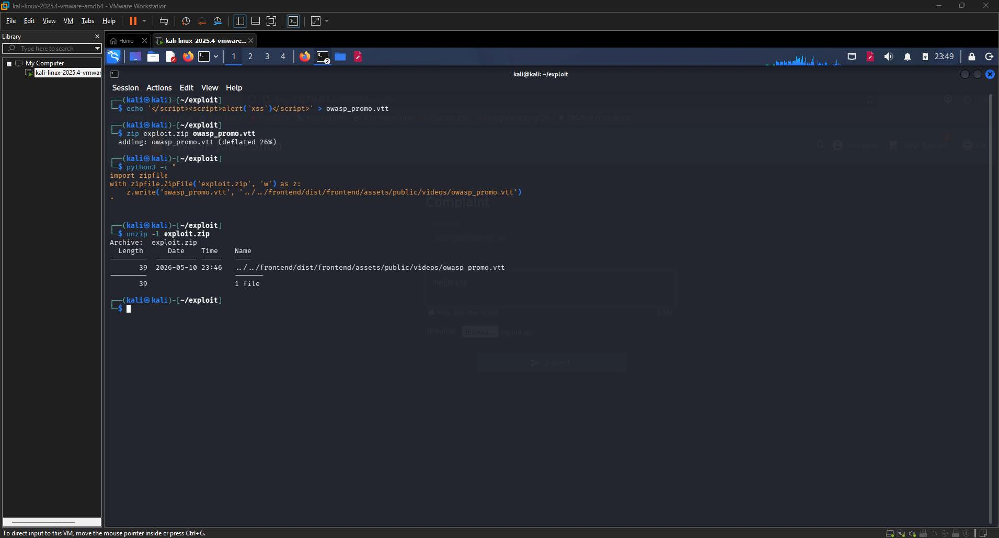
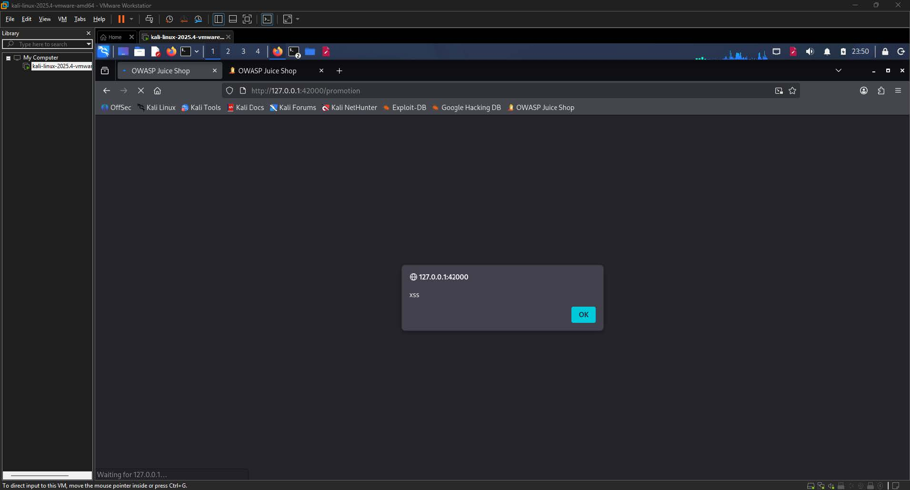
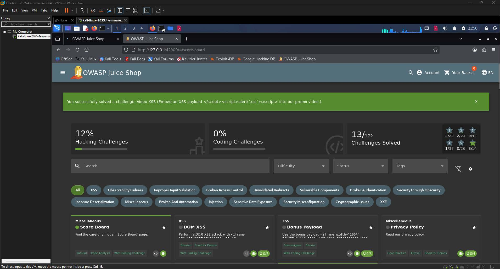

# Video XSS Write-up

| Challenge Name | Video XSS  |
| :---- | :---- |
| Category | XSS / Injection  |
| Difficulty | 6-Star |
| OWASP Top 10 | A03:2021 \- Injection  |
| Secondary OWASP | A05:2021 \- Security Misconfiguration  |
| CWE | CWE-79: Improper Neutralization of Input During Web Page Generation  |
| CVSS v3.1 Vector | AV:N/AC:L/PR:L/UI:R/S:C/C:L/I:L/A:N  |
| CVSS v3.1 Score | 5.4 (Medium)  |
| Environment | OWASP Juice Shop |
| Date Completed | 2026-05-11  |
| Author | [Kean Louis R. Rosales](https://keanrosales.com/Rosales,%20Kean%20Louis.pdf) |

## 1\. Executive Summary

The OWASP Juice Shop application exposes a stored Cross-Site Scripting (XSS) vulnerability through the promotional video subtitle file served at `/assets/public/videos/owasp_promo.vtt`. By crafting a malicious WebVTT subtitle file and delivering it to the server through the complaint page's ZIP upload feature, an authenticated attacker can replace the legitimate subtitle file with one containing arbitrary JavaScript. Any user who subsequently loads the promotion video page will have that script executed in their browser without consent. This finding is classified under OWASP A03:2021 Injection because the application fails to validate or sanitize the content of uploaded archive files before extracting and serving them as static assets, allowing injected script code to be treated as trusted page content. 

## 2\. Technical Background

OWASP Juice Shop is a deliberately vulnerable web application built on a Node.js backend with an Angular frontend. The promotion video page is served at `localhost:3000/promotion` and renders a video element whose source resolves to `/assets/public/videos/owasp_promo.mp4`. The accompanying WebVTT subtitle track is loaded from `/assets/public/videos/owasp_promo.vtt` and is embedded directly into the DOM by the browser's native `<track>` element. The complaint page provides a ZIP file upload feature intended for attaching supporting documentation to customer complaints. The server extracts uploaded ZIP archives without verifying the paths of the contained files, which allows a path-traversal attack to overwrite arbitrary files in the Angular build output directory at `frontend/dist/frontend/`. 

### 2.2 Vulnerability Class

This vulnerability is an instance of CWE-79 (Stored Cross-Site Scripting), in which attacker-controlled content is persisted on the server and later rendered in the browsers of other users without adequate output encoding or content validation. The expected secure behavior is that the server should validate both the MIME type and the content of uploaded files and should enforce that ZIP archive entries cannot traverse outside a designated upload directory. The missing controls are path-traversal prevention during ZIP extraction and content-type enforcement on files served as static assets. The absence of these controls means that a malicious subtitle file containing a raw `<script>` block is served with a content type that the browser parses, and the injected script executes in the context of the Juice Shop origin. 

## 3\. Reconnaissance and Discovery

### 3.1 Hypothesis

While reviewing the promotion video page, it was noted that the page rendered live subtitle text overlaid on the video player. This observation raised the hypothesis that subtitle data was being loaded from an external file and injected into the DOM at runtime. If the server did not enforce content integrity on that file, and if a writable path to that file could be found through another feature of the application, it would be possible to substitute the legitimate subtitle content with a payload containing executable script. 

### 3.2 Discovery Method

Tools used: Browser DevTools (Inspector, Network, Console), Python 3 (zipfile module), Linux shell (echo, zip)

Target component: `/assets/public/videos/owasp_promo.vtt`, complaint page ZIP upload endpoint

Steps performed:

1. Navigated to `localhost:3000/promotion` and opened the browser's Inspector panel to examine the HTML source of the video player element. The `<track>` element referenced a subtitle file, and the Network tab confirmed the file was fetched from `/assets/public/videos/owasp_promo.vtt`.

  
**Image 1.1:** Browser DevTools Network tab showing the GET request for `owasp_promo.vtt` 

2. Directly accessed `http://127.0.0.1:42000/assets/public/videos/owasp_promo.vtt` in the browser to confirm the file was publicly readable and to examine its content and structure. The file began with the `WEBVTT` header and contained plain-text subtitle cues.  
3. Inspected the page source further and identified the JavaScript bundle reference `self.webpackChunkfrontend`, confirming that the Angular build output directory is named `frontend` and that the full server-side path to the subtitle file is `frontend/dist/frontend/assets/public/videos/owasp_promo.vtt`.

  
**Image 1.2:** raw WEBVTT subtitle content rendered in the viewport 

4. Constructed a malicious WebVTT file containing a script injection payload, packaged it inside a ZIP archive using a path-traversal entry name targeting the subtitle file's server-side location, and uploaded the archive through the complaint page.

Finding: Direct access to the `.vtt` file confirmed it was publicly readable and served without integrity checks, and the webpack bundle reference revealed the server-side directory structure necessary to craft a path-traversal ZIP entry.

## 4\. Exploitation

### 4.1 Prerequisites

| Requirement | Detail |
| :---- | :---- |
| Authentication | User |
| Special Tools | Python 3 |
| Network Access | Local |
| Permissions | None |

### 4.2 Attack Chain

1. Identify the subtitle file path \-- Navigate to `localhost:3000/promotion`, open DevTools, and inspect the Network tab to confirm that the video player loads its subtitle track from `/assets/public/videos/owasp_promo.vtt`. Confirm public read access by visiting the URL directly.  
2. Determine the server-side directory structure \-- Inspect the page source for Angular bundle references. The string `self.webpackChunkfrontend` confirms the project is named `frontend`, meaning the static asset root is at `frontend/dist/frontend/` on the server.  
3. Create the malicious subtitle file \-- Use the shell to write a file named `owasp_promo.vtt` whose content is a script injection payload rather than valid WebVTT cues.  
4. Package the file with a path-traversal entry name \-- Use Python's `zipfile` module to create a ZIP archive in which the entry's stored path traverses two directory levels upward and then descends into the Angular build output path for the subtitle file.  
5. Upload the archive via the complaint page \-- Navigate to the complaint page, attach the crafted ZIP file, and submit the form. The server extracts the archive without sanitizing entry paths, causing the malicious `owasp_promo.vtt` to overwrite the legitimate subtitle file.  
6. Trigger the payload \-- Navigate to or reload `localhost:3000/promotion`. The browser fetches the now-replaced subtitle file and executes the injected script, producing an alert dialog.

### 4.3 Evidence — Payload / Request

Step 1: Create the malicious subtitle file

```shell
echo '</script><script>alert(`xss`)</script>' > owasp_promo.vtt
```

Step 2: Package with a path-traversal entry name using Python

```py
import zipfile

with zipfile.ZipFile('exploit.zip', 'w') as z:
    z.write(
        'owasp_promo.vtt',
        '../../frontend/dist/frontend/assets/public/videos/owasp_promo.vtt'
    )
```

Step 3: Verify the entry path in the archive

```shell
unzip -l exploit.zip
```

Expected output:

```
Archive:  exploit.zip
  Length      Date    Time    Name
---------  ---------- -----   ----
       39  2026-05-10 23:48   ../../frontend/dist/frontend/assets/public/videos/owasp_promo.vtt
---------                     -------
       39                     1 file
```

  
**Image 1.3:** Terminal window showing the three commands executed in sequence 

### 4.4 Proof of Exploitation

After the ZIP was uploaded and extracted by the server, navigating to `localhost:3000/promotion` caused the browser to execute the injected script and display an alert dialog reading "xss", and the Juice Shop score board displayed a green success banner confirming the "Video XSS" challenge had been solved.   
  
**Image 1.4:** Browser displaying the alert dialog with the text "xss"   
  
**Image 1.5:** Juice Shop score board showing the green success banner 

## 5\. Root Cause Analysis

The root cause is the absence of path-traversal sanitization in the server-side ZIP extraction routine used by the complaint upload handler. This violates the Principle of Least Privilege and the Secure by Default design principle, because the extraction routine is granted write access to the entire Angular build output directory rather than being confined to a designated, isolated upload staging area.

Contributing factors:

1. The server does not normalize or validate ZIP entry paths before extraction, allowing `../` sequences to escape the intended destination directory.  
2. The complaint upload feature accepts arbitrary ZIP archives without restricting the file types or paths of their contents.  
3. The Angular build output directory, which contains files served directly to users as trusted static assets, is writable by the application process at runtime, meaning overwritten files are immediately served without any cache invalidation or integrity verification.  
4. The browser's `<track>` element processes the content of the loaded `.vtt` file and inserts subtitle cues into the DOM; because the injected payload broke out of the expected WebVTT cue format and introduced a raw `<script>` block, the browser's HTML parser executed it as JavaScript.

## 6\. Impact Assessment

| Dimension | Rating | Justification |
| :---- | :---- | :---- |
| Confidentiality | Low | The attacker can inject scripts that steal session tokens or user data from other visitors, but the vulnerability itself does not directly expose stored data.  |
| Integrity | Low | The attack permanently overwrites a served static asset, altering what is delivered to all subsequent visitors of the promotion page.  |
| Availability | None | The attack does not disrupt the availability of the application or its underlying services.  |
| Privilege Required | Low | A valid user account is required to access the complaint page and submit the upload.  |
| User Interaction | Required | A victim user must navigate to or reload the promotion video page for the script to execute in their browser.  |
| Scope | Changed | The injected script executes in the victim's browser under the Juice Shop origin, affecting a security context beyond the complaint upload feature itself.  |

### 6.1 Business Impact

The injected script executes under the Juice Shop origin in every visitor's browser until the file is restored, meaning an attacker can harvest session tokens, redirect users to phishing pages, or silently perform authenticated actions on behalf of the victim. Unlike a reflected XSS attack that requires luring individual users to a crafted URL, this stored variant requires no further attacker interaction after the ZIP is uploaded. For a real e-commerce platform, this translates to the potential for mass account compromise and reputational damage proportional to the volume of users who view the promotion page during the window of exposure. 

## 7\. Remediation

### 7.1 Short-Term — ZIP Entry Path Sanitization (Immediate) 

The fastest mitigation is to normalize each ZIP entry's stored path before use and reject any entry whose resolved output path falls outside the intended extraction destination.

```javascript
const path = require('path');
const AdmZip = require('adm-zip');

const EXTRACT_ROOT = path.resolve('/safe/upload/staging/');

function safeExtract(zipPath) {
  const zip = new AdmZip(zipPath);
  for (const entry of zip.getEntries()) {
    // Resolve the target path and confirm it stays inside the root
    const target = path.resolve(EXTRACT_ROOT, entry.entryName);
    if (!target.startsWith(EXTRACT_ROOT + path.sep)) {
      throw new Error(`Path traversal detected in entry: ${entry.entryName}`);
    }
  }
  zip.extractAllTo(EXTRACT_ROOT, true);
}
```

This check intercepts traversal attempts before any file write occurs. It does not require changes to the upload form, authentication logic, or the Angular frontend.

### 7.2 Long-Term — Isolated Upload Directory with Content Validation (Recommended) 

The architecturally correct fix separates the upload staging area from the application's runtime static assets by placing extracted files in an isolated directory that is never served directly to users. Uploaded files should be scanned for allowed MIME types and content patterns before being accepted. Static assets that must be user-replaceable should be served through a controlled pipeline that enforces content integrity.

```javascript
const path = require('path');
const fs = require('fs');

const ALLOWED_MIME_TYPES = ['application/pdf', 'image/png', 'image/jpeg'];
const UPLOAD_STAGING = path.resolve('/var/app/uploads/staging/');

// Never extract directly to the Angular dist folder.
// Validate MIME type before moving to a content-addressed store.
function validateAndStage(extractedFilePath) {
  const detectedType = detectMimeType(extractedFilePath); // use file-type or similar library
  if (!ALLOWED_MIME_TYPES.includes(detectedType)) {
    fs.unlinkSync(extractedFilePath);
    throw new Error(`Rejected file with disallowed MIME type: ${detectedType}`);
  }
  // Move to staging; never overwrite application assets
}
```

### 7.3 Remediation Priority

| Action | Effort | Priority |
| :---- | :---- | :---- |
| ZIP path traversal sanitization  | Low | Critical |
| MIME type validation on extracted files  | Medium | High |
| Move upload staging outside static asset directory  | Medium | High |
| Serve user-replaceable assets through integrity-checked pipeline  | High | Medium |

## 8\. References

\[1\] OWASP Foundation, "A03:2021 \- Injection," OWASP Top 10, 2021\. \[Online\]. Available: [https://owasp.org/Top10/A03\_2021-Injection/](https://owasp.org/Top10/A03_2021-Injection/). \[Accessed: May 11, 2026\].

\[2\] OWASP Foundation, "A05:2021 \- Security Misconfiguration," OWASP Top 10, 2021\. \[Online\]. Available: [https://owasp.org/Top10/A05\_2021-Security\_Misconfiguration/](https://owasp.org/Top10/A05_2021-Security_Misconfiguration/). \[Accessed: May 11, 2026\].

\[3\] MITRE Corporation, "CWE-79: Improper Neutralization of Input During Web Page Generation ('Cross-site Scripting')," Common Weakness Enumeration, 2023\. \[Online\]. Available: [https://cwe.mitre.org/data/definitions/79.html](https://cwe.mitre.org/data/definitions/79.html). \[Accessed: May 11, 2026\].

\[4\] MITRE Corporation, "CWE-22: Improper Limitation of a Pathname to a Restricted Directory ('Path Traversal')," Common Weakness Enumeration, 2023\. \[Online\]. Available: [https://cwe.mitre.org/data/definitions/22.html](https://cwe.mitre.org/data/definitions/22.html). \[Accessed: May 11, 2026\].

\[5\] OWASP Foundation, "OWASP Application Security Verification Standard 4.0 \-- V12: File and Resources Verification Requirements," OWASP ASVS, 2019\. \[Online\]. Available: [https://owasp.org/www-project-application-security-verification-standard/](https://owasp.org/www-project-application-security-verification-standard/). \[Accessed: May 11, 2026\].

\[6\] PortSwigger, "File Upload Vulnerabilities," Web Security Academy. \[Online\]. Available: [https://portswigger.net/web-security/file-upload](https://portswigger.net/web-security/file-upload). \[Accessed: May 11, 2026\].

\[7\] OWASP Foundation, "Testing for ZIP Path Traversal," OWASP Testing Guide v4.2. \[Online\]. Available: [https://owasp.org/www-project-web-security-testing-guide/](https://owasp.org/www-project-web-security-testing-guide/). \[Accessed: May 11, 2026\].

## Appendix 

1. CVSS v3.1 Score Calculation

The CVSS v3.1 vector for this finding is `AV:N/AC:L/PR:L/UI:R/S:C/C:L/I:L/A:N`, which produces a Base Score of 5.4 (Medium). Each metric is justified as follows.

Attack Vector (AV): Network \-- The attacker submits the malicious ZIP through the Juice Shop's complaint page over HTTP using only a standard web browser. No physical access, local network positioning, or adjacent segment is required, and any internet-reachable deployment of the application would be exploitable remotely.

Attack Complexity (AC): Low \-- No special conditions or race conditions need to be in place. The path-traversal technique is deterministic, the upload endpoint is consistently accessible to authenticated users, and the injected file is immediately served to subsequent visitors. The attack can be reproduced reliably on every attempt.

Privileges Required (PR): Low \-- A valid Juice Shop user account is required to reach the complaint page and submit the upload. No administrative or elevated role is necessary at any point in the attack chain, so Low rather than None is the correct rating.

User Interaction (UI): Required \-- The injected script does not execute on the attacker's own browser. A separate victim user must navigate to the promotion video page for the payload to run. This distinguishes the finding from a fully self-propagating attack and warrants the Required rating.

Scope (S): Changed \-- The complaint upload feature operates under one security context, but the injected script executes in the victim's browser under the Juice Shop origin and can read cookies, local storage, and session tokens belonging to that origin. The impact therefore extends beyond the vulnerable component itself, satisfying the Changed scope criterion.

Confidentiality Impact (C): Low \-- An injected script can read session tokens and other origin-scoped data from a victim's browser session, constituting a limited but meaningful information disclosure. Because no server-side data store is directly accessed and the attacker does not receive data automatically without a victim triggering the payload, the impact is rated Low rather than High.

Integrity Impact (I): Low \-- The attack permanently overwrites a static asset that is served to all subsequent visitors, altering the content they receive. However, the direct data manipulated is limited to a single subtitle file, and the broader application data store is not modified, so Low is the appropriate rating.

Availability Impact (A): None \-- The attack does not degrade, interrupt, or deny the availability of the application or any of its components. All functionality remains accessible throughout and after exploitation.

The numerical score is derived by applying the CVSS v3.1 Base Score formula to the selected metric values. The Exploitability sub-score is elevated by the Network attack vector, Low complexity, and Low privilege requirement, and is slightly moderated by the Required user interaction. The Impact sub-score reflects the Changed scope, which amplifies the Low confidentiality and Low integrity impacts. The resulting composite Base Score of 5.4 places this finding in the Medium severity band under the CVSS v3.1 qualitative severity rating scale.

2. Personal Experience Notes

The initial observation that led to this challenge was noticing the subtitle text animating on the promotion video player and immediately wondering whether it was being loaded from a separate file or hardcoded into the HTML. Opening the Network tab to check was a reflex at that point, and seeing the `.vtt` request appear was satisfying because it confirmed the hypothesis within seconds.

The more interesting part was working backwards from the subtitle file's URL path to its server-side location. Knowing that Juice Shop uses Angular narrowed things down considerably. The `self.webpackChunkfrontend` string was the key detail because it exposed the project name used in the Angular build output path, which is not something that would be immediately obvious without inspecting the page source. That small discovery made the path-traversal target unambiguous.

Crafting the ZIP archive with Python's `zipfile` module rather than a standard `zip` command was necessary because standard zip utilities on most systems will sanitize traversal sequences in entry names before writing them. Using the library directly bypassed that protection and allowed the full `../../` prefix to be stored literally inside the archive. Verifying the entry name with `unzip -l` before submitting was a useful habit because it confirmed the traversal path was preserved exactly as intended.

Seeing the alert pop up on the promotion page after uploading was a clean confirmation that the file had been overwritten and that the browser was parsing the injected content. The green success banner on the score board appearing immediately afterward made it clear the challenge logic was triggered by the alert execution rather than by the file replacement alone.

